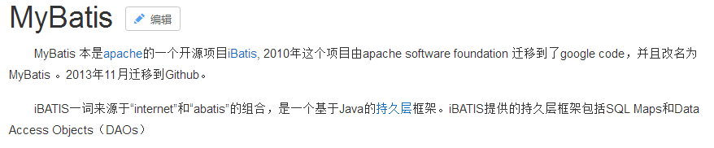
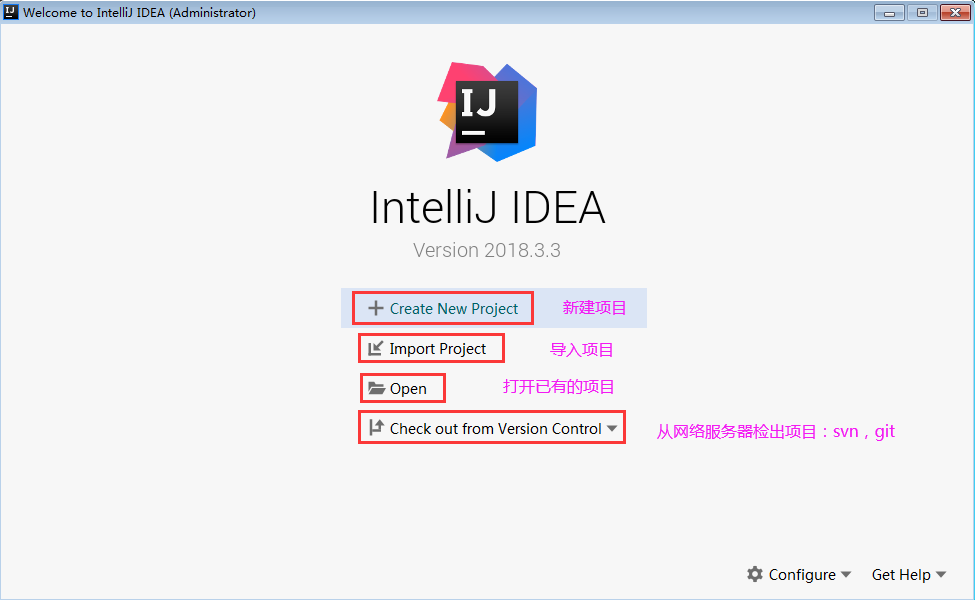
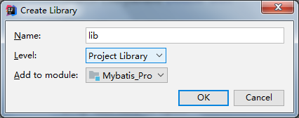
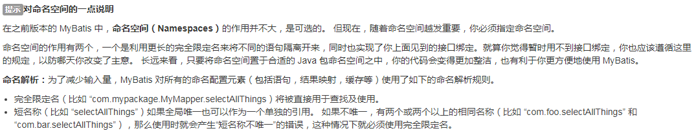

## 第1章 框架概述

### 1.1 什么是框架

#### 1.1.1 什么是框架 

​		框架（Framework）是整个或部分系统的**可重用设计**，表现为一组抽象构件及构件实例间交互的方法;另一种定义认为，框架是可被应用开发者定制的应用骨架。前者是从应用方面而后者是从目的方面给出的定义。 

​		简而言之，**框架其实就是某种应用的半成品**，就是一组组件，供你选用完成你自己的系统。简单说就是使用别人搭好的舞台，你来做表演。而且，框架一般是成熟的，不断升级的软件。**框架使用一般都应该降版本使用**（选择GA）

**框架目的：提高开发效率（底层提高代码重用），不是提高程序性能**

#### 1.1.2 框架要解决的问题 

​		框架要解决的最重要的一个问题是技术整合的问题，在J2EE的 框架中，有着各种各样的技术（如jdbc，servlet,EJB...），不同的软件企业需要从J2EE中选择不同的技术，这就使得软件企业最终的应用依赖于这些技术，技术自身的复杂性和技术的风险性将会直接对应用造成冲击。而应用是软件企业的核心，是竞争力的关键所在，因此应该将应用自身的设计（开发者自行编写的代码）和具体的实现技术（底层技术，jdbc，servlet....）**解耦(降低耦合性，粘连性，耦合度)。**这样，软件企业的研发将集中在应用的设计上，而不是具体的技术实现，技术实现是应用的底层支撑，它不应该直接对应用产生影响。 

###### 框架一般处在低层应用平台（如J2EE）和高层业务逻辑之间的中间层。


#### 1.1.3 软件开发的分层重要性 

​		框架的重要性在于它实现了部分功能，并且能够很好的将低层应用平台和高层业务逻辑进行了缓和。为了实现软件工程中的“**高内聚、低耦合**”。把问题划分开来各个解决，易于控制，易于延展，易于分配资源。我们常见的MVC软件设计思想就是很好的分层思想。

高内聚、低耦合:程序代码运行时互相联系紧密，代码编写时代码之间的联系不能紧密，一般是通过反射和设计模式来完成，new代码那么改代码都是高耦合的，可以通过使用反射技术代替，降低耦合，

**耦合不是能解决的问题，而是只能降低的问题**


​		通过分层更好的实现了各个部分的职责，在每一层将再细化出不同的框架，分别解决各层关注的问题。

#### 1.1.4 分层开发下的常见框架 

常见的JavaEE开发框架： 

##### 1、解决数据的持久化问题的框架：数据库访问层



​		作为持久层的框架，还有一个封装程度更高的框架就是Hibernate，但这个框架因为各种原因目前在国内的流行程度下降太多，现在公司开发也越来越少使用。目前使用Spring Data（底层使用HIbernate实现）来实现数据持久化也是一种趋势。 

Hibernate+JPA：持久层框架


##### 2、解决WEB层问题的MVC框架：控制层


##### 3、解决技术整合问题的框架


#### 1.1.5 MyBatis框架概述 

​		mybatis是一个优秀的基于java的持久层框架，它内部封装了jdbc，让开发者只需要**关注sql语句**本身，而不需要花费精力去处理加载驱动、创建连接、创建statement等繁杂的过程。 

​		mybatis通过**xml**或注解的方式将要执行的各种**statement**（insert delete  select update）配置起来，并通过java对象和statement中**sql的动态参数**进行占位装配数据，映射生成最终执行的sql语句，最后由mybatis框架执行sql并将结果**自动映射java对象**并返回。 

​		采用ORM思想解决了实体和数据库映射的问题，对jdbc进行了封装，屏蔽了jdbc api底层访问细节，使我们不用与jdbc api打交道，就可以完成对数据库的持久化操作。 

### 1.2 JDBC编程的分析

#### 1.2.1 jdbc程序的回顾 

```java
public static void main(String[] args) { 
	Connection connection = null; 
	PreparedStatement preparedStatement = null; 
	ResultSet resultSet = null; 
	try { 
		//加载数据库驱动 
		Class.forName("com.mysql.jdbc.Driver"); 
		//通过驱动管理类获取数据库链接 
		connection = DriverManager .getConnection("jdbc:mysql://localhost:3306/mybatis?	characterEncoding=utf-8","root", "root"); 
		//定义sql语句 ?表示占位符 
		String sql = "select * from user where username = ?";
		//获取预处理
		statement preparedStatement = connection.prepareStatement(sql); 
		//设置参数，第一个参数为sql语句中参数的序号（从1开始），第二个参数为设置的参数值 		  			preparedStatement.setString(1, "王五"); 
		//向数据库发出sql执行查询，查询出结果集 
		resultSet = preparedStatement.executeQuery(); 
		//遍历查询结果集 
		while(resultSet.next()){ 
			System.out.println(resultSet.getString("id")+" "+resultSet.getString("username")); 
		} 
	} catch (Exception e) { 
		e.printStackTrace(); 
	}finally{ 
		//释放资源 
		if(resultSet!=null){ 
			try { 
				resultSet.close(); 
			} catch (SQLException e) { 
				e.printStackTrace(); 
			} 
		} 
		if(preparedStatement!=null){ 
			try { 
				preparedStatement.close(); 
			} catch (SQLException e) { 
				e.printStackTrace(); 
			} 
		} 
        if(connection!=null){ 
            try { 
                connection.close(); 
            } catch (SQLException e) { 
                // TODO Auto-generated catch block 
                e.printStackTrace(); 
            } 
        } 
    } 
}
//上边使用jdbc的原始方法（未经封装）实现了查询数据库表记录的操作。
```

#### 1.2.2 jdbc问题分析 

1、数据库链接创建、释放频繁造成系统资源浪费从而影响系统性能，如果使用数据库链接池可解决此问题。

2、Sql语句在代码中硬编码，造成代码不易维护，实际应用sql变化的可能较大，sql变动需要改变java代码。 

3、使用preparedStatement向占有位符号传参数存在硬编码，因为sql语句的where条件不一定，可能多也可能少，修改sql还要修改代码，系统不易维护。 

4、对结果集解析存在硬编码（查询列名），sql变化导致解析代码变化，系统不易维护，如果能将数据库记录封装成pojo对象解析比较方便。（自定义反射工具类，自动封装结果集的每行数据为一个实体对象）

实体对象命名：entity（没有数据库，没有javaee），po（有数据库），pojo（有数据库），javabean（javaee）

## 第2章 Mybatis框架快速入门 

### 2.1 Mybatis框架开发的准备

mybatis中文文档地址：https://mybatis.org/mybatis-3/zh/

#### 2.1.1 官网下载Mybatis框架 

从百度中“mybatis download”可以下载最新的Mybatis开发包。 


进入选择语言的界面，进入中文版本的开发文档。

我们可以看到熟悉的中文开发文档了。

下载相关的jar包或maven开发的坐标。 


Mybaits整体架构


### 2.2 搭建Mybatis开发环境

IDea创建项目流程：

1.点击新建项目



2.选择java项目,确定SDK（JDK）版本，点击next


3.在弹窗中选择创建模板复选框，点击next


3.在弹窗中确定项目名，项目存储路径，项目基本包名，点击完成


一般会弹窗，询问是否创建不存在的目录


创建完成的项目：


#### 2.2.1 创建Java工程 


通过将文件夹标记为资源文件夹用于存放配置文件


将在资料中提供的数据库配置文件和log4j日志文件添加到项目中：

资料->


#### 2.2.2 添加Mybatis的jar到lib，并准备数据库

后面使用maven构建项目后添加以下依赖：


当前没有使用maven，就在下载的mybatis文件夹中将以下jar添加到项目中，步骤：

1.在项目中创建一个lib目录存储所有的jar

2.将以下jar添加到lib中

解压下载的mybati包，能看见


mybatis的jar

mybatis依赖的jar

数据库操作jar


3.添加完jar后，将lib文件夹的jar加入项目


在弹窗点击ok确定



在数据库中运行user.sql文件

资料->

#### 2.2.3 编写User实体类：和数据库的字段一一对应

```java
package com.yaorange.entity;

import java.util.Date;

/**
 * 用户的实体类
 */
public class User {
    private int id;
    private String username;// 用户姓名
    private String sex;// 性别
    private Date birthday;// 生日
    private String address;// 地址
	//省略getter和setter
}
```

快捷生成代码：Alt+insert


#### 2.2.4 编写持久层接口的映射文件UserDao.xml 

**要求：** 

创建位置：一般定义有意义的包名单独存储。 

名称：必须以持久层接口名称命名文件名，扩展名是.xml


```xml
<?xml version="1.0" encoding="UTF-8" ?>
<!DOCTYPE mapper
        PUBLIC "-//mybatis.org//DTD Mapper 3.0//EN"
        "http://mybatis.org/dtd/mybatis-3-mapper.dtd">
<!-- mapper:根标签，namespace：命名空间，一般都是对应的dao接口路径 -->
<mapper namespace="com.yaorange.dao.UserDao">
    <!-- statement，内容：
	  sql语句：
		id：唯一标识，可以随便写，但是一般取值都是dao接口的方法名
      	resultType：sql语句查询结果集的封装类型,tb_user即为数据库中的表
    -->
    <select id="findAll" resultType="com.yaorange.entity.User">
        select * from user
    </select>
</mapper>
```



#### 2.2.5 编写SqlMapConfig.xml配置文件

```xml
<?xml version="1.0" encoding="UTF-8"?>
<!DOCTYPE configuration
        PUBLIC "-//mybatis.org//DTD Config 3.0//EN"
        "http://mybatis.org/dtd/mybatis-3-config.dtd">
<configuration>
    <!--加载外部属性文件-->
    <properties resource="jdbcConfig.properties"/>
    <!--定义别名-->
    <typeAliases>
        <typeAlias type="com.yaorange.entity.User" alias="User"/>
    </typeAliases>
    <!-- 配置mybatis的环境 -->
    <environments default="mysql">
        <!-- 配置mysql的环境 -->
        <environment id="mysql">
            <!-- 配置事务的类型 -->
            <transactionManager type="JDBC"/>
            <!-- 配置连接数据库的信息：用的是数据源(连接池) -->
            <dataSource type="POOLED">
                <property name="driver" value="${jdbc.driver}"/>
                <property name="url" value="${jdbc.url}"/>
                <property name="username" value="${jdbc.username}"/>
                <property name="password" value="${jdbc.password}"/>
            </dataSource>
        </environment>
    </environments>
    <!-- 加载mybatis映射配置 -->
    <mappers>
        <mapper resource="mapper/UserDao.xml"/>
    </mappers>
</configuration>
```

#### 2.2.7 编写测试类 

```java
import com.yaorange.entity.User;
import com.yaorange.mapper.UserDao;
import org.apache.ibatis.io.Resources;
import org.apache.ibatis.session.SqlSession;
import org.apache.ibatis.session.SqlSessionFactory;
import org.apache.ibatis.session.SqlSessionFactoryBuilder;

import java.io.IOException;
import java.io.InputStream;
import java.util.List;

public class Main {

    public static void main(String[] args) throws IOException {
        //1.读取配置文件
        InputStream in = Resources.getResourceAsStream("SqlMapConfig.xml");
        //2.创建SqlSessionFactory的构建者对象
        SqlSessionFactoryBuilder builder = new SqlSessionFactoryBuilder();
        //3.使用构建者创建工厂对象SqlSessionFactory
        SqlSessionFactory factory = builder.build(in);
        // 4.使用SqlSessionFactory生产SqlSession对象
        SqlSession session = factory.openSession();
        // 5.使用SqlSession操作数据库
        List<User> users = session.selectList("com.yaorange.dao.UserDao.findAll");
        for(User user : users) {
            System.out.println(user);
        }
        //6.释放资源
        session.close();
        in.close();
    }
}
```

#### 总结：

开发步骤：

1.添加jar：mybatis本身的jar和框架依赖的jar

2.创建数据库，并在java中定义与其映射**关联的实体类**（属性和数据库字段一一对应，名称和数据类型应该对应），实体中的数据类型只能使用包装类型和自定义类型（使用包装类的原因：数据库中每个字段存在空的概念，如果使用基本数据类型，那么成员变量存在默认值，无法描述空状态）

3.创建映射文件，在映射文件中定义各种操作数据库的语句，使用标记**select、insert、update、delete**,在标签中通过parameterType指定参数类型，通过resultType指定结果映射类型，同时给每个语句标签的指定一个唯一id，用于外部访问（namespace+id）

4.创建mybatis的全局配置文件，在配置文件中**配置环境**，环境中指定**事务**处理方式（目前永远是JDBC）和**数据源**，同时可以在配置中配置**外部属性文件**的加载和**类别名**的指定，必须指定**映射文件**的加载

5.创建代码的测试，需要获取SqlSessionFactory，该session工厂是通过SqlSessionFactoryBuilder构建，有了SessionFactory后通过工厂获取SqlSession，通过SqlSession方法操作数据库，并返回结果

### 2.3带参数的查询

在映射文件中定义语句：

```xml
	<!--
	细节： 
	resultType属性： 用于指定结果集的类型。 
	parameterType属性：用于指定传入参数的类型。 
	sql语句中使用#{}字符： 
		它代表占位符，相当于原来jdbc部分所学的?，都是用于执行语句时替换实际的数据。 
		具体的数据是由#{}里面的内容决定的。 
	#{}中内容的写法： 
		由于数据类型是基本类型，所以此处可以随意写。
	-->
	<select id="findOneById" parameterType="java.lang.Integer" resultType="User">
        select * FROM user WHERE id=#{id}
    </select>
```

测试方法：

```java
	@Test
    public void findUserById() throws IOException {
        //1.加载全局配置文件
        InputStream resource = Resources.getResourceAsStream("SqlMapConfig.xml");
        //2.创建SqlSessionFactory的构建者对象
        SqlSessionFactoryBuilder builder = new SqlSessionFactoryBuilder();
        //3.通过构造者对象构造工厂
        SqlSessionFactory factory = builder.build(resource);
        //4.通过工厂获取Sql
        // Session对象
        SqlSession session = factory.openSession();
        //5.通过session操作数据库
        //方法的第一个参数是在映射文件中的namespace.语句的id
        List<User> users = session.selectList("com.yaorange.dao.UserDao.findOneById",44);
        for (User user : users){
            System.out.println(user);
        }
        //6.释放资源
        session.close();
        resource.close();
    }
```

### 2.4新增操作

定义映射语句：

```xml
	<!--
    细节：
        parameterType属性：
            代表参数的类型，因为我们要传入的是一个类的对象，所以类型就写类的全名称
        sql语句中使用#{}字符：
            它代表占位符，相当于原来jdbc部分所学的?，都是用于执行语句时替换实际的数据
            具体的数据是由#{}里面的内容决定的
        #{}中内容的写法：
            由于我们保存方法的参数是 一个User对象，此处要写User对象中的属性名称。
            它用的是ognl表达式
        ognl表达式：
            它是apache提供的一种表达式语言，全称是： Object Graphic Navigation Language 对象图导航语言
            它是按照一定的语法格式来获取数据的
            语法格式就是使用 #{对象.对象}的方式
            #{user.username}它会先去找user对象，然后在user对象中找到username属性，并调用getUsername()方法把值取出来。
            但是我们在parameterType属性上指定了实体类名称，所以可以省略user.而直接写username
      -->
	<insert id="add" parameterType="User">
        insert into user(username,birthday,sex,address) value(#{username},#{birthday},#{sex},#{address})
    </insert>
```

编写测试：所有**更新操作都需要进行事务提交**

```java
	@Test
    public void add() throws IOException {
        //1.加载全局配置文件
        InputStream resource = Resources.getResourceAsStream("SqlMapConfig.xml");
        //2.创建SqlSessionFactory的构建者对象
        SqlSessionFactoryBuilder builder = new SqlSessionFactoryBuilder();
        //3.通过构造者对象构造工厂
        SqlSessionFactory factory = builder.build(resource);
        //4.通过工厂获取Sql
        // Session对象
        SqlSession session = factory.openSession();
        //5.通过session操作数据库
        //方法的第一个参数是在映射文件中的namespace.语句的id
        User user = new User();
        user.setUsername("小王");
        user.setBirthday(new Date());
        user.setSex("女");
        user.setAddress("四川成都");

        int num = session.insert("com.yaorange.dao.UserDao.add", user);
        System.out.println(num);

        //提交事务
        session.commit();
        //6.释放资源
        session.close();
        resource.close();
    }
```

### 2.5更新操作：

映射语句：

```XML
	<update id="updateUser" parameterType="User">
        update user set username=#{username},birthday=#{birthday},sex=#{sex},address=#{address} where id=#{id}
    </update>
```

测试代码：

```java
	@Test
    public void update() throws IOException {
        //1.加载全局配置文件
        InputStream resource = Resources.getResourceAsStream("SqlMapConfig.xml");
        //2.创建SqlSessionFactory的构建者对象
        SqlSessionFactoryBuilder builder = new SqlSessionFactoryBuilder();
        //3.通过构造者对象构造工厂
        SqlSessionFactory factory = builder.build(resource);
        //4.通过工厂获取Sql
        // Session对象
        SqlSession session = factory.openSession();
        //5.通过session操作数据库
        //方法的第一个参数是在映射文件中的namespace.语句的id
        User user = new User();
        
        user.setId(46);
        
        user.setUsername("小王");
        user.setBirthday(new Date());
        user.setSex("男");
        user.setAddress("四川雅安");

        int num = session.update("com.yaorange.dao.UserDao.updateUser", user);
        System.out.println(num);

        //提交事务
        session.commit();
        //6.释放资源
        session.close();
        resource.close();
    }
```

### 2.6删除操作

映射语句：

```xml
<delete id="deleteUserById" parameterType="int">    
    delete from user where id=#{id}
</delete>
```

测试代码：

```java
	@Test
    public void delete() throws IOException {
        //1.加载全局配置文件
        InputStream resource = Resources.getResourceAsStream("SqlMapConfig.xml");
        //2.创建SqlSessionFactory的构建者对象
        SqlSessionFactoryBuilder builder = new SqlSessionFactoryBuilder();
        //3.通过构造者对象构造工厂
        SqlSessionFactory factory = builder.build(resource);
        //4.通过工厂获取Sql
        // Session对象
        SqlSession session = factory.openSession();
        //5.通过session操作数据库
        //方法的第一个参数是在映射文件中的namespace.语句的id
        int num = session.delete("com.yaorange.dao.UserDao.deleteUserById", 46);
        System.out.println(num);

        //提交事务
        session.commit();
        //6.释放资源
        session.close();
        resource.close();
    }
```

### 补充：

##### 添加log4j的配置：

将log4j属性文件添加到classpath（src/config/项目的根目录）目录下。

##### selectOne和SelectList：

如果查询结果是一条数据，那么两种都可以使用

如果查询结果是多条数据，那么只能使用selectList，使用SelectOne会出现异常报错

##### parameterType：

指定输入的参数数据类型

##### resultType:

指定输出结果的映射类型

### 总结：

#### 基于xml配置使用mybatis使用

通过配置全局文件和映射文件，在使用中通过获取SqlSession（获取对象的代码的固定，先读取加载配置文件，然后构造SQLSessionFactory，通过Factory获取SQLSession）

通过SQLSession调用方法执行语句，方法参数的第一个参数是需要执行的sql语句标识（就是映射文件的namespace+语句标签的id），第二个参数是可选的，是用于在语句中装配的参数，可以是单个基本数据类型和String值，也可以是对象值，参数值的不同决定配置语句时的paramterType的数据类型和在语句中#{占位别名}中的别名，如果是单个值，别名可以自定义（但是一般都应该有实际意义），如果是对象参数值，那么#{}中的别名必须为对象的属性名（底层需要反射调用get方法获取属性值）

问题：

1：每次调用的方法时的语句参数是需要指定的（硬编码），不利于开发

2：该方式不需要定义daoceng相关的代码，不符合三层架构开发，而是直接是service层中编写上面测试代码

## 第3章 基于代理Dao实现CRUD操作 (掌握)

##### 基本环境


### 使用要求：

还是需要配置全局文件和映射文件，只是有一些固定的使用要求

```
 1、创建映射文件，文件命名必须和mapper接口名一致，映射文件所在路径必须和mapper接口的路径保持一致，必须在相同的包下
 2、映射配置文件中mapper标签的namespace属性取值必须是持久层接口的全限定类名 
 3、SQL语句的配置标签<select>,<insert>,<delete>,<update>的id属性必须和持久层接口的方法名相同。
 4、在全局配置文件中配置映射器（mappers）时，选择package方式
```

##### 补充：

###### 在resources root的目录中创建多级包：

不能直接输入com.yaorange,这样创建的不是多级目录而是一级：

必须使用\分级


config中指定和src的包名的同名目录意义：


### 3.1 根据ID查询

#### 3.1.1 在持久层接口中添加findById方法

```java
/** 
 * 根据id查询 
 * @param userId 
 * @return 
 */ 
User findById(Integer Id);
```

#### 3.1.2 在用户的映射配置文件中配置 

```xml
<!-- 根据id查询 --> 
<select id="findById" resultType="User" parameterType="int"> 
	select * from user where id = #{id} 
</select>
```

#### 3.1.3 在测试类添加测试 

```java
@Test
public void findUserById()throws Exception {
	//1.读取配置文件 
	InputStream in = Resources.getResourceAsStream("SqlMapConfig.xml");
	//2.创建构建者对象 
	SqlSessionFactoryBuilder builder = new SqlSessionFactoryBuilder();
	//3.创建SqlSession工厂对象 
	SqlSessionFactory factory = builder.build(in);
	//4.创建SqlSession对象 
    SqlSession session = factory.openSession();
	//5.创建Dao的代理对象 
	UserDao userDao = session.getMapper(UserDao.class);
    //6.执行操作 
    User user = userDao.findById(41);
    System.out.println(user);
}
```

### 3.2 保存操作

#### 3.2.1 在持久层接口中添加新增方法 

```java
/** 
 * 保存用户 
 * @param user 
 * @return 影响数据库记录的行数 
 */ 
int saveUser(User user);
```

#### 3.2.2 在用户的映射配置文件中配置 

```xml
<!-- 保存用户-->
<insert id="saveUser" parameterType="User">
	insert into user(username,birthday,sex,address) values(#{username},#{birthday},#{sex},#{address})
</insert>
```

#### 3.2.3 添加测试类中的测试方法 

```java
	@Test
    public void saveUser() throws IOException {
        //1.读取配置文件
        InputStream in = Resources.getResourceAsStream("SqlMapConfig.xml");
        //2.创建构建者对象
        SqlSessionFactoryBuilder builder = new SqlSessionFactoryBuilder();
        //3.创建SqlSession工厂对象
        SqlSessionFactory factory = builder.build(in);
        //4.创建SqlSession对象
        SqlSession session = factory.openSession();
        //5.创建Dao的代理对象
        UserDao userDao = session.getMapper(UserDao.class);
        //创建对象
        User user = new User();
        user.setUsername("小吴");
        user.setAddress("北京市顺义区");
        user.setSex("男");
        user.setBirthday(new Date());
        System.out.println("保存操作之前："+user);
        //6.执行保存方法
        int num = userDao.saveUser(user);
        System.out.println("新增方法返回值："+num);
        System.out.println("保存操作之后："+user);
        //7.事务提交
        session.commit();
        //8.释放资源
        session.close();
        in.close();
    }
```

#### 3.3.1 在持久层接口中添加更新方法 

```java
/** 
 * 更新用户 
 * @param user 
 * @return 影响数据库记录的行数 
 */ 
int updateUser(User user);
```

#### 3.3.2 在用户的映射配置文件中配置 

```xml
<!-- 更新用户 -->
<update id="updateUser" parameterType="User">
	update user set username=#{username},birthday=#{birthday},sex=#{sex}, address=#{address} where id=#{id}
</update>
```

#### 3.3.3 加入更新的测试方法 

```java
	@Test
    public void updateUser() throws IOException {
        //1.读取配置文件
        InputStream in = Resources.getResourceAsStream("SqlMapConfig.xml");
        //2.创建构建者对象
        SqlSessionFactoryBuilder builder = new SqlSessionFactoryBuilder();
        //3.创建SqlSession工厂对象
        SqlSessionFactory factory = builder.build(in);
        //4.创建SqlSession对象
        SqlSession session = factory.openSession();
        //5.创建Dao的代理对象
        UserDao userDao = session.getMapper(UserDao.class);
        //获取对象
        User user = userDao.findUserById(42);
        user.setAddress("四川广元");
        //6.执行更新方法
        int num = userDao.updateUser(user);

        //7.事务提交
        session.commit();
        //8.释放资源
        session.close();
        in.close();
    }
```

### 3.4 用户删除

#### 3.4.1 在持久层接口中添加删除方法 

```java
/** 
 * 根据id删除用户 
 * @param userId 
 * @return 
 */
int deleteUser(Integer id);
```

#### 3.4.2 在用户的映射配置文件中配置 

```xml
<!-- 删除用户 --> 
<delete id="deleteUser" parameterType="java.lang.Integer"> 
	delete from user where id = #{id} 
</delete>
```

#### 3.4.3 加入删除的测试方法 

```java
 	@Test
    public void deleteUser() throws IOException {
        //1.读取配置文件
        InputStream in = Resources.getResourceAsStream("SqlMapConfig.xml");
        //2.创建构建者对象
        SqlSessionFactoryBuilder builder = new SqlSessionFactoryBuilder();
        //3.创建SqlSession工厂对象
        SqlSessionFactory factory = builder.build(in);
        //4.创建SqlSession对象
        SqlSession session = factory.openSession();
        //5.创建Dao的代理对象
        UserDao userDao = session.getMapper(UserDao.class);
        //6.执行删除方法
        int num = userDao.deleteUser(42);
        System.out.println(num);
        //7.事务提交
        session.commit();
        //8.释放资源
        session.close();
        in.close();
    }
```

### 完整代码：

##### Mappe接口：

```java
package com.yaorange.mapper;

import com.yaorange.entity.User;

import java.util.List;

/**
 * @description: 数据访问接口：也就是mapper接口，
 * 在实际一般使用mybatis框架后，dao层一般会命名为mapper，dao中的接口一般命名为XXXMapper
 */
public interface UserMapper {
    //查询所有
    List<User> getAllUser();
    //通过id获取单个用户
    User getUserById(Integer id);
    //新增用户
    int addUser(User user);
    //更新用户
    int updateUser(User user);
    //删除单个用户
    int deleteUserById(Integer id);
}
```

##### 映射文件

```xml
<?xml version="1.0" encoding="UTF-8" ?>
<!DOCTYPE mapper
        PUBLIC "-//mybatis.org//DTD Mapper 3.0//EN"
        "http://mybatis.org/dtd/mybatis-3-mapper.dtd">
<!--基于Mapper接口开发，namespace的值必须为映射接口的全路径名-->
<mapper namespace="com.yaorange.mapper.UserMapper">
    <!--parameterType和resultType的值都是数据类型，可以写全路径名，也可以使用别名-->
    <!--parameterType：指定调用方法是传入参数的数据类型-->
    <!--resultType：指定语句执行完后返回的结果映射类型，查询需要指定，而更新语句一般不需要指定，默认返回int值-->
    <!--#{}:在语句中作为占位符使用，类似于sql语句中的？作用，用于告诉mybatis该怎样装配参数-->
    <!--大括号中的命名：如果参数的单个值可以自定义，但是如果参数是对象类型，那么命名必须为对象的属性名-->
    <!--基于Mapper接口开发，标签中id的值，必须是映射接口中的方法名-->
    <select id="getAllUser" resultType="com.yaorange.entity.User">
      select * from user
    </select>

    <select id="getUserById" parameterType="java.lang.Integer" resultType="user">
        select * FROM user WHERE id=#{val}
    </select>

    <insert id="addUser" parameterType="user">
        insert into user(username,birthday,sex,address) value(#{username},#{birthday},#{sex},#{address})
    </insert>

    <update id="updateUser" parameterType="user">
        update user set username=#{username},birthday=#{birthday},sex=#{sex},address=#{address} where id=#{id}
    </update>

    <delete id="deleteUserById" parameterType="int">
        delete from user where id=#{userId}
    </delete>
</mapper>
```

##### 测试代码：

```java
package com.yaorange;

import com.yaorange.entity.User;
import com.yaorange.mapper.UserMapper;
import org.apache.ibatis.io.Resources;
import org.apache.ibatis.session.SqlSession;
import org.apache.ibatis.session.SqlSessionFactory;
import org.apache.ibatis.session.SqlSessionFactoryBuilder;
import org.junit.After;
import org.junit.Before;
import org.junit.Test;

import java.io.IOException;
import java.io.InputStream;
import java.util.Date;
import java.util.List;

public class Main {
    //定义全局属性
    private SqlSession sqlSession;

    @Before//在@Test标识的方法执行前执行
    //读取配置文件，构建SQLSessionFactory,通过factory创建SqlSession
    public void start() throws IOException {
        //指定mybatis全局配置文件
        String resource = "mybatis-config.xml";
        //读取配置文件
        InputStream inputStream = Resources.getResourceAsStream(resource);
        //使用构建设计模式创建SqlSessionFactory(类似于数据库连接池)
        SqlSessionFactory sqlSessionFactory = new SqlSessionFactoryBuilder().build(inputStream);
        //获取到SqlSession对象：该对象具有各种操作数据库语句的方法
        sqlSession = sqlSessionFactory.openSession();
    }
    @After//在@Test标识的方法执行后执行
    public void end(){
        sqlSession.commit();//事务提交
        sqlSession.close();//关闭session
    }

    //查询所有的方法测试
    @Test
    public void getAllUserTest(){
        //使用Mapper接口开发的步骤：
//        1：通过SqlSession对象获取指定接口的代理对象
        UserMapper mapper = sqlSession.getMapper(UserMapper.class);
//        2.：直接调用接口的方法：底层会自动获取当前方法标识的语句执行
        List<User> users = mapper.getAllUser();
        System.out.println("查询所有：");
        for (User user : users) {
            System.out.println(user);
        }
    }

    //查询所有的方法测试
    @Test
    public void getUserByIdTest(){
        //使用Mapper接口开发的步骤：
//        1：通过SqlSession对象获取指定接口的代理对象
        UserMapper mapper = sqlSession.getMapper(UserMapper.class);
//        2.：直接调用接口的方法：底层会自动获取当前方法标识的语句执行
        User user = mapper.getUserById(43);
        System.out.println("查询单个：");
        System.out.println(user);
    }

    //新增的方法测试
    @Test
    public void addUserTest(){
        //使用Mapper接口开发的步骤：
//        1：通过SqlSession对象获取指定接口的代理对象
        UserMapper mapper = sqlSession.getMapper(UserMapper.class);
//        2.：直接调用接口的方法：底层会自动获取当前方法标识的语句执行
        //准备数据
        User user = new User();
//        user.setId();数据库自动增长
        user.setUsername("小洪");
        user.setSex("男");
        user.setBirthday(new Date());
        user.setAddress("四川绵阳");

        //调用方法
        int row = mapper.addUser(user);
        if(row > 0){
            System.out.println("新增成功");
        }

    }

    //更新的方法测试
    @Test
    public void updateUserTest(){
        //使用Mapper接口开发的步骤：
//        1：通过SqlSession对象获取指定接口的代理对象
        UserMapper mapper = sqlSession.getMapper(UserMapper.class);
//        2.：直接调用接口的方法：底层会自动获取当前方法标识的语句执行
        //准备数据
        User user = new User();
        user.setId(47);//更新条件
        user.setUsername("小洪");
        user.setSex("女");
        user.setBirthday(new Date());
        user.setAddress("四川攀枝花");

        //调用方法
        int row = mapper.updateUser(user);
        if(row > 0){
            System.out.println("更新成功");
        }

    }

    //通过id删除的方法测试
    @Test
    public void deleteUserTest(){
        //使用Mapper接口开发的步骤：
//        1：通过SqlSession对象获取指定接口的代理对象
        UserMapper mapper = sqlSession.getMapper(UserMapper.class);
//        2.：直接调用接口的方法：底层会自动获取当前方法标识的语句执行

        //调用方法
        int row = mapper.deleteUserById(47);
        if(row > 0){
            System.out.println("删除成功");
        }

    }

}

```

### 总结：

基于Mapper接口开发使用Mybatis：

环境准备：

​	1.添加jar

开发操作：

​	1.配置映射文件：要求文件所在目录必须和接口在同名包下，文件中的namespace值必须为接口的全路径名，文件中的每个语句标签的id必须为接口的方法名

​	2.配置全局文件：建议加载映射配置的地方使用package，而不使用mapper

​	3.开发接口

使用操作：

​	1.通过读取全局配置文件获取SQLSessionFactory，通过Factory创建SQLSession

​	2.通过SqlSession.getMapper(接口类字节码)，获取指定接口的代理类

​	3.通过代理类调用接口方法执行语句返回结果
