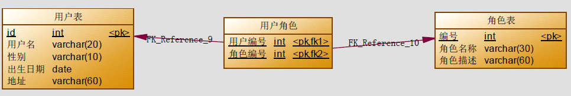

## 1.Mybatis 多表查询之一对一（掌握）

关联描述中：是双向分别描述的，从哪方去看，哪方就是主体

User和Account的关系需要在主体是哪方：

​	从User方看双方关系：一对多关系

​	从Account方看关系：一对一关系

本次案例主要以最为简单的用户和账户的模型来分析Mybatis 多表关系。用户为User 表，账户为Account
表。

一对一关系：

​		一个账户（Account）只能属于一个用户（User）

​		一个书籍（Book）只有一个作者（Author）

基于主键设计：


基于外键：

​	


### 1.1 一对一查询(多对一)

需求
	查询所有账户信息，关联查询用户信息。
注意：
	因为一个账户信息只能供某个用户使用，所以从查询账户信息出发关联查询用户信息为一对一查询。如
果从用户信息出发查询用户下的账户信息则为一对多查询，因为一个用户可以有多个账户。

#### 2.1.1 方式一：通过继承方式

##### 2.1.1.1 定义账户信息的实体类

```java
public class Account implements Serializable{
    private Integer id;
    private Integer uid;
    private Double money;

    public Integer getId() {
        return id;
    }

    public void setId(Integer id) {
        this.id = id;
    }

    public Integer getUid() {
        return uid;
    }

    public void setUid(Integer uid) {
        this.uid = uid;
    }

    public Double getMoney() {
        return money;
    }

    public void setMoney(Double money) {
        this.money = money;
    }

    @Override
    public String toString() {
        return "Account{" +
                "id=" + id +
                ", uid=" + uid +
                ", money=" + money +
                '}';
    }
}
```

##### 2.1.1.2 编写Sql语句 

实现查询账户信息时，也要查询账户所对应的用户信息。 

```sql
SELECT account.*, user.username, user.address FROM account, user WHERE account.uid = user.id 
```

在MySQL中测试的查询结果如下：


##### 2.1.1.3 定义AccountUser类 

为了能够封装上面SQL语句的查询结果，定义类中要包含账户信息同时还要包含用户信息，所以我们要在定义AccountUser类时可以继承Account类。

```java
public class AccountUser extends Account implements Serializable {
    private String username;
    private String address;

    public String getUsername() {
        return username;
    }

    public void setUsername(String username) {
        this.username = username;
    }

    public String getAddress() {
        return address;
    }

    public void setAddress(String address) {
        this.address = address;
    }

    @Override
    public String toString() {
        return super.toString() + "AccountUser{" +
                "username='" + username + '\'' +
                ", address='" + address + '\'' +
                '}';
    }
}
```

##### 2.1.1.4 定义账户的持久层Dao接口 

```java
public interface AccountDao {
    /** 
     * 查询所有账户，同时获取账户的所属用户名称以及它的地址信息 
     * @return 
     */ 
    List<AccountUser> findAll();
}
```

##### 2.1.1.5 定义AccountDao.xml文件中的查询配置信息 

```xml
<?xml version="1.0" encoding="UTF-8" ?>
<!DOCTYPE mapper
        PUBLIC "-//mybatis.org//DTD Mapper 3.0//EN"
        "http://mybatis.org/dtd/mybatis-3-mapper.dtd">
<mapper namespace="com.yaorange.mapper.AccountDao"> 
    <!-- 配置查询所有操作--> 
    <select id="findAll" resultType="Accountuser"> 
        select a.*,u.username,u.address from account a,user u where a.uid =u.id; 
    </select> 
</mapper>
```

注意：因为上面查询的结果中包含了账户信息同时还包含了用户信息，所以我们的返回值类型returnType的值设置为AccountUser类型，这样就可以接收账户信息和用户信息了。

##### 2.1.1.6 在SqlMapConfig.xml中配置映射文件

```xml
	<mappers>
        <mapper resource="sqlmap/UserDao.xml"/>
        <mapper resource="sqlmap/AccountDao.xml"/>
    </mappers>
```

##### 2.1.1.7 创建AccountTest测试类 

```java
	@Test
	public void findAll() throws IOException {
		//1.读取配置文件
        InputStream in = Resources.getResourceAsStream("SqlMapConfig.xml");
        //2.创建SqlSessionFactory的构建者对象
        SqlSessionFactoryBuilder builder = new SqlSessionFactoryBuilder();
        //3.使用构建者创建工厂对象SqlSessionFactory
        SqlSessionFactory factory = builder.build(in);
        //4.使用SqlSessionFactory生产SqlSession对象
        SqlSession session = factory.openSession();
        //5.创建Dao的代理对象
        AccountDao accountDao = session.getMapper(AccountDao.class);
        //6.执行查询方法
        List<AccountUser> accountUsers = accountDao.findAll();
        for(AccountUser accountUser : accountUsers){
            System.out.println(accountUser);
        }
        //7.释放资源
        session.close();
        in.close();
	}
```

##### 2.1.1.8 小结： 

定义专门的po类作为输出类型，其中包含了sql查询结果集所有的字段（本次是通过继承实体）。此方法较为简单，企业中使用普遍。不建议

#### 2.1.2 方式二 

使用resultMap，定义专门的resultMap用于映射一对一查询结果。

 通过面向对象的(has a)关系可以得知，我们可以在Account类中加入一个User类的对象来代表这个账户是哪个用户的。

##### 2.1.2.1 修改Account类

在Account类中加入User类的对象作为Account类的一个属性。 

```java
public class Account implements Serializable{
    private Integer id;
    private Integer uid;
    private Double money;
    private User user;

    public User getUser() {
        return user;
    }

    public void setUser(User user) {
        this.user = user;
    }

    public Integer getId() {
        return id;
    }

    public void setId(Integer id) {
        this.id = id;
    }

    public Integer getUid() {
        return uid;
    }

    public void setUid(Integer uid) {
        this.uid = uid;
    }

    public Double getMoney() {
        return money;
    }

    public void setMoney(Double money) {
        this.money = money;
    }

    @Override
    public String toString() {
        return "Account{" +
                "id=" + id +
                ", uid=" + uid +
                ", money=" + money +
                ", user=" + user +
                '}';
    }
}
```

##### 2.1.2.2 修改AccountDao接口中的方法 

```java
	/** 
     * 查询所有账户，同时获取账户的所属用户名称以及它的地址信息 
     * @return 
     */ 
    List<Account> findAll();
```

 注意：第二种方式，将返回值改 为了Account类型。 

因为Account类中包含了一个User类的对象，它可以封装账户所对应的用户信息。

##### 2.1.2.3 重新定义AccountDao.xml文件 

```xml
<?xml version="1.0" encoding="UTF-8" ?>
<!DOCTYPE mapper
        PUBLIC "-//mybatis.org//DTD Mapper 3.0//EN"
        "http://mybatis.org/dtd/mybatis-3-mapper.dtd">
<mapper namespace="com.yaorange.mapper.AccountDao">
    <!-- 配置查询所有操作-->
    <select id="findAll" resultMap="accountMap">
        select a.*,u.username,u.address from account a,user u where a.uid =u.id;
    </select>

    <!-- 建立对应关系 -->
    <resultMap type="Account" id="accountMap">
        <id column="aid" property="id"/>
        <result column="uid" property="uid"/>
        <result column="money" property="money"/>
        <!-- 它是用于指定从表方的引用实体属性的 -->
        <association property="user" javaType="User">
            <id column="id" property="id"/>
            <result column="username" property="username"/>
            <result column="sex" property="sex"/>
            <result column="birthday" property="birthday"/>
            <result column="address" property="address"/>
        </association>
    </resultMap>
</mapper>
```

##### 2.1.2.4 在AccountTest类中加入测试方法 

```java
	@Test
    public void findAll() throws IOException {
        //1.读取配置文件
        InputStream in = Resources.getResourceAsStream("SqlMapConfig.xml");
        //2.创建SqlSessionFactory的构建者对象
        SqlSessionFactoryBuilder builder = new SqlSessionFactoryBuilder();
        //3.使用构建者创建工厂对象SqlSessionFactory
        SqlSessionFactory factory = builder.build(in);
        //4.使用SqlSessionFactory生产SqlSession对象
        SqlSession session = factory.openSession();
        //5.创建Dao的代理对象
        AccountDao accountDao = session.getMapper(AccountDao.class);
        //6.执行查询方法
        List<Account> accounts = accountDao.findAll();
        for(Account account : accounts){
            System.out.println(account);
        }
        //7.释放资源
        session.close();
        in.close();
    }
```

### 1.2 懒加载（延迟加载）

在上面的使用方式中，都是一次性将所有数据都进行查询获取，然后在ResultMap中进行映射，如果一对一查询中，关联属性user,使用的不是很频繁，而是偶尔使用，那么可以进行延迟加载配置

懒加载（延迟加载）：也就是先查询账户Account，查询Account时不查询User，当程序中在需要使用User属性的数据时再去查询User

#### 定义接口：

AccountMapper：添加方法

```java
Account getAccountById(Integer id);
```

UserMapper：添加方法

```java
User getUserById(Integer id);
```

#### 配置映射文件：

AccountMapper.xml

```xml
	<!--公共字段-->
    <sql id="accountColums">
        id,money,uid
    </sql>
    <!--通过id查询账户-->
    <select id="getAccountById" resultMap="accountMap1">
        select <include refid="accountColums"/> from account where id=#{id}
    </select>
    <!--优化配置-->
    <resultMap id="baseResultMap" type="Account">
        <!--映射当前实体的本身字段-->
        <id column="id" property="id"/>
        <result column="money" property="money"/>
    </resultMap>
    <!--账户查询结果映射-->
    <resultMap id="accountMap1" type="Account" extends="baseResultMap">
        <!--映射关联对象属性：association：映射对象属性的，collection：映射对象集合属性的-->
        <!--嵌套查询方式配置：延迟加载只能在嵌套查询中配置-->
        <!--column:指定用于嵌套查询的参数字段名-->
        <!--select:指定嵌套查询的语句：namespace+id-->
        <!--fetchType:指定嵌套查询的加载方式，值为lazy（延迟加载） 和 eager（及时加载）-->
        <association property="user" javaType="User" column="uid" select="com.yaorange.mapper.UserMapper.getUserById" fetchType="lazy">
        </association>
    </resultMap>
```

UserMapper.xml:

```xml
<?xml version="1.0" encoding="UTF-8" ?>
<!DOCTYPE mapper
        PUBLIC "-//mybatis.org//DTD Mapper 3.0//EN"
        "http://mybatis.org/dtd/mybatis-3-mapper.dtd">
<mapper namespace="com.yaorange.mapper.UserMapper">
    <!--公共字段-->
    <sql id="userColums">
        id,username,sex,birthday,address
    </sql>
    
    <!--通过id查询用户-->
    <select id="getUserById" resultType="User">
        select <include refid="userColums"/> from user where id=#{uid}
    </select>
</mapper>
```

##### 配置全局文件

官方文档：https://mybatis.org/mybatis-3/zh/configuration.html#settings


```xml
	<settings>
        <!--开启延迟加载-->
        <setting name="lazyLoadingEnabled" value="true"/>
        <!--配置触发延迟加载语句的执行的方法:覆盖默认配置，避免调用toString会触发延迟加载语句执行-->
        <setting name="lazyLoadTriggerMethods" value="equals,clone,hashCode"/>
    </settings>
```

#### 测试代码

```java
@Test
    public void getAccountByIDTest() {
        AccountMapper mapper = sqlSession.getMapper(AccountMapper.class);
        Account account = mapper.getAccountById(2);
        System.out.println(account);//不会执行延迟加载属性，因为没有使用延迟加载关联属性的数据
        //执行下面代码时会触发延迟加载语句的执行：因为只要使用的延迟加载关联的属性时就执行语句
//        System.out.println(account.getUser());
    }
```


## 2. Mybatis 多表查询之一对多（掌握）

### 2.1 一对多查询 

需求： 

​		查询所有用户信息及用户关联的账户信息。 

分析： 

​		用户信息和他的账户信息为一对多关系，并且查询过程中如果用户没有账户信息，此时也要将用户信息查询出来，我们想到了左外连接查询比较合适。

同理：

​	用户和角色：一个用户可以有多个角色

​	订单和订单项：一个订单有多个订单项

#### 2.1.1 编写SQL语句 

```
SELECT u.*, acc.id id, acc.uid, acc.money FROM user u LEFT JOIN account acc ON u.id = acc.uid
```

测试该SQL语句在MySQL客户端工具的查询结果如下：


理解简单连接和左右外连接测试语句：

```sql
SELECT u.*, acc.id id, acc.uid, acc.money FROM user u LEFT JOIN account acc ON u.id = acc.uid;
SELECT u.*, acc.id id, acc.uid, acc.money FROM user u RIGHT JOIN account acc ON u.id = acc.uid;
SELECT u.*, acc.id id, acc.uid, acc.money FROM user u , account acc where u.id = acc.uid;
```

#### 2.1.2 User类加入List<Account> 

一对一关联：使用的关联属性是对象属性（描述一）

一对多关联：使用的关联属性是对象集合属性（描述多）

```java
public class User implements Serializable{
    private int id;
    private String username;// 用户姓名
    private String sex;// 性别
    private Date birthday;// 生日
    private String address;// 地址
    private List<Account> accounts;

    public List<Account> getAccounts() {
        return accounts;
    }

    public void setAccounts(List<Account> accounts) {
        this.accounts = accounts;
    }

    public int getId() {
        return id;
    }

    public void setId(int id) {
        this.id = id;
    }

    public String getUsername() {
        return username;
    }

    public void setUsername(String username) {
        this.username = username;
    }

    public String getSex() {
        return sex;
    }

    public void setSex(String sex) {
        this.sex = sex;
    }

    public Date getBirthday() {
        return birthday;
    }

    public void setBirthday(Date birthday) {
        this.birthday = birthday;
    }

    public String getAddress() {
        return address;
    }

    public void setAddress(String address) {
        this.address = address;
    }

    @Override
    public String toString() {
        return "User{" +
                "id=" + id +
                ", username='" + username + '\'' +
                ", sex='" + sex + '\'' +
                ", birthday=" + birthday +
                ", address='" + address + '\'' +
                ", accounts=" + accounts +
                '}';
    }
}
```

#### 2.1.3 用户持久层Dao接口中加入查询方法 

```java
/** 
* 查询所有用户，同时获取出每个用户下的所有账户信息 
* @return 
*/ 
List<User> findAll();
```

#### 2.1.4 用户持久层Dao映射文件配置 

```xml
<?xml version="1.0" encoding="UTF-8" ?>
<!DOCTYPE mapper
        PUBLIC "-//mybatis.org//DTD Mapper 3.0//EN"
        "http://mybatis.org/dtd/mybatis-3-mapper.dtd">
<mapper namespace="com.yaorange.mapper.UserDao">
    <!-- 配置查询所有操作 -->
    <select id="findAll" resultMap="userMap">
        select u.*,a.id as aid ,a.uid,a.money from user u left outer join account a on u.id =a.uid
    </select>
    <!--配置结果映射-->
    <resultMap type="User" id="userMap">
        <id column="id" property="id"></id>
        <result column="username" property="username"/>
        <result column="address" property="address"/>
        <result column="sex" property="sex"/>
        <result column="birthday" property="birthday"/>
        <!-- collection是用于建立一对多中集合属性的对应关系 ofType用于指定集合元素的数据类型 -->
        <collection property="accounts" ofType="Account">
            <id column="aid" property="id"/>
            <result column="uid" property="uid"/>
            <result column="money" property="money"/>
        </collection>
    </resultMap>
</mapper>
```

collection ：

​		部分定义了用户关联的账户信息。表示关联查询结果集 

property="accList"： 

​		关联查询的结果集存储在User对象的上哪个属性。 

ofType="account"： 

​		指定关联查询的结果集中的对象类型即List中的对象类型。此处可以使用别名，也可以使用全限定名。

#### 2.2.5 测试方法 

```java
	@Test
    public void findAll() throws IOException {
        //1.读取配置文件
        InputStream in = Resources.getResourceAsStream("SqlMapConfig.xml");
        //2.创建SqlSessionFactory的构建者对象
        SqlSessionFactoryBuilder builder = new SqlSessionFactoryBuilder();
        //3.使用构建者创建工厂对象SqlSessionFactory
        SqlSessionFactory factory = builder.build(in);
        //4.使用SqlSessionFactory生产SqlSession对象
        SqlSession session = factory.openSession();
        //5.创建Dao的代理对象
        UserDao userDao = session.getMapper(UserDao.class);
        //6.执行查询方法
        List<User> users = userDao.findAll();
        for(User user : users) {
            System.out.println("-------每个用户的内容---------");
            System.out.println(user);
            System.out.println(user.getAccounts());
        }
        //7.释放资源
        session.close();
        in.close();
    }
```

## 3. Mybatis 多表查询之多对多（掌握）

### 3.1 实现Role 到User 多对多

通过前面的学习，我们使用Mybatis 实现一对多关系的维护。多对多关系其实我们看成是双向的一对多关
系。

同理:学生和课程：也是多对多关系，一个学生可以有多个课程，一个课程中可以有多个学生

多对多就是通过双向查询：通过学生查询课程，也可以通过课程查询学生

而一对一和一对多都是描述单向查询：通过账户查询用户是一对一（多对一），通过用户查询账户是一对多

#### 3.1.1 用户与角色的关系模型

用户与角色的多对多关系模型如下：

在MySQL 数据库中添加角色表，用户角色的中间表。
角色表

用户角色中间表


#### 3.1.2 业务要求及实现SQL 

需求： 

​		实现查询所有角色并且加载它所分配的用户信息。 

分析： 

​		查询角色我们需要用到Role表，但角色分配的用户的信息我们并不能直接找到用户信息，而是要通过中间表(USER_ROLE表)才能关联到用户信息。 

下面是实现的SQL语句： 

**内连接**

```sql
SELECT r.*,u.id uid, u.username username, u.birthday birthday, u.sex sex, u.address address FROM ROLE r 
INNER JOIN USER_ROLE ur ON ( r.id = ur.rid) 
INNER JOIN USER u ON (ur.uid = u.id);
```

语句相当于：

select r.*,u.id uid, u.username username, u.birthday birthday, u.sex sex, u.address address FROM ROLE r,USER_ROLE ur,USER u where r.id = ur.rid and ur.uid = u.id;

**左外连**

```sql
select u.*,r.id as rid,r.role_name,r.role_desc from role r
        left join user_role ur on r.id = ur.rid
        left join user u on u.id = ur.uid;
```

通过分析查询所有时需要使用外连接（本次选择左外连接）

#### 3.1.3 编写角色实体类 

```java
public class Role implements Serializable {
    private Integer roleId;
    private String roleName;
    private String roleDesc; 
    //多对多的关系映射：一个角色可以赋予多个用户 
    private List<User> users;

    public Integer getRoleId() {
        return roleId;
    }

    public void setRoleId(Integer roleId) {
        this.roleId = roleId;
    }

    public String getRoleName() {
        return roleName;
    }

    public void setRoleName(String roleName) {
        this.roleName = roleName;
    }

    public String getRoleDesc() {
        return roleDesc;
    }

    public void setRoleDesc(String roleDesc) {
        this.roleDesc = roleDesc;
    }

    public List<User> getUsers() {
        return users;
    }

    public void setUsers(List<User> users) {
        this.users = users;
    }

    @Override
    public String toString() {
        return "Role{" +
                "roleId=" + roleId +
                ", roleName='" + roleName + '\'' +
                ", roleDesc='" + roleDesc + '\'' +
                ", users=" + users +
                '}';
    }
}
```

#### 3.1.4 编写Role持久层接口 

```java
public interface RoleDao {
    /** 
     * 查询所有角色 
     * @return 
     */ 
    List<Role> findAll();
}
```

#### 3.1.5 编写映射文件 

```xml
<?xml version="1.0" encoding="UTF-8" ?>
<!DOCTYPE mapper
        PUBLIC "-//mybatis.org//DTD Mapper 3.0//EN"
        "http://mybatis.org/dtd/mybatis-3-mapper.dtd">
<mapper namespace="com.yaorange.mapper.RoleDao">
    <!--查询所有-->
    <select id="findAll" resultMap="roleMap">
        select u.*,r.id as rid,r.role_name,r.role_desc from role r
        left outer join user_role ur on r.id = ur.rid
        left outer join user u on u.id = ur.uid
    </select>

    <!--定义role表的ResultMap--> 
    <resultMap id="roleMap" type="Role"> 
        <id property="roleId" column="rid"/> 
        <result property="roleName" column="role_name"/> 
        <result property="roleDesc" column="role_desc"/> 
        <collection property="users" ofType="User"> 
            <id column="id" property="id"/> 
            <result column="username" property="username"/> 
            <result column="address" property="address"/> 
            <result column="sex" property="sex"/> 
            <result column="birthday" property="birthday"/> 
        </collection> 
    </resultMap>
</mapper>
```

#### 3.1.6 编写测试类 

```java
	@Test
    public void findAll() throws IOException {
        //1.读取配置文件
        InputStream in = Resources.getResourceAsStream("SqlMapConfig.xml");
        //2.创建SqlSessionFactory的构建者对象
        SqlSessionFactoryBuilder builder = new SqlSessionFactoryBuilder();
        //3.使用构建者创建工厂对象SqlSessionFactory
        SqlSessionFactory factory = builder.build(in);
        //4.使用SqlSessionFactory生产SqlSession对象
        SqlSession session = factory.openSession();
        //5.创建Dao的代理对象
        RoleDao roleDao = session.getMapper(RoleDao.class);
        //6.执行查询方法
        List<Role> roles = roleDao.findAll();
        for(Role role : roles){
            System.out.println("---每个角色的信息----");
            System.out.println(role);
            System.out.println(role.getUsers());
        }
        //7.释放资源
        session.close();
        in.close();
    }
```


