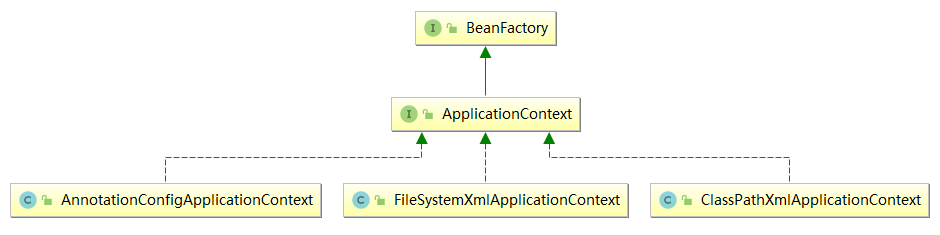

## 第1章 Spring概述

### 1.1 spring概述[了解]

#### 1.1.1 spring是什么


**总结：Spring是一个轻量级控制反转(IoC)和面向切面(AOP)的容器框架。**

#### 1.1.2 Spring的发展历程

1997年IBM提出了EJB的思想
1998年，SUN制定开发标准规范EJB1.0
1999年，EJB1.1发布
2001年，EJB2.0发布
2003年，EJB2.1发布
2006年，EJB3.0发布


EJB：在JavaEE中的为了实现松耦合的中间件，也就是将所有JavaBean存放在EJB容器中进行统一管理，在运行时实现程序各个组件（也就是JavaBean）的关联

###### Rod Johnson（spring之父）


​	Expert One-to-One J2EE Design and Development(2002)
​		阐述了J2EE使用EJB开发设计的优点及解决方案
​	Expert One-to-One J2EE Development without EJB(2004)
​		阐述了J2EE开发不使用EJB的解决方式（Spring雏形）

#### 1.1.3 为什么学习 Spring（完整学完后都应该理解的）

- ##### IOC，方便解耦，简化开发 （高内聚低耦合）

> Spring 就是一个大工厂（容器），可以将所有对象创建和依赖关系的维护，交给 Spring 管理
>
> spring 工厂是用于生成 bean

- ##### AOP （面向切面）编程的支持

> Spring 提供面向切面编程，可以方便的实现对程序进行权限拦截、运行监控等功能

- ##### 声明式事务的支持

> 只需要通过配置就可以完成对事务的管理，而无需手动编程

- ##### 方便程序的测试

> Spring 对 Junit4 （5版本可以使用Junit5）支持，可以通过注解方便的测试 Spring 程序

- ##### 方便集成各种优秀框架（使用的核心原因）

> Spring 不排斥各种优秀的开源框架，其内部提供了对各种优秀框架（如：Struts、Hibernate、MyBatis、Quartz 等）的直接支持

- ##### 降低 JavaEE API 的使用难度

> Spring 对 JavaEE 开发中非常难用的一些 API（JDBC、JavaMail、远程调用等），都提供了封装，使这些 API 应用难度大大降低

#### 1.1.4 Spring 的版本

在本阶段课程使用的版本：5.1.*（5.1.9）

Spring 3/4/5

> 官网：[https://spring.io/projects/spring-framework](#)


#### 1.1.5 spring的体系结构（面试中应该掌握）


## 第2章 IOC的概念和作用

### 2.1 程序的耦合和解耦[理解]

#### 2.1.1 什么是程序的耦合 

​		耦合性(Coupling)，也叫耦合度，是对模块间关联程度的度量。耦合的强弱取决于模块间接口的复杂性、调用模块的方式以及通过界面传送数据的多少。模块间的耦合度是指模块之间的依赖关系，包括控制关系、调用关系、数据传递关系。模块间联系越多，其耦合性越强，同时表明其独立性越差( 降低耦合性，可以提高其独立性)。耦合性存在于各个领域，而非软件设计中独有的，但是我们只讨论软件工程中的耦合。 

​		在软件工程中，耦合指的就是就是对象之间的依赖性。对象之间的耦合越高，维护成本越高。因此对象的设计应使类和构件之间的耦合最小。软件设计中通常用耦合度和内聚度作为衡量模块独立程度的标准。

###### 划分模块的一个准则就是高内聚低耦合。  

###### 内聚与耦合 

​		内聚标志一个模块内各个元素彼此结合的紧密程度，它是信息隐蔽和局部化概念的自然扩展。内聚是从功能角度来度量模块内的联系，一个好的内聚模块应当恰好做一件事（类的完整性）。它描述的是模块内的功能联系。耦合是软件结构中各模块之间相互连接的一种度量，耦合强弱取决于模块间接口的复杂程度、进入或访问一个模块的点以及通过接口的数据。 **程序讲究的是低耦合，高内聚**。就是同一个模块内的各个元素之间要高度紧密，但是各个模块之间的相互依存度却要不那么紧密。 

内聚和耦合是密切相关的，同其他模块存在高耦合的模块意味着低内聚，而高内聚的模块意味着该模块同其他模块之间是低耦合。在进行软件设计时，应力争做到高内聚，低耦合。

###### 我们在开发中，有些依赖关系是必须的，有些依赖关系可以通过优化代码来解除的。 

```java
请看下面的示例代码： 
/* 账户的业务层实现类 */ 
public class AccountServiceImpl implements IAccountService { 
	private IAccountDao accountDao = new AccountDaoImpl(); 
} 
上面的代码表示： 业务层调用持久层，并且此时业务层在依赖持久层的接口和实现类。如果此时没有持久层实现类，编译将不能通过。这种编译期依赖关系，应该在我们开发中杜绝。我们需要优化代码解决。
```

```java
再比如： 
	早期我们的JDBC操作，注册驱动时，我们为什么不使用DriverManager的register方法，而是采用Class.forName的方式？ 
public class JdbcDemo1 { 
	public static void main(String[] args) throws Exception { 
		//1.注册驱动 
		//DriverManager.registerDriver(new com.mysql.jdbc.Driver()); 					         Class.forName("com.mysql.jdbc.Driver"); 
		//2.获取连接 
		//3.获取预处理sql语句对象 
		//4.获取结果集 
		//5.遍历结果集 
	} 
} 
原因就是： 我们的类依赖了数据库的具体驱动类（MySQL），如果这时候更换了数据库品牌（比如Oracle），需要修改源码来重新数据库驱动。这显然不是我们想要的。
```

#### 2.1.2 解决程序耦合的思路 

```java
	当是我们讲解jdbc时，是通过反射来注册驱动的，代码如下： 
	Class.forName("com.mysql.jdbc.Driver");//此处只是一个字符串
	此时的好处是，我们的类中不再依赖具体的驱动类，此时就算删除mysql的驱动jar包，依然可以编译（运行就不要想了，没有驱动不可能运行成功的）。 
	同时，也产生了一个新的问题，mysql驱动的全限定类名字符串是在java类中写死的，一旦要改还是要修改源码。
    
	解决这个问题也很简单，使用配置文件配置。
```

#### 2.1.3 工厂模式解耦 

​		在实际开发中我们可以把三层的对象都使用配置文件配置起来，当启动服务器应用加载的时候，让一个类中的方法通过读取配置文件，把这些对象创建出来并存起来。在接下来的使用的时候，直接拿过来用就好了。 

​		那么，这个读取配置文件，创建和获取三层对象的类就是工厂。

#### 2.1.4 Spring模拟实现

bean.xml

```xml
<beans>
    <bean id="userService" class="com.yaorange.spring.demo2.UserService2Impl"/>
</beans>
```

BeanFactory

```java
import org.dom4j.Document;
import org.dom4j.DocumentException;
import org.dom4j.Element;
import org.dom4j.Node;
import org.dom4j.io.SAXReader;

import java.net.URL;

public class BeanFactory {
	public Object getBean(String id) {
		Object result = null;
		//根据id到bean.xml中去找对应的class
		SAXReader reader = new SAXReader();
		URL resource = BeanFactory.class.getClassLoader().getResource("bean.xml");
		try {
			Document document = reader.read(resource);
			Element element = (Element) document.selectSingleNode("//bean[@id='" + id + "']");
			String classez = element.attributeValue("class");
			Class<?> aClass = Class.forName(classez);
			result = aClass.newInstance();
		} catch (DocumentException e) {
			e.printStackTrace();
		} catch (ClassNotFoundException e) {
			e.printStackTrace();
		} catch (IllegalAccessException e) {
			e.printStackTrace();
		} catch (InstantiationException e) {
			e.printStackTrace();
		}
		//根据反射实例化class
		return result;
	}
}
```

BeanFactoryTest

```java
public class BeanFactoryTest {
	public static void main(String[] args) {
		BeanFactory factory = new BeanFactory();

		UserService userService = (UserService)factory.getBean("userService");

		userService.print();
	}
}
```

#### 2.1.4 控制反转-Inversion Of Control 

​		上一小节解耦的思路有2个问题： 

###### 1、存哪去？ 

​		分析：由于我们是很多对象，肯定要找个集合来存。这时候有Map和List供选择。 到底选Map还是List就看我					们有没有查找需求。**有查找需求，选Map**。 

​		所以我们的答案就是 

​					在应用加载时，创建一个Map，用于存放三层对象。 

​					我们把这个map称之为**容器**。 

###### 2、还是没解释什么是工厂？ 

​		工厂就是负责给我们从容器中获取指定类的对象。这时候我们获取对象的方式发生了改变。

​		原来： 我们在获取对象时，都是采用new的方式。**是主动的**。


​		现在： 我们获取对象时，同时跟工厂要，有工厂为我们查找或者创建对象。**是被动的**。


**这种被动接收的方式获取对象的思想就是控制反转，它是spring框架的核心之一。**

**明确ioc的作用：**

 削减计算机程序的耦合(解除我们代码中的依赖关系)。有IOC的地方一定会进行DI操作（**IOC的目的就是为了DI**）

## 第3章 使用spring的IOC解决程序耦合

### 3.1 案例的前期准备[会用] 

​		本章我们使用的案例是，账户的业务层和持久层的依赖关系解决。在开始spring的配置之前，我们要先准备一下环境。由于我们是使用spring解决依赖关系，并不是真正的要做增删改查操作，所以此时我们没必要写实体类。并且我们在此处使用的是java工程，不是java web工程。

#### 3.1.1 准备spring的开发包 

官网：http://spring.io/ 

下载地址： http://repo.springsource.org/libs-release-local/org/springframework/spring 

解压:(Spring目录结构:) 

- docs :API和开发规范.

* libs :jar包和源码. 

* schema :约束.

  我们上课使用的版本是spring5.1.9。 

**特别说明：** 

**spring5版本是用jdk8编写的，所以要求我们的jdk版本是8及以上。 同时tomcat的版本要求8.5及以上。**

#### Maven操作:

1.创建Maven项目


#### 3.1.2 创建业务层接口和实现类 

```java
/* 账户的业务层接口 */
public interface IAccountService {
    /*保存账户（此处只是模拟，并不是真的要保存） */
    void saveAccount();
}
/* 账户的业务层实现类 */
public class IAccountServiceImpl implements IAccountService {
    private IAccountDao accountDao = new IAccountDaoImpl();//此处的依赖关系有待解决 			@Override
    @Override
    public void saveAccount() {
        accountDao.saveAccount();
    }
}
```

#### 3.1.3 创建持久层接口和实现类

```java
/*账户的持久层接口*/
public interface IAccountDao {
    /** * 保存账户 */
    void saveAccount();
} 
/*账户的持久层实现类 */
public class IAccountDaoImpl implements IAccountDao {
    @Override
    public void saveAccount() {
        System.out.println("保存了账户");
    }
}
```

### 3.2 基于XML的配置（入门案例）[掌握]

#### 3.2.1 第一步：添加依赖：

```xml
	<dependencies>
        <!--Maven会自动添加当前jar依赖的其他jar-->
        <dependency>
            <groupId>org.springframework</groupId>
            <artifactId>spring-context</artifactId>
            <version>5.1.9.RELEASE</version>
        </dependency>
    </dependencies>
```

#### 3.2.2 第二步：在类的根路径下创建一个任意名称的xml文件（不能是中文）


```xml
给配置文件导入约束： 
spring-framework-5.1.9.RELEASE-dist.zip\spring-framework-5.1.9.RELEASE\docs\spring-framework-reference\core.html
```


```xml
<?xml version="1.0" encoding="UTF-8"?> 
<beans xmlns="http://www.springframework.org/schema/beans" 				         xmlns:xsi="http://www.w3.org/2001/XMLSchema-instance" 	xsi:schemaLocation="http://www.springframework.org/schema/beans 	http://www.springframework.org/schema/beans/spring-beans.xsd"> 
</beans>
```

#### 3.2.3 第三步：让spring管理资源，在配置文件中配置service和dao 

```xml
<!-- bean标签：用于配置让spring创建对象，并且存入ioc容器之中 
	id属性：对象的唯一标识。 
	class属性：指定要创建对象的全限定类名 
--> 
<!-- 配置service --> 
<bean id="accountService" class="com.itheima.service.impl.AccountServiceImpl"> </bean> 
<!-- 配置dao --> 
<bean id="accountDao" class="com.itheima.dao.impl.AccountDaoImpl"></bean>
```

#### 3.2.4 测试配置是否成功 

```java
/*模拟一个业务层 */ 
public class Client { 
	/*使用main方法获取容器测试执行*/ 
	public static void main(String[] args) { 
		//1.使用ApplicationContext接口，就是在获取spring容器 
		ApplicationContext ac = new ClassPathXmlApplicationContext("bean.xml"); 
		//2.根据bean的id获取对象 
		IAccountService aService = (IAccountService)ac.getBean("accountService"); 
		System.out.println(aService); 
		IAccountDao aDao = (IAccountDao) ac.getBean("accountDao"); 
		System.out.println(aDao); 
    } 
} 
```

运行结果：

自行测试

## 3.3 Spring基于XML的IOC细节（掌握）

### 3.3.1 spring中工厂的类结构图


#### 3.3.1.1 BeanFactory 和ApplicationContext 的区别


BeanFactory 才是Spring 容器中的顶层接口。
ApplicationContext 是它的子接口。
BeanFactory 和ApplicationContext 的区别：
		**创建对象的时间点不一样**。
				ApplicationContext：只要一读取配置文件，默认情况下就会创建对象。
				BeanFactory：什么时候使用什么时候创建对象。

#### 3.3.1.2 ApplicationContext 接口的实现类



**ClassPathXmlApplicationContext：**
		它是从类的根路径下加载配置文件 推荐使用这种
**FileSystemXmlApplicationContext：**
		它是从磁盘路径上加载配置文件，配置文件可以在磁盘的任意位置。
**AnnotationConfigApplicationContext:**
		当我们使用注解配置容器对象时，需要使用此类来创建spring 容器。它用来读取注解。

### 3.3.2 IOC中bean标签和管理对象细节

#### 3.3.2.1 bean标签 

作用：

​		用于配置对象让spring来创建的。

​		**默认情况**下它调用的是类中的无参构造函数。如果没有无参构造函数则不能创建成功。 

属性： 

​		id：给对象在容器中提供一个唯一标识。用于获取对象。 

​		name：给对象在容器中提供一个标识（在一般情况意义和id相同）。用于获取对象。 

​		class：指定类的全限定类名。用于反射创建对象。默认情况下调用无参构造函数。 

​		scope：指定对象的作用范围。 

​				**singleton :默认值，单例的.** （整个容器中只有一个对象）

​				**prototype :多例的.** （Spring容器中存在多个对象）

​				request :WEB项目中,Spring创建一个Bean的对象,将对象存入到request域中. 

​				session :WEB项目中,Spring创建一个Bean的对象,将对象存入到session域中. 

​				global session :WEB项目中,应用在Portlet环境.如果没有Portlet环境那么globalSession相当于session. 

​		init-method：指定类中的初始化方法名称。在构造函数执行后会执行当前属性指定的任意方法

​		destroy-method：指定类中销毁方法名称。在类对象销毁时执行的方法

##### 测试初始化和销毁方法：

```java
package com.yaorange.dao.impl;

import com.yaorange.dao.AccountDao;

public class AccountDaoImpl implements AccountDao {
    public AccountDaoImpl() {
        System.out.println("DAO对象创建.....");
    }

    public void init(){
        System.out.println("初始化方法....");
    }

    public void desstroy(){
        System.out.println("销毁方法.....");
    }
    public void addAccount() {
        System.out.println("账户新增........");
    }
}
```

```xml
    <bean id="accountDao" class="com.yaorange.dao.impl.AccountDaoImpl" init-method="init" destroy-method="desstroy"/>
```

**测试代码：**

```java
package com.yaorange.test;

import com.yaorange.dao.AccountDao;
import org.springframework.context.ApplicationContext;
import org.springframework.context.support.ClassPathXmlApplicationContext;

import java.util.Scanner;

public class SpringIOCTest {
    public static void main(String[] args) {
        ApplicationContext applicationContext = new ClassPathXmlApplicationContext("beans.xml");
        AccountDao accountDao = (AccountDao) applicationContext.getBean("accountDao");
        accountDao.addAccount();
        //关闭容器时，会销毁对象，对象就会调用销毁方法
        ((ClassPathXmlApplicationContext) applicationContext).close();
    }
}
```

#### 3.3.2.2 bean的作用范围和生命周期 

**单例对象：scope="singleton"** 

​		一个应用只有一个对象的实例。它的作用范围就是整个引用。

​		生命周期： 

​				**对象出生：当应用加载，创建容器时，对象就被创建了。** 

​				对象活着：只要容器在，对象一直活着。 

​				**对象死亡：当应用卸载，销毁容器时，对象就被销毁了。** 

**多例对象：scope="prototype"** 

​		每次访问对象时（getBean），都会重新创建对象实例。 

​		生命周期： 

​			**对象出生：当使用对象时（getBean），创建新的对象实例。** 

​			对象活着：只要对象在使用中，就一直活着。 

​			**对象死亡：当对象长时间不用时，被java的垃圾回收器回收了。**

#### 3.3.2.3 实例化Bean（创建对象）的三种方式

**第一种方式：使用默认无参构造函数** **（常用方式）**

```xml
<!--在默认情况下：它会根据默认无参构造函数（默认构造函数）来创建类对象。如果bean中没有默认无参构造函数，将会创建失败。-->
<bean id="accountService" class="com.itheima.service.impl.AccountServiceImpl"/>
```

**第二种方式：spring管理静态工厂-使用静态工厂的方法创建对象**（偶尔会使用）

需要自定义一个静态工厂类：工厂提供用于创建对象的静态方法

```java
/*模拟一个静态工厂，创建业务层实现类 */ 
public class StaticFactory { 
	public static IAccountService createAccountService(){ 
        return new AccountServiceImpl(); 
    } 
} 
<!-- 此种方式是: 使用StaticFactory类中的静态方法createAccountService创建对象，并存入spring容器 
	id属性：指定bean的id，用于从容器中获取 
	class属性：指定静态工厂的全限定类名 
	factory-method属性：指定生产对象的静态方法 
--> 
<bean id="accountService" class="com.itheima.factory.StaticFactory" factory-method="createAccountService"></bean>
```

**第三种方式：spring管理实例工厂-使用实例工厂的方法创建对象** 

需要自定义一个实例工厂类：工厂提供用于创建对象的普通方法

```java
/**
 * 模拟一个实例工厂，创建业务层实现类 
 * 此工厂创建对象，必须现有工厂实例对象，再调用方法 
 */ 
 public class InstanceFactory { 
 	public IAccountService createAccountService(){ 
 		return new AccountServiceImpl(); 
 	} 
 } 
 <!-- 此种方式是： 先把工厂的创建交给spring来管理。 然后在使用工厂的bean来调用里面的方法 
 	factory-bean属性：用于指定实例工厂bean的id。 
 	factory-method属性：用于指定实例工厂中创建对象的方法。 
 --> 
 <bean id="instancFactory" class="com.itheima.factory.InstanceFactory"></bean> 
 <bean id="accountService" factory-bean="instancFactory" factory-method="createAccountService"></bean>
```

### 3.3.3 spring的依赖注入

#### 3.3.3.1 依赖注入的概念 

​		依赖注入：Dependency Injection。它是spring框架核心ioc的具体实现（IOC的目的）。 

**DI的前提是必须先进行IOC操作**

​		我们的程序在编写时，通过控制反转，把对象的创建交给了spring，但是代码中不可能出现没有依赖的情况。ioc解耦只是降低他们的依赖关系，**但不会消除**。例如：我们的业务层仍会调用持久层的方法。 

​		那这种业务层和持久层的依赖关系，在使用spring之后，就让spring来维护了。 

​		简单的说，就是坐等框架把持久层对象传入业务层，而不用我们自己去获取。

#### 3.3.3.2 构造函数注入 

​		顾名思义，就是使用类中的构造函数，给成员变量赋值。注意，赋值的操作不是我们自己做的，而是通过配置的方式，让spring框架来为我们注入。具体代码如下： 

```JAVA
public class AccountServiceImpl implements IAccountService { 
	private String name; 
	private Integer age; 
	private Date birthday; 
	public AccountServiceImpl(String name, Integer age, Date birthday) { 
		this.name = name; 
		this.age = age; 
		this.birthday = birthday; 
	} 
	@Override 
	public void saveAccount() { 
		System.out.println(name+","+age+","+birthday); 
	} 
} 
<!-- 使用构造函数的方式，给service中的属性传值 
	要求： 类中需要提供一个对应参数列表的构造函数。 
	涉及的标签： 
		constructor-arg 
			属性： 
				index:指定参数在构造函数参数列表的索引位置(一般不使用) 
				type:指定参数在构造函数中的数据类型(一般不需要指定)
				name:指定参数在构造函数中的名称 用这个找给谁赋值 （常用）
				=======上面三个都是找给谁赋值，下面两个指的是赋什么值的============== 
				value:它能赋的值是基本数据类型和String类型 
				ref:它能赋的值是其他bean类型，也就是说，必须得是在配置文件中配置过的bean 
--> 
<bean id="accountService" class="com.itheima.service.impl.AccountServiceImpl"> 		        <constructor-arg name="name" value="张三"></constructor-arg> 
   <constructor-arg name="age" value="18"></constructor-arg> 
   <constructor-arg name="birthday" ref="now"></constructor-arg> 
</bean> 
<bean id="now" class="java.util.Date"></bean><!--等同于new Date()-->
```

#### 3.3.3.3 set方法注入 

​		顾名思义，就是在类中提供需要注入成员的set方法。

​		具体代码如下： 

```JAVA
public class AccountServiceImpl implements IAccountService { 
	private String name; 
	private Integer age; 
	private Date birthday; 
	public void setName(String name) { 
		this.name = name; 
	} 
	public void setAge(Integer age) { 
		this.age = age; 
	} 
	public void setBirthday(Date birthday) { 
		this.birthday = birthday; 
	} 
	@Override 
	public void saveAccount() { 
		System.out.println(name+","+age+","+birthday); 
	} 
} 
<!-- 通过配置文件给bean中的属性传值：使用set方法的方式 涉及的标签： 
	property
	属性： 
		name：找的是类中set方法后面的部分 
		ref：给属性赋值是其他bean类型的 
		value：给属性赋值是基本数据类型和string类型的 实际开发中，此种方式用的较多。 
--> 
<bean id="accountService" class="com.itheima.service.impl.AccountServiceImpl"> 
	<property name="name" value="test"></property> 
	<property name="age" value="21"></property> 
	<property name="birthday" ref="now"></property> 
</bean> 
<bean id="now" class="java.util.Date"></bean>
```

#### 3.3.3.4 使用p名称空间注入数据（本质还是调用set方法） （熟悉）

​		此种方式是通过在xml中导入p名称空间，使用**p:propertyName**来注入数据，它的本质仍然是调用类中的set方法实现注入功能。 

Java类代码： 

```JAVA
/** 
 * 使用p名称空间注入，本质还是调用类中的set方法 
 */ 
public class AccountServiceImpl4 implements IAccountService { 
	private String name; 
	private Integer age; 
	private Date birthday; 
	public void setName(String name) { 
		this.name = name; 
	} 
	public void setAge(Integer age) { 
		this.age = age; 
	} 
	public void setBirthday(Date birthday) { 
		this.birthday = birthday; 
	} 
	@Override 
	public void saveAccount() { 
		System.out.println(name+","+age+","+birthday); 
	}
}
```

配置文件代码：

```XML
<beans xmlns="http://www.springframework.org/schema/beans"xmlns:p="http://www.springframework.org/schema/p"xmlns:xsi="http://www.w3.org/2001/XMLSchema-instance" xsi:schemaLocation=" http://www.springframework.org/schema/beans http://www.springframework.org/schema/beans/spring-beans.xsd"> 
 <bean id="accountService" 
       class="com.itheima.service.impl.AccountServiceImpl4" 
       p:name="test" p:age="21" p:birthday-ref="now"/> 
</beans>
```

#### 3.3.3.5 注入集合属性 

​		顾名思义，就是给类中的集合成员传值，它用的也是set方法注入的方式，只不过变量的数据类型都是集合。我们这里介绍注入数组，Array,List,Set,Map,Properties。

具体代码如下： 

```JAVA
public class AccountServiceImpl implements IAccountService { 
	private String[] myStrs; 
	private List<String> myList; 
	private Set<String> mySet; 
	private Map<String,String> myMap; 
	private Properties myProps; 
	public void setMyStrs(String[] myStrs) { 
		this.myStrs = myStrs; 
	} 
	public void setMyList(List<String> myList) { 
		this.myList = myList; 
	} 
    public void setMySet(Set<String> mySet) { 
		this.mySet = mySet; 
	} 
	public void setMyMap(Map<String, String> myMap) { 
		this.myMap = myMap; 
	} 
	public void setMyProps(Properties myProps) { 
		this.myProps = myProps; 
	} 
	@Override 
	public void saveAccount() { 
		System.out.println(Arrays.toString(myStrs)); 
		System.out.println(myList); 
		System.out.println(mySet); 
		System.out.println(myMap);
		System.out.println(myProps); 
	} 
} 
<!-- 注入集合数据 List结构的： array,list,set Map结构的 map,entry,props,prop --> 
<bean id="accountService" class="com.itheima.service.impl.AccountServiceImpl"> 
	<!-- 在注入集合数据时，只要结构相同，标签可以互换 --> 
	<!-- 给数组注入数据 --> 
	<property name="myStrs"> 
		<set> 
			<value>AAA</value> 
			<value>BBB</value> 
			<value>CCC</value> 
		</set> 
	</property> 
	<!-- 注入list集合数据 --> 
	<property name="myList"> 
		<array> 
			<value>AAA</value> 
			<value>BBB</value> 
			<value>CCC</value> 
		</array> 
	</property> 
	<!-- 注入set集合数据 --> 
	<property name="mySet"> 
		<list> 
			<value>AAA</value> 
			<value>BBB</value> 
			<value>CCC</value> 
		</list> 
	</property> 
	<!-- 注入Map数据 --> 
	<property name="myMap"> 
	<props> 
		<prop key="testA">aaa</prop> 
		<prop key="testB">bbb</prop> 
	</props> 
	</property> 
	<!-- 注入properties数据 -->
	<property name="myProps"> 
		<map> 
			<entry key="testA" value="aaa">/entry> 
			<entry key="testB"> <value>bbb</value> </entry> 
		</map> 
	</property> 
</bean>
```

#### 3.3.3.6 SpEL注入（熟悉）

#{表达式}

```xml
 <property name="username" value="#{表达式}"/>
```

数字值和字符串值：#{123}, #{‘zhangsan’}

引用其他bean值：#{bean的id}

引用其他bean的属性：#{bean的id.属性名}

执行其他bean的方法：#{bean的id.方法名}

引用静态方法或属性：#{T(类路径).属性名/方法名}

```xml
	<bean id="valueClass" class="com.yaorange.entity.ValueClass">
        <property name="val" value="abcd"/>
    </bean>
    <bean id="user" class="com.yaorange.entity.User">
        <property name="username" value="#{'zhangsan'}"/>
        <property name="password" value="#{T(java.lang.Math).PI}"/>
        <property name="sex" value="#{valueClass.val}"/>
        <property name="name" value="#{valueClass.toUpperCase()}"/>
        <property name="age" value="#{10>15?20:18}"/>
    </bean>
```

### 3.3.4多配置文件的开发

需要同时加载多个配置文件

第一种：在创建BeanFactory时同时指定多个配置文件地址

```java
ApplicationContext ac = new ClassPathXmlApplicationContext("bean.xml","bean1.xml");
```

第二种：在创建BeanFactory时使用通配符：*匹配多个配置文件地址

```java
//加载所有以bean开头的xml文件
ApplicationContext ac = new ClassPathXmlApplicationContext("bean*.xml");
```

第三种：在一个配置文件中包含导入其他配置文件

在bean.xml中添加下面代码

```xml
<import resource="bean1.xml"/>
```

### 3.3.5自动装配（了解）

前提：需要给对应的属性设置set方法

##### 针对单个bean的配置

如果当前People类中的属性名和某个bean的id名一致，那么Spring会自动将bean对象赋值给属性

```xml
<bean id="people" class="com.yaorange.entity.Peopele" autowire="byName"/>
```

如果当前People类中的属性的数据类型和某个bean的Class一致，那么Spring会自动将bean对象赋值给属性

```xml
<bean id="people" class="com.yaorange.entity.Peopele" autowire="byType"/>
```

提示：基于类型的自动注入必须保证在整个Spring容器中只有唯一的一个bean类型满足要求

##### 配置全局（针对所有bean的配置）

```xml
<?xml version="1.0" encoding="UTF-8"?>
<beans xmlns="http://www.springframework.org/schema/beans"
       xmlns:xsi="http://www.w3.org/2001/XMLSchema-instance"
       xsi:schemaLocation="http://www.springframework.org/schema/beans 
       http://www.springframework.org/schema/beans/spring-beans.xsd" default-autowire="byType">
```

### 总结：

基于XML的IOC的配置（较低耦合，降低依赖）

基于IOC的前提进行DI（依赖注入）

开发步骤：

1.添加依赖（spring4个jar）

2.创建Spring容器的配置文件（所有的类对象都会被Spring通过读取配置文件后创建存储）

3.在配置文件中配置需要被Spring管理的类的bean

4.在需要数据（可以是基本数据类型，也可以是自定义的对象类型）注入的类中通过DI（依赖注入）配置将数据赋值给类属性

​	所有的类中都不应该存在强耦合的new对象方法
