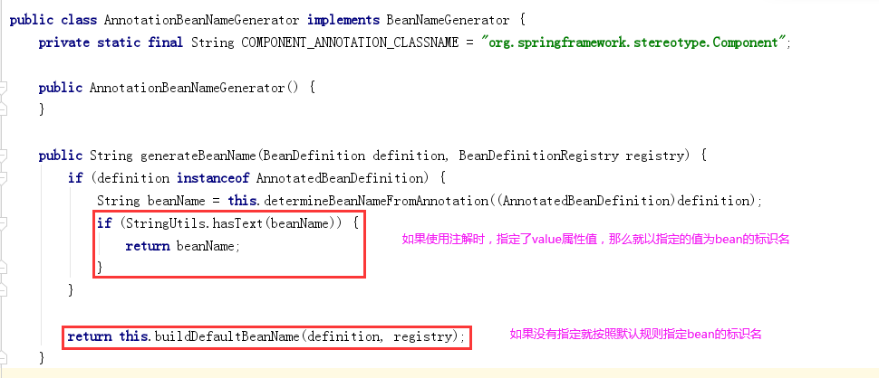

### 第1章 案例：使用spring的IoC的实现账户的CRUD

#### 1.1 需求和技术要求

##### 1.1.1 需求 

​		实现账户的CRUD操作

##### 1.1.2 技术要求 

​		使用spring的IoC实现对象的管理 

​		使用DBUtils作为持久层解决方案 

​		使用c3p0数据源

#### 1.2 环境搭建

##### 1.2.1 添加依赖

```xml
	<dependency>
      <groupId>org.springframework</groupId>
      <artifactId>spring-context</artifactId>
      <version>5.1.6.RELEASE</version>
    </dependency>
    <dependency>
      <groupId>com.mchange</groupId>
      <artifactId>c3p0</artifactId>
      <version>0.9.5.2</version>
    </dependency>
    <dependency>
      <groupId>commons-dbutils</groupId>
      <artifactId>commons-dbutils</artifactId>
      <version>1.6</version>
    </dependency>
    <dependency>
      <groupId>mysql</groupId>
      <artifactId>mysql-connector-java</artifactId>
      <version>5.1.38</version>
    </dependency>
```

##### 1.2.2 创建数据库和编写实体类 

数据库语句：

```sql
create table account(
	id int primary key auto_increment,
	name varchar(40),
	money float
)character set utf8 collate utf8_general_ci;

insert into account(name,money) values('aaa',1000);
insert into account(name,money) values('bbb',1000);
insert into account(name,money) values('ccc',1000);
```

实体类：

```java
import java.io.Serializable;

/**
 * 账户的实体类
 */
public class Account implements Serializable {

    private Integer id;
    private String name;
    private Float money;

    public Integer getId() {
        return id;
    }

    public void setId(Integer id) {
        this.id = id;
    }

    public String getName() {
        return name;
    }

    public void setName(String name) {
        this.name = name;
    }

    public Float getMoney() {
        return money;
    }

    public void setMoney(Float money) {
        this.money = money;
    }

    @Override
    public String toString() {
        return "Account{" +
                "id=" + id +
                ", name='" + name + '\'' +
                ", money=" + money +
                '}';
    }
}
```

##### 1.2.3 编写持久层代码 

持久层接口：

```java
import com.yc.entity.Account;
import java.util.List;

/**
 * 账户的持久层接口
 */
public interface IAccountDao {

    /*查询所有*/
    List<Account> findAllAccount();

    /* 查询一个*/
    Account findAccountById(Integer accountId);

    /*保存*/
    void saveAccount(Account account);

    /*更新*/
    void updateAccount(Account account);

    /*删除*/
    void deleteAccount(Integer acccountId);
}
```

持久层实现类：

```java
import com.yc.dao.IAccountDao;
import com.yc.entity.Account;
import org.apache.commons.dbutils.QueryRunner;
import org.apache.commons.dbutils.handlers.BeanHandler;
import org.apache.commons.dbutils.handlers.BeanListHandler;

import java.util.List;

/**
 * 账户的持久层实现类
 */
public class AccountDaoImpl implements IAccountDao {

    private QueryRunner runner;

    public void setRunner(QueryRunner runner) {
        this.runner = runner;
    }

    @Override
    public List<Account> findAllAccount() {
        try{
            return runner.query("select * from account",new BeanListHandler<Account>(Account.class));
        }catch (Exception e) {
            throw new RuntimeException(e);
        }
    }

    @Override
    public Account findAccountById(Integer accountId) {
        try{
            return runner.query("select * from account where id = ? ",new BeanHandler<Account>(Account.class),accountId);
        }catch (Exception e) {
            throw new RuntimeException(e);
        }
    }

    @Override
    public void saveAccount(Account account) {
        try{
            runner.update("insert into account(name,money)values(?,?)",account.getName(),account.getMoney());
        }catch (Exception e) {
            throw new RuntimeException(e);
        }
    }

    @Override
    public void updateAccount(Account account) {
        try{
            runner.update("update account set name=?,money=? where id=?",account.getName(),account.getMoney(),account.getId());
        }catch (Exception e) {
            throw new RuntimeException(e);
        }
    }

    @Override
    public void deleteAccount(Integer accountId) {
        try{
            runner.update("delete from account where id=?",accountId);
        }catch (Exception e) {
            throw new RuntimeException(e);
        }
    }
}
```

##### 1.2.4 编写业务层代码

业务层接口：

```java
import com.yc.entity.Account;

import java.util.List;

/**
 * 账户的业务层接口
 */
public interface IAccountService {

    /*查询所有*/
    List<Account> findAllAccount();

    /*查询一个*/
    Account findAccountById(Integer accountId);

    /*保存*/
    void saveAccount(Account account);

    /*更新*/
    void updateAccount(Account account);
    
    /*删除*/
    void deleteAccount(Integer acccountId);

}
```

业务层实现类：

```java
import com.yc.dao.IAccountDao;
import com.yc.entity.Account;
import com.yc.service.IAccountService;

import java.util.List;

/**
 * 账户的业务层实现类
 */
public class AccountServiceImpl implements IAccountService {

    private IAccountDao accountDao;

    public void setAccountDao(IAccountDao accountDao) {
        this.accountDao = accountDao;
    }

    @Override
    public List<Account> findAllAccount() {
        return accountDao.findAllAccount();
    }

    @Override
    public Account findAccountById(Integer accountId) {
        return accountDao.findAccountById(accountId);
    }

    @Override
    public void saveAccount(Account account) {
        accountDao.saveAccount(account);
    }

    @Override
    public void updateAccount(Account account) {
        accountDao.updateAccount(account);
    }

    @Override
    public void deleteAccount(Integer acccountId) {
        accountDao.deleteAccount(acccountId);
    }
}
```

#### 1.3 配置步骤（掌握）

##### 1.3.1 配置对象

```xml
<?xml version="1.0" encoding="UTF-8"?>
<beans xmlns="http://www.springframework.org/schema/beans"
       xmlns:xsi="http://www.w3.org/2001/XMLSchema-instance"
       xsi:schemaLocation="http://www.springframework.org/schema/beans
        http://www.springframework.org/schema/beans/spring-beans.xsd">
    <!-- 配置Service -->
    <bean id="accountService" class="com.yc.service.impl.AccountServiceImpl">
        <!-- 注入dao -->
        <property name="accountDao" ref="accountDao"></property>
    </bean>

    <!--配置Dao对象-->
    <bean id="accountDao" class="com.yc.dao.impl.AccountDaoImpl">
        <!-- 注入QueryRunner -->
        <property name="runner" ref="runner"></property>
    </bean>

    <!--配置QueryRunner-->
    <bean id="runner" class="org.apache.commons.dbutils.QueryRunner" scope="prototype">
        <!--注入数据源-->
        <constructor-arg name="ds" ref="dataSource"></constructor-arg>
    </bean>

    <!-- 配置数据源 -->
    <bean id="dataSource" class="com.mchange.v2.c3p0.ComboPooledDataSource">
        <!--连接数据库的必备信息-->
        <property name="driverClass" value="com.mysql.jdbc.Driver"></property>
        <property name="jdbcUrl" value="jdbc:mysql://localhost:3306/mydb"></property>
        <property name="user" value="root"></property>
        <property name="password" value="mysqlpass"></property>
    </bean>
</beans>
```

#### 1.4 测试案例

##### 1.4.1 测试类代码

```java
import com.yc.entity.Account;
import com.yc.service.IAccountService;
import org.junit.Test;
import org.junit.runner.RunWith;
import org.springframework.context.ApplicationContext;
import org.springframework.context.support.ClassPathXmlApplicationContext;

import java.util.List;

/**
 * 使用Junit单元测试：测试我们的配置
 */
public class AccountServiceTest {
    /*测试查询所有*/
    @Test
    public void testFindAll() {
        ApplicationContext ac = new ClassPathXmlApplicationContext("bean.xml");
        IAccountService as = ac.getBean("accountService",IAccountService.class);
        List<Account> accounts = as.findAllAccount();
        for(Account account : accounts){
            System.out.println(account);
        }
    }
    /*测试查询一个*/
    @Test
    public void testFindOne() {
        ApplicationContext ac = new ClassPathXmlApplicationContext("bean.xml");
        IAccountService as = ac.getBean("accountService",IAccountService.class);
        Account account = as.findAccountById(1);
        System.out.println(account);
    }
    /*测试保存*/
    @Test
    public void testSave() {
        ApplicationContext ac = new ClassPathXmlApplicationContext("bean.xml");
        IAccountService as = ac.getBean("accountService",IAccountService.class);
        Account account = new Account();
        account.setName("test");
        account.setMoney(12345f);
        as.saveAccount(account);

    }
    /*测试更新*/
    @Test
    public void testUpdate() {
        ApplicationContext ac = new ClassPathXmlApplicationContext("bean.xml");
        IAccountService as = ac.getBean("accountService",IAccountService.class);
        Account account = as.findAccountById(4);
        account.setMoney(23456f);
        as.updateAccount(account);
    }
    /*测试查询删除*/
    @Test
    public void testDelete() {
        ApplicationContext ac = new ClassPathXmlApplicationContext("bean.xml");
        IAccountService as = ac.getBean("accountService",IAccountService.class);
        as.deleteAccount(4);
    }
}
```

##### 1.4.2 分析测试了中的问题 

​		通过上面的测试类，我们可以看出，每个测试方法都重新获取了一次spring的核心容器，造成了不必要的重复代码，增加了我们开发的工作量。这种情况，在开发中应该避免发生。 

​		有些同学可能想到了，我们把容器的获取定义到类中去。

例如： 

```java
 public class AccountServiceTest { 
 		private ApplicationContext ac = new ClassPathXmlApplicationContext("bean.xml"); 		private IAccountService as = ac.getBean("accountService",IAccountService.class); 
 }
```

或：

```java
public class CRUDTest {
    private AccountService accountService;
    @Before
    public void init(){
        ApplicationContext context = new ClassPathXmlApplicationContext("applicationContext.xml");
        accountService = (AccountService) context.getBean("accountService");
    }
}
```

上面两种方式虽然能解决问题，但是需要我们自己写代码来获取容器。 能不能测试时直接就编写测试方法，而不需要手动编码来获取容器呢？ 请在今天的最后一章节找答案。

### 第2章 基于注解的IOC配置（掌握）

#### 2.1 明确：写在最前 

​		学习基于注解的IoC配置，大家脑海里首先得有一个认知，即**注解配置和xml配置要实现的功能都是一样的**，都是要降低程序间的耦合。只是配置的形式不一样。 

​		关于实际的开发中到底使用xml还是注解，每家公司有着不同的使用习惯。所以这两种配置方式我们都需要掌握。 

​		我们在讲解注解配置时，采用上一章节的案例，把spring的xml配置内容改为使用注解逐步实现。

#### 2.2 环境搭建

##### 2.2.1 第一步：添加依赖。

```xml
	<dependency>
      <groupId>org.springframework</groupId>
      <artifactId>spring-context</artifactId>
      <version>5.1.6.RELEASE</version>
    </dependency>
    <dependency>
      <groupId>com.mchange</groupId>
      <artifactId>c3p0</artifactId>
      <version>0.9.5.2</version>
    </dependency>
    <dependency>
      <groupId>commons-dbutils</groupId>
      <artifactId>commons-dbutils</artifactId>
      <version>1.6</version>
    </dependency>
    <dependency>
      <groupId>mysql</groupId>
      <artifactId>mysql-connector-java</artifactId>
      <version>5.1.38</version>
    </dependency>
```

##### 2.2.2 第二步：使用@Component注解配置管理的资源

##### 使用注解标识需要被Spring管理的类：

1.在所有需要被Spring管理的类上使用注解@Component

效果等同于：

```xml
<bean class="com.yaorange.service.impl.AccountServiceImpl">
```

如果想要达到指定当前被管理类在容器中的id名，那么使用@Component("标识名")

@Component("accountService")

```xml
<bean id="accountService" class="com.yaorange.service.impl.AccountServiceImpl">
```

如果注解中不指定标识名，那么spring容器中默认使用当前类名的首字母小写作为该对象的标识名

2.在类中需要注入数据的属性上，通过使用注解@Autowired，进行自动装配

使用注解进行依赖注入时，可以没有set方法

```java
@Component("accountDao")
public class AccountDaoImpl implements IAccountDao {
	@Autowired
    private QueryRunner runner;

//    public void setRunner(QueryRunner runner) {
//        this.runner = runner;
//    }
}
```


##### 参考代码

持久层实现类

```java
import com.yaorange.dao.IAccountDao;
import com.yaorange.entity.Account;
import org.apache.commons.dbutils.QueryRunner;
import org.apache.commons.dbutils.handlers.BeanHandler;
import org.apache.commons.dbutils.handlers.BeanListHandler;
import org.springframework.beans.factory.annotation.Autowired;
import org.springframework.stereotype.Repository;

import java.util.List;

/**
 * 账户的持久层实现类
 */
@Component("accountDao")
public class AccountDaoImpl implements IAccountDao {
    @Autowired
    private QueryRunner runner;

//    public void setRunner(QueryRunner runner) {
//        this.runner = runner;
//    }

    @Override
    public List<Account> findAllAccount() {
        try{
            return runner.query("select * from account",new BeanListHandler<Account>(Account.class));
        }catch (Exception e) {
            throw new RuntimeException(e);
        }
    }

    @Override
    public Account findAccountById(Integer accountId) {
        try{
            return runner.query("select * from account where id = ? ",new BeanHandler<Account>(Account.class),accountId);
        }catch (Exception e) {
            throw new RuntimeException(e);
        }
    }

    @Override
    public void saveAccount(Account account) {
        try{
            runner.update("insert into account(name,money)values(?,?)",account.getName(),account.getMoney());
        }catch (Exception e) {
            throw new RuntimeException(e);
        }
    }

    @Override
    public void updateAccount(Account account) {
        try{
            runner.update("update account set name=?,money=? where id=?",account.getName(),account.getMoney(),account.getId());
        }catch (Exception e) {
            throw new RuntimeException(e);
        }
    }

    @Override
    public void deleteAccount(Integer accountId) {
        try{
            runner.update("delete from account where id=?",accountId);
        }catch (Exception e) {
            throw new RuntimeException(e);
        }
    }
}

```

业务实现类：

```java
import com.yaorange.dao.IAccountDao;
import com.yaorange.entity.Account;
import com.yaorange.service.IAccountService;
import org.springframework.beans.factory.annotation.Autowired;
import org.springframework.stereotype.Service;

import java.util.List;

/**
 * 账户的业务层实现类
 */
@Component("accountService")
public class AccountServiceImpl implements IAccountService {
    @Autowired
    private IAccountDao accountDao;

//    public void setAccountDao(IAccountDao accountDao) {
//        this.accountDao = accountDao;
//    }

    @Override
    public List<Account> findAllAccount() {
        return accountDao.findAllAccount();
    }

    @Override
    public Account findAccountById(Integer accountId) {
        return accountDao.findAccountById(accountId);
    }

    @Override
    public void saveAccount(Account account) {
        accountDao.saveAccount(account);
    }

    @Override
    public void updateAccount(Account account) {
        accountDao.updateAccount(account);
    }

    @Override
    public void deleteAccount(Integer acccountId) {
        accountDao.deleteAccount(acccountId);
    }
}
```

**注意： 当我们使用注解注入时，set方法不用写**

##### 2.2.3 第三步：创建spring的xml配置文件并开启对注解的支持

注意： 基于注解整合时，导入约束时需要多导入一个context名称空间下的约束。

```xml
<?xml version="1.0" encoding="UTF-8"?>
<beans xmlns="http://www.springframework.org/schema/beans"
       xmlns:xsi="http://www.w3.org/2001/XMLSchema-instance"
       xmlns:context="http://www.springframework.org/schema/context"
       xsi:schemaLocation="http://www.springframework.org/schema/beans
        http://www.springframework.org/schema/beans/spring-beans.xsd
        http://www.springframework.org/schema/context
        http://www.springframework.org/schema/context/spring-context.xsd">
    <!-- 告知spring在创建容器时要扫描的包 -->
    <context:component-scan base-package="com.yaorange"/>

    <!--配置QueryRunner-->
    <bean id="runner" class="org.apache.commons.dbutils.QueryRunner" scope="prototype">
        <!--注入数据源-->
        <constructor-arg name="ds" ref="dataSource"></constructor-arg>
    </bean>

    <!-- 配置数据源 -->
    <bean id="dataSource" class="com.mchange.v2.c3p0.ComboPooledDataSource">
        <!--连接数据库的必备信息-->
        <property name="driverClass" value="com.mysql.jdbc.Driver"></property>
        <property name="jdbcUrl" value="jdbc:mysql://localhost:3306/mydb"></property>
        <property name="user" value="root"></property>
        <property name="password" value="mysqlpass"></property>
    </bean>
</beans>
```

#### 总结：

##### 基于注解开发SpringIOC步骤：

1：在需要进行IOC管理的类上使用注解：@Component("标识名")

2：在类中需要注入数据的属性上使用注解：@Autowired

3：在Spring配置文件中添加注解包扫描加载：

<context:component-scan base-package="使用了@Component注解的类所在包名"/>

如果需要扫描多个包：建议使用多个context:component-scan标签

```xml
<context:component-scan base-package="com.yaorange.service.impl"/>
<context:component-scan base-package="com.yaorange.dao.impl"/>
```

*注意：非自行开发的类需要被SpringIOC管理只能通过配置Bean标签方式，而不能使用注解+扫包方式*

#### 2.3 常用注解（除了了解的，其他都为掌握注解）

##### 2.3.1 用于创建对象的

注解都是用在类上

​	相当于：<bean id="" class="">

###### 2.3.1.1 @Component 

​	**作用：** 

​			被标识的类让spring来管理。相当于在xml中配置一个bean。 

​	**属性：**

​			value：指定bean的id。如果不指定value属性，默认bean的id是**当前类的类名的首字母小写。**如果类名前面是**连续两个大写字母**，那么bean的**id名就是类名**

###### 底层说明：

**AnnotationBeanNameGenerator：**




**Introspector：**


###### 2.3.1.2 @Controller @Service @Repository （实际开发中常用）

​	这三个注解都是@Component 一个的衍生注解，他们的作用及属性都是一模一样的。 

​	他们只不过是提供了更加明确的语义化。 

​			**@Controller**：一般用于控制层处理器标识的注解。 

​			**@Service**：一般用于业务层标识的注解。 

​			**@Repository**：一般用于持久层标识的注解。 

​			**@Component** ：一般用于其他组件上，如util包中类上

*细节：如果注解中有且只有一个属性要赋值时，且名称是value，value在赋值是可以不写。*

优化：

下面注解使用上没有问题，只是不利于代码阅读

```java
@Component("accountDao")
@Component("accountService")
```

替换

下面注解更加符合开发约定

```java
@Repository("accountDao")//使用在数据访问类上
@Service("accountService")//使用在业务类上
```

##### 2.3.2 用于注入数据的

都是使用在属性上

​	相当于：<property name="" ref="">
​					<property name="" value="">

###### 2.3.2.1 @Autowired 

​	**作用：** 

​			自动**按照类型**注入。当使用注解注入属性时，set方法可以省略。它只能注入（加入了Spring容器管理的）和被标识的属性的**数据类型一致**的bean。当有多个类型匹配时，使用被标识的属性的**属性名**称作为bean的id，在Spring容器查找，找到了也可以注入成功。找不到就报错。

如果想要指定注入的bean的id，而不使用被标识的属性名作为id，那么必须结合下面的注解

###### 2.3.2.2 @Qualifier 

​	**作用：** @Autowired一起使用，用于指定注入属性的bean的id。

​	**属性：** 

​			value：指定bean的id。

###### 2.3.2.3 @Resource （常用，推荐）

​	**作用：** 

​			直接按照Bean的id注入。它也只能注入满足指定id名的bean。 

​	**属性：** 

​			name：指定bean的id。name是不能省略的，必须显式写出

```java
@Resource(name = "runner")
//等同于
@Autowired
@Qualifier("runner")
```

###### 使用建议：

​	如果能保证程序中注入的数据是唯一存在，那么可以直接使用@Autowired

​	如果无法保证注入数据唯一存在，那么就建议使用@Resource(name = "bean的id")

###### 2.3.2.4 @Value （了解）

​	**作用：** 

​			注入基本数据类型和String类型数据的 

​	**属性：** 

​			value：用于指定值

```java
@Value("zhangsan")
private String name;
```

##### 2.3.3 用于改变作用范围的：

​	用于类上的注解

​	相当于：<bean id="" class="" scope="">

###### 2.3.3.1 @Scope 

​	**作用：** 

​			指定bean的作用范围。 

​	**属性：** 

​			value：指定范围的值。 取值：singleton prototype request session globalsession

```java
@Service("accountService")
@Scope("prototype")
public class AccountServiceImpl implements AccountService {}
```

##### 2.3.4 和生命周期相关的：(了解)

​		相当于：<bean id="" class="" init-method="" destroy-method="" />

###### 2.3.4.1 @PostConstruct 

​	**作用：** 

​			用于指定初始化方法。被标识的方法会在构造函数之后执行

###### 2.3.4.2 @PreDestroy 

​	**作用：** 

​			用于指定销毁方法。

##### 2.3.5 关于Spring注解和XML的选择问题 

**注解的优势：** 

​		配置简单，维护方便（我们找到类，就相当于找到了对应的配置）。 

**XML的优势：** 

​		修改时，不用改源码。不涉及重新编译和部署。 Spring管理Bean方式的比较：


###### 总结：

**第三方的类通过xml配置，加入Spring容器管理**

**开发者自行开发的类通过注解配置，加入Spring容器管理**

#### 2.4 spring的纯注解配置 (熟悉，这是趋势)

​		讲到此处，基于注解的IoC配置已经完成，但是大家都发现了一个问题：我们依然离不开spring的xml配置文件，那么能不能不写这个bean.xml，所有配置都用注解来实现呢？ 

​		当然，同学们也需要注意一下，我们**选择哪种配置的原则是简化开发和配置方便，而非追求某种技术**。

##### 2.4.1 待改造的问题 

​		我们发现，之所以我们现在离不开xml配置文件，是因为我们有一句很关键的配置： 

```xml
<!-- 告知spring框架在，读取配置文件，创建容器时，扫描注解，依据注解创建对象，并存入容器中 --> <context:component-scan base-package="om.yaorange"/>
```

​		如果他要也能用注解配置，那么我们就离脱离xml文件又进了一步。 

​		另外，数据源和QueryRunner的配置也需要靠注解来实现。 

```xml
	<!--配置QueryRunner-->
    <bean id="runner" class="org.apache.commons.dbutils.QueryRunner" scope="prototype">
        <!--注入数据源-->
        <constructor-arg name="ds" ref="dataSource"></constructor-arg>
    </bean>

    <!-- 配置数据源 -->
    <bean id="dataSource" class="com.mchange.v2.c3p0.ComboPooledDataSource">
        <!--连接数据库的必备信息-->
        <property name="driverClass" value="com.mysql.jdbc.Driver"></property>
        <property name="jdbcUrl" value="jdbc:mysql://localhost:3306/mydb"></property>
        <property name="user" value="root"></property>
        <property name="password" value="mysqlpass"></property>
    </bean>
```

##### 2.4.2 新注解说明

###### 2.4.2.1 @Configuration 

​	**作用：** 

​			用于指定当前类是一个spring配置类，当创建容器时会从该类上加载注解。获取容器时需要使用		      	 AnnotationConfigApplicationContext(有@Configuration注解的类.class)。 

​	**属性：** 

​			value:用于指定配置类的字节码，一般不指定，使用默认被标识的类的Class

示例代码：

```java
 /** 
  * spring的配置类，相当于bean.xml文件 
  */
@Configuration 
public class SpringConfiguration { }
```

 **注意：** 我们已经把配置文件用类来代替了，但是如何配置创建容器时要扫描的包呢？ 请看下一个注解。

###### 2.4.2.2 @ComponentScan 

​	作用： 

​			用于指定spring在初始化容器时要扫描的包。作用和在spring的xml配置文件中的： <context:component-scan base-package="com.itheima"/>是一样的。 

​	属性： 

​			basePackages：用于指定要扫描的包。和该注解中的value属性作用一样。 

示例代码： 

```java
/** 
 * spring的配置类，相当于bean.xml文件 
 */ 
@Configuration
//扫描单个包
@ComponentScan("com.yaorange.service.impl")
//扫描多个包，使用value属性
//@ComponentScan({"com.yaorange.service.impl","com.yaorange.dao.impl"})
//扫描多个包，使用basePackages属性
//@ComponentScan(basePackages = {"com.yaorange.service.impl","com.yaorange.dao.impl"})
public class SpringConfiguration { } 
```

**注意**： 我们已经配置好了要扫描的包，但是数据源和QueryRunner对象如何从配置文件中移除呢？ 请看下一个注解。

###### 2.4.2.3 @Bean 

​	**作用：** 

​			该注解只能写在方法上，表明使用此方法创建一个对象，并且放入spring容器。 

​	**属性：** 

​			name：给当前@Bean注解方法创建的对象指定一个名称(即bean的id）。 

示例代码：

```java
@Configuration//标识当前类为配置类
@ComponentScan(basePackages = {"com.yaorange.dao.impl","com.yaorange.service.impl"})//配置扫描。取代xml中的扫描加载
public class SpringConfig {
 	/** * 创建一个数据源，并存入spring容器中 */ 
 	@Bean(name="dataSource") 
 	public DataSource createDataSource() { 
 		try { 
 			ComboPooledDataSource ds = new ComboPooledDataSource(); 
 			ds.setUser("root"); 
 			ds.setPassword("1234"); 
 			ds.setDriverClass("com.mysql.jdbc.Driver"); 
 			ds.setJdbcUrl("jdbc:mysql:///spring_day02"); 
 			return ds; 
 		} catch (Exception e) { 
 			throw new RuntimeException(e); 
 		} 
 	} 
 	/** * 创建一个QueryRunner，并且也存入spring容器中*/ 
    @Bean(name="runer")
 	public QueryRunner createQueryRunner(DataSource dataSource) { 
 		return new QueryRunner(dataSource); 
 	} 
 }
```

 **注意:** 我们已经把数据源和QueryRunner从配置文件中移除了，此时可以删除bean.xml了。 但是由于没有了配置文件，创建数据源的配置又都写死在类中了。如何把它们配置出来呢？ 请看下一个注解。

###### 2.5.2.4 @PropertySource 

​	**作用：**
​			用于加载.properties文件中的配置。例如我们配置数据源时，可以把连接数据库的信息写到properties配置文件中，就可以使用此注解指定properties配置文件的位置。

​	**属性：** 

​			value[]：用于指定properties文件位置。如果是在类路径下，**需要写上classpath:**

示例代码：

```java
/** * 连接数据库的配置类 */ 
//@Configuration 
@PropertySource("classpath:jdbc.properties") 
public class JdbcConfig { 
	@Value("${jdbc.driver}") 
	private String driver; 
	@Value("${jdbc.url}") 
	private String url; 
	@Value("${jdbc.username}") 
	private String username; 
	@Value("${jdbc.password}") 
	private String password; 
	/** * 创建一个数据源，并存入spring容器中 */ 
	@Bean(name="dataSource") 
	public DataSource createDataSource() { 
		try { 
			ComboPooledDataSource ds = new ComboPooledDataSource(); 
			ds.setDriverClass(driver); 
			ds.setJdbcUrl(url); 
			ds.setUser(username); 
			ds.setPassword(password); 
			return ds; 
		} catch (Exception e) { 
			throw new RuntimeException(e); 
		} 
	} 
} 
```

 jdbc.properties文件：

```properties
jdbc.driver=com.mysql.jdbc.Driver
jdbc.url=jdbc:mysql://localhost:3306/mydb
jdbc.username=root
jdbc.password=mysqlpass
```

 注意： 此时我们已经有了两个配置类，但是他们还没有关系。如何建立他们的关系呢？ 请看下一个注解。

###### 2.5.2.5 @Import 

多配置类时使用，类似于在xml中<import resource=""/>

​	**作用：** 

​			用于导入其他配置类，在引入其他配置类时，可以不用再写@Configuration注解。当然，写上也没问题。 	**属性：** 

​		value[]：用于指定其他配置类的字节码。 

示例代码： 

```java
package com.yaorange.config;

import com.mchange.v2.c3p0.ComboPooledDataSource;
import org.apache.commons.dbutils.QueryRunner;
import org.springframework.beans.factory.annotation.Value;
import org.springframework.context.annotation.*;

import javax.sql.DataSource;
import java.beans.PropertyVetoException;

@Configuration//标识当前类为配置类
//扫描加载IOC组件，替换在xml中扫描加载
@ComponentScan({"com.yaorange.service.impl","com.yaorange.dao.impl"})

//引入其他配置类
@Import({JDBCConfig.class})
public class SpringConfig {

    @Bean(name = "runner")
    //在@Bean标识的方法中，如果有参数，那么Spring在执行方法时会自动在容器中查询注入数据
    public QueryRunner createRunner(DataSource dataSource){
        return new QueryRunner(dataSource);
    }
}

```

注意： 我们已经把要配置的都配置好了，但是新的问题产生了，由于没有配置文件了，如何获取容器呢？ 请看下一小节。

###### 2.5.2.6 通过注解获取容器： 

```java
ApplicationContext ac = new AnnotationConfigApplicationContext(SpringConfiguration.class);
```

##### 2.5.3 工程结构图


### 第3章 Spring整合Junit[掌握]

#### 3.1 测试类中的问题和解决思路

##### 3.1.1 问题 

在测试类中，每个测试方法都有以下两行代码： 

```java
ApplicationContext ac = new ClassPathXmlApplicationContext("bean.xml"); 
IAccountService as = ac.getBean("accountService",IAccountService.class); 
```

这两行代码的作用是获取容器，如果不写的话，直接会提示空指针异常。所以又不能轻易删掉。

##### 3.1.2 解决思路分析 

​		针对上述问题，我们需要的是程序能自动帮我们创建容器。一旦程序能自动为我们创建spring容器，我们就无须手动创建了，问题也就解决了。 

​		我们都知道，junit单元测试的原理（在web阶段课程中讲过），但显然，junit是无法实现的，因为它自己都无法知晓我们是否使用了spring框架，更不用说帮我们创建spring容器了。不过好在，junit给我们暴露了一个注解，可以让我们替换掉它的运行器。 

​		这时，我们需要依靠spring框架，因为它提供了一个运行器，可以读取配置文件（或注解）来创建容器。我们只需要告诉它配置文件在哪就行了。

#### 3.2 配置步骤

##### 3.2.1 第一步：添加测试依赖

此处需要注意的是：junit版本问题，**使用4.12或以上版本**

```xml
	<dependency>
      <groupId>org.springframework</groupId>
      <artifactId>spring-test</artifactId>
      <version>5.1.9.RELEASE</version>
    </dependency>
    <dependency>
      <groupId>junit</groupId>
      <artifactId>junit</artifactId>
      <version>4.12</version>
    </dependency>
```

##### 3.2.2 第二步：使用@RunWith注解替换原有运行器 

```java
@RunWith(SpringJUnit4ClassRunner.class) 
public class AccountServiceTest { }
```

##### 3.2.3 第三步：使用@ContextConfiguration指定spring配置文件的位置 

```java
@RunWith(SpringJUnit4ClassRunner.class) 
@ContextConfiguration(locations= {"classpath:bean.xml"}) 
//@ContextConfiguration(classes = {SpringConfiguration.class})//加载配置类
public class AccountServiceTest { }
```

**@ContextConfiguration**注解： 

​	locations属性：用于指定配置文件的位置。如果是类路径下，需要用classpath:表明 

​	classes属性：用于指定注解的类。当不使用xml配置时，需要用此属性指定注解类的位置。

##### 3.2.4 第四步：使用@Autowired给测试类中的变量注入数据

```java
@RunWith(SpringJUnit4ClassRunner.class) 
@ContextConfiguration(locations= {"classpath:bean.xml"}) 
//@ContextConfiguration(classes = {SpringConfiguration.class})
public class AccountServiceTest { 
	@Autowired 
	private IAccountService as ; 
    
    /*测试查询所有*/
    @Test
    public void testFindAll() {
        List<Account> accounts = as.findAllAccount();
        for(Account account : accounts){
            System.out.println(account);
        }
    }
    //.......其他测试方法省略
}
```

#### 3.3 为什么不把测试类配到xml中 

​	在解释这个问题之前，先解除大家的疑虑，配到XML中能不能用呢？ 

​	答案是肯定的，没问题，可以使用。 

​	那么为什么不采用配置到xml中的方式呢？ 

​	这个原因是这样的： 

​			第一：当我们在xml中配置了一个bean，spring加载配置文件创建容器时，就会创建对象。 

​			第二：测试类只是我们在测试功能时使用，而在项目中它并不参与程序逻辑，也不会解决需求上的问题，所以创建完了，并没有使用。那么存在容器中就会造成资源的浪费。 

​	所以，基于以上两点，我们不应该把测试配置到xml文件中。

#### 3.4 通过Idea自动生成测试类

使用步骤：

1.将鼠标光标放在在需要进行测试的业务类上，按下快捷键Ctrl+Shift+T


2.在弹出的选择框点击Create New Test，在弹窗中选择操作


3.自动生成的测试类，在Maven的test包中，找到该类后按照前面的步骤添加测试配置和测试代码


```java
package com.yaorange.service.impl;

import com.yaorange.entity.Account;
import com.yaorange.service.IAccountService;
import org.junit.Test;
import org.junit.runner.RunWith;
import org.springframework.test.context.ContextConfiguration;
import org.springframework.test.context.junit4.SpringJUnit4ClassRunner;

import javax.annotation.Resource;

import java.util.List;

import static org.junit.Assert.*;
@RunWith(SpringJUnit4ClassRunner.class)
@ContextConfiguration(locations = {"classpath:bean.xml"})
public class AccountServiceImplTest {
    @Resource(name = "accountService")
    private IAccountService service;

    @Test
    public void findAllAccount() {
        List<Account> accounts = service.findAllAccount();
        for (Account account : accounts) {
            System.out.println(account);
        }
    }

    @Test
    public void findAccountById() {
    }

    @Test
    public void saveAccount() {
    }

    @Test
    public void updateAccount() {
    }

    @Test
    public void deleteAccount() {
    }
}

```


#### 总结:

##### 基于注解的IOC和DI配置（掌握）

步骤：

1.在类上使用注解进行IOC标识，@Component，衍生注解@Service，@Repository，@Controller

2.在类中的属性上通过注解进行DI标识，@Autowired（如果要指定注入的id名，结合注解@Qualifier("bean的id")使用），@Resource

3.在配置文件中通过配置扫描加载组件

```xml
 <context:component-scan base-package="使用了IOC标识的注解类所在包"/>
```

注意：以上注解实现IOC一般都是针对自行开发的类进行的，而第三方的类如果想要交给Spring容器管理，那么只能在配置文件中通过配置bean的方式实现，数据的注入也只能通过配置constructor-arg或property标签的方式完成


##### 纯注解开发，需要同学们按照讲义或视频，进行熟悉，掌握几个重要注解

开发步骤：

1.在替代xml文件的类上使用@Configuration标识当前类为配置类

2.在类上通过@ComponentScan注解进行组件扫描（将使用注解的组件类，创建添加到Spring容器中）

3.在配置中编写有指定返回值类型的方法，在方法上通过@Bean(name="标识名")，将方法返回的对象值加入到Spring容器中，并以指定标识名作为容器中该bean的id


##### 基于Spring进行junit测试（掌握）

开发步骤：

1.在创建的测试类上定义运行器覆盖默认的Junit运行器：@RunWith(SpringJUnit4ClassRunner.class)

2.在测试上使用注解读取配置文件或配置类：

​	@ContextConfiguration(locations = {"配置文件地址"})//如果配置文件在classpath（或Maven的resources）下，那么**必须在地址前添加前缀"classpath:xxxx"**

​	@ContextConfiguration(classes = {配置类名.class})

3.在测试类中定义需要测试的类属性，在属性上通过DI(依赖注入)注解,将Spring容器中的对象赋值给属性用于测试

4.在测试类中编写测试方法，并通过@Test注解标识

**建议使用IDEA自动生成测试类方式进行编写**


