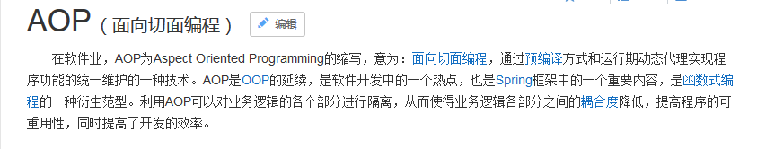
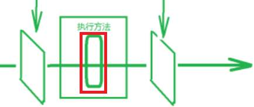
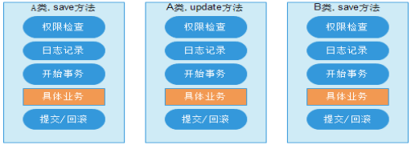
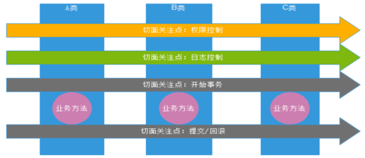

## 第1章 AOP的相关概念[理解]

### 1.1 AOP概述

#### 1.1.1 什么是AOP 

​		AOP：全称是Aspect Oriented Programming即：面向切面编程。



​		

简单的说它就是把我们程序**重复的代码**抽取出来（看做一个可以切面），在需要执行的地方，底层使用**动态代理**的技术，在不修改源码的基础上，通过插入切面，对我们的已有业务方法进行**增强**。





#### 1.1.2 AOP的作用及优势 

作用： 在程序**运行期间**，不修改源码对已有方法进行增强（扩展）。 

优势： 

​	减少重复代码 

​	提高开发效率 

​	维护方便

#### 1.1.3 AOP的实现方式 

使用**动态代理**技术

### 1.2 AOP的具体应用

#### 1.2.1 案例中问题 

这是我们昨天课程中做的增删改查例子。下面是客户的业务层实现类。

```java
/**
 * 账户的业务层实现类
 */
@Service("accountService")
public class AccountServiceImpl implements AccountService {
    @Autowired
    private IAccountDao accountDao;

    @Override
    public List<Account> findAllAccount() {
        return accountDao.findAllAccount();
    }

    @Override
    public Account findAccountById(Integer accountId) {
        return accountDao.findAccountById(accountId);
    }

    @Override
    public void saveAccount(Account account) {
        accountDao.saveAccount(account);
    }

    @Override
    public void updateAccount(Account account) {
        accountDao.updateAccount(account);
    }

    @Override
    public void deleteAccount(Integer acccountId) {
        accountDao.deleteAccount(acccountId);
    }
}
```

##### 问题就是： 

调用的更新操作，不需要事务提交就能执行成功。说明事务被自动控制了。换言之，我们使用了connection对象的setAutoCommit(true) 

此方式控制事务，如果我们每次都执行一条sql语句，没有问题，但是如果业务方法一次要执行多条sql语句，这种方式就无法保证功能的正确执行（无法保证数据的一致性）。

请看下面的示例：

 我们在业务层接口中多加入一个方法。 

```java
	/**
     * 转账
     * @param sourceName        转出账户名称
     * @param targetName        转入账户名称
     * @param money             转账金额
     */
    void transfer(String sourceName,String targetName,Float money);
```

业务层实现类：

```java
 	@Override
    public void transfer(String sourceName, String targetName, Float money) {
        System.out.println("transfer....");
            //1根据名称查询转出账户
            Account source = accountDao.findAccountByName(sourceName);
            //2根据名称查询转入账户
            Account target = accountDao.findAccountByName(targetName);
            //3转出账户减钱
            source.setMoney(source.getMoney()-money);
            //4转入账户加钱
            target.setMoney(target.getMoney()+money);
            //5更新转出账户
            accountDao.updateAccount(source);
        
	        int i=1/0;//模拟转账异常

            //6更新转入账户
            accountDao.updateAccount(target);
    }
```

当我们执行时，由于执行有异常，转账失败。但是因为我们是每次执行dao方法都是独立事务（事务的控制是由Connection控制，每个Dao方法都是使用不同的Connection执行语句），导致无法实现事务控制，无法保证同一个业务方法中的操作被一个事务同时控制，要么都成功，要么都失败（**不符合事务的一致性**）

#### 1.2.2 问题的解决 

解决办法： 让业务层来控制事务的提交和回滚。

思路：

1.需要保证业务层方法执行中使用一个Connection对象控制事务提交

2.同时保证业务层中使用的Connection对象，是该业务方法中调用的所以数据访问方法执行语句时使用的Connection（只有这样才能保证多个语句被同一个事务控制）

定义连接工具类：

```java
import org.springframework.stereotype.Component;
import javax.annotation.Resource;
import javax.sql.DataSource;
import java.sql.Connection;

/**
 * 连接的工具类，它用于从数据源中获取一个连接，并且实现和线程的绑定
 * 可以保证在同一个线程中任何地方通过该工具类获取的连接都是同一个连接
 */
@Component("connectionUtils")
public class ConnectionUtils {
    private ThreadLocal<Connection> tl = new ThreadLocal<Connection>();
    
    @Resource(name = "dataSource")
    private DataSource dataSource;
    
    /**
     * 获取当前线程上的连接
     * @return
     */
    public Connection getThreadConnection() {
        try{
            //1.先从ThreadLocal上获取
            Connection conn = tl.get();
            //2.判断当前线程上是否有连接
            if (conn == null) {
                //3.从数据源中获取一个连接，并且存入ThreadLocal中
                conn = dataSource.getConnection();
                tl.set(conn);
            }
            //4.返回当前线程上的连接
            return conn;
        }catch (Exception e){
            throw new RuntimeException(e);
        }
    }

    /**
     * 把连接和线程解绑
     */
    public void removeConnection(){
        tl.remove();
    }
}
```

定义事务管理类：

```java
import org.springframework.stereotype.Component;
import javax.annotation.Resource;

/**
 * 和事务管理相关的工具类，它包含了，开启事务，提交事务，回滚事务和释放连接
 */
@Component("txManager")
public class TransactionManager {
    @Resource(name = "connectionUtils")
    private ConnectionUtils connectionUtils;
    /**
     * 开启事务
     */
    public  void beginTransaction(){
        try {
            connectionUtils.getThreadConnection().setAutoCommit(false);
        }catch (Exception e){
            e.printStackTrace();
        }
    }

    /**
     * 提交事务
     */
    public  void commit(){
        try {
            connectionUtils.getThreadConnection().commit();
        }catch (Exception e){
            e.printStackTrace();
        }
    }

    /**
     * 回滚事务
     */
    public  void rollback(){
        try {
            connectionUtils.getThreadConnection().rollback();
        }catch (Exception e){
            e.printStackTrace();
        }
    }


    /**
     * 释放连接
     */
    public  void release(){
        try {
            connectionUtils.getThreadConnection().close();//还回连接池中
            connectionUtils.removeConnection();
        }catch (Exception e){
            e.printStackTrace();
        }
    }
}
```

改造后的持久层实现类：

```java
/**
 * 账户的持久层实现类
 */
@Repository("accountDao")
public class AccountDaoImpl implements AccountDao {
    @Resource(name = "runner")
    private QueryRunner runner;
    @Resource(name = "connectionUtils")
    private ConnectionUtils connectionUtils;

    @Override
    public List<Account> findAllAccount() {
        try{
            return runner.query(connectionUtils.getThreadConnection(),"select * from account",new BeanListHandler<Account>(Account.class));
        }catch (Exception e) {
            throw new RuntimeException(e);
        }
    }

    @Override
    public Account findAccountById(Integer accountId) {
        try{
            return runner.query(connectionUtils.getThreadConnection(),"select * from account where id = ? ",new BeanHandler<Account>(Account.class),accountId);
        }catch (Exception e) {
            throw new RuntimeException(e);
        }
    }

    @Override
    public void saveAccount(Account account) {
        try{
            runner.update(connectionUtils.getThreadConnection(),"insert into account(name,money)values(?,?)",account.getName(),account.getMoney());
        }catch (Exception e) {
            throw new RuntimeException(e);
        }
    }

    @Override
    public void updateAccount(Account account) {
        try{
            runner.update(connectionUtils.getThreadConnection(),"update account set name=?,money=? where id=?",account.getName(),account.getMoney(),account.getId());
        }catch (Exception e) {
            throw new RuntimeException(e);
        }
    }

    @Override
    public void deleteAccount(Integer accountId) {
        try{
            runner.update(connectionUtils.getThreadConnection(),"delete from account where id=?",accountId);
        }catch (Exception e) {
            throw new RuntimeException(e);
        }
    }

    @Override
    public Account findAccountByName(String accountName) {
        try{
            List<Account> accounts = runner.query(connectionUtils.getThreadConnection(),"select * from account where name = ? ",new BeanListHandler<Account>(Account.class),accountName);
            if(accounts == null || accounts.size() == 0){
                return null;
            }
            if(accounts.size() > 1){
                throw new RuntimeException("结果集不唯一，数据有问题");
            }
            return accounts.get(0);
        }catch (Exception e) {
            throw new RuntimeException(e);
        }
    }
}

```

改造后的业务层实现类： 

```java
/**
 * 账户的业务层实现类
 * 事务控制应该都是在业务层
 */
@Service("accountService")
public class AccountServiceImpl implements AccountService{
	@Resource(name = "accountDao")
    private AccountDao accountDao;
    @Resource(name = "txManager")
    private TransactionManager txManager;

    @Override
    public List<Account> findAllAccount() {
        try {
            //1.开启事务
            txManager.beginTransaction();
            //2.执行操作
            List<Account> accounts = accountDao.findAllAccount();
            //3.提交事务
            txManager.commit();
            //4.返回结果
            return accounts;
        }catch (Exception e){
            //5.回滚操作
            txManager.rollback();
            throw new RuntimeException(e);
        }finally {
            //6.释放连接
            txManager.release();
        }

    }

    @Override
    public Account findAccountById(Integer accountId) {
        try {
            //1.开启事务
            txManager.beginTransaction();
            //2.执行操作
            Account account = accountDao.findAccountById(accountId);
            //3.提交事务
            txManager.commit();
            //4.返回结果
            return account;
        }catch (Exception e){
            //5.回滚操作
            txManager.rollback();
            throw new RuntimeException(e);
        }finally {
            //6.释放连接
            txManager.release();
        }
    }

    @Override
    public void saveAccount(Account account) {
        try {
            //1.开启事务
            txManager.beginTransaction();
            //2.执行操作
            accountDao.saveAccount(account);
            //3.提交事务
            txManager.commit();
        }catch (Exception e){
            //4.回滚操作
            txManager.rollback();
        }finally {
            //5.释放连接
            txManager.release();
        }

    }

    @Override
    public void updateAccount(Account account) {
        try {
            //1.开启事务
            txManager.beginTransaction();
            //2.执行操作
            accountDao.updateAccount(account);
            //3.提交事务
            txManager.commit();
        }catch (Exception e){
            //4.回滚操作
            txManager.rollback();
        }finally {
            //5.释放连接
            txManager.release();
        }

    }

    @Override
    public void deleteAccount(Integer acccountId) {
        try {
            //1.开启事务
            txManager.beginTransaction();
            //2.执行操作
            accountDao.deleteAccount(acccountId);
            //3.提交事务
            txManager.commit();
        }catch (Exception e){
            //4.回滚操作
            txManager.rollback();
        }finally {
            //5.释放连接
            txManager.release();
        }

    }

    @Override
    public void transfer(String sourceName, String targetName, Float money) {
        try {
            //1.开启事务
            txManager.beginTransaction();
            //2.执行操作

            //2.1根据名称查询转出账户
            Account source = accountDao.findAccountByName(sourceName);
            //2.2根据名称查询转入账户
            Account target = accountDao.findAccountByName(targetName);
            //2.3转出账户减钱
            source.setMoney(source.getMoney()-money);
            //2.4转入账户加钱
            target.setMoney(target.getMoney()+money);
            //2.5更新转出账户
            accountDao.updateAccount(source);

            int i=1/0;//模拟转账异常

            //2.6更新转入账户
            accountDao.updateAccount(target);
            //3.提交事务
            txManager.commit();

        }catch (Exception e){
            //4.回滚操作
            txManager.rollback();
            e.printStackTrace();
        }finally {
            //5.释放连接
            txManager.release();
        }

    }
}
```

定义bean.xml

```xml
<?xml version="1.0" encoding="UTF-8"?>
<beans xmlns="http://www.springframework.org/schema/beans"
       xmlns:xsi="http://www.w3.org/2001/XMLSchema-instance"
       xmlns:context="http://www.springframework.org/schema/context"
       xsi:schemaLocation="http://www.springframework.org/schema/beans
        http://www.springframework.org/schema/beans/spring-beans.xsd
        http://www.springframework.org/schema/context
        http://www.springframework.org/schema/context/spring-context.xsd">
    <!-- 告知spring在创建容器时要扫描的包 -->
    <context:component-scan base-package="com.yaorange"/>

    <!--配置QueryRunner-->
    <bean id="runner" class="org.apache.commons.dbutils.QueryRunner" scope="prototype"></bean>

    <!-- 配置数据源 -->
    <bean id="dataSource" class="com.mchange.v2.c3p0.ComboPooledDataSource">
        <!--连接数据库的必备信息-->
        <property name="driverClass" value="com.mysql.jdbc.Driver"></property>
        <property name="jdbcUrl" value="jdbc:mysql://localhost:3306/mydb"></property>
        <property name="user" value="root"></property>
        <property name="password" value="mysqlpass"></property>
    </bean>
</beans>
```

编写测试用例：

```java
@RunWith(SpringJUnit4ClassRunner.class)
@ContextConfiguration(locations = "classpath:bean.xml")
public class AccountServiceTest {
    
    @Resource(name = "accountService")
    private AccountService as;
    @Test
    public  void testTransfer(){
        as.transfer("aaa","bbb",100f);
    }
}
```

#### 1.2.3 新的问题 

​		上一小节的代码，通过对业务层改造，已经可以实现事务控制了，但是由于我们添加了事务控制，也产生了一个新的问题： 

​		业务层方法变得臃肿了，里面充斥着很多重复代码。并且业务层方法和事务控制方法耦合了。

 		试想一下，如果我们此时提交，回滚，释放资源中任何一个方法名变更，都需要修改业务层的代码，况且这还只是一个业务层实现类，而实际的项目中这种业务层实现类可能有十几个甚至几十个。 

​	思考： 

​		这个问题能不能解决呢？ 

**代理模式：**

通过设计一个代理类对被代理类进行效果增强（在不改变源代码的基础上，增加新的操作）

#### 1.2.4 动态代理回顾

##### 1.2.4.1 动态代理常用的有两种方式 

###### 基于接口的动态代理

​		提供者：JDK官方的Proxy类。 

​		要求：被代理类**最少实现一个接口**。动态代理的调用处理程序必须实现InvocationHandler接口，及使用Proxy类中的newProxyInstance方法动态的创建代理类 

###### 基于子类的动态代理 

​		提供者：第三方的CGLib，如果报asmxxxx异常，需要导入asm.jar。 

​		要求：被代理类不能用**final修饰**的类（最终类）。

**开发中代理方式的选择**：看被代理类是否有实现接口，有实现接口就是要JDK的，没有接口那么就使用cglib

##### 1.2.4.2 使用JDK官方的Proxy类创建代理对象 

定义生产接口：

```java
/**
 * 对生产厂家要求的接口
 */
public interface Produce {
    /**
     * 销售
     * @param money
     */
    void saleProduct(float money);
}
```

定义生产者：

```java
/**
 * 一个生产者
 */
public class Producer implements Produce {
    /**
     * 销售
     * @param money
     */
    public void saleProduct(float money){
        System.out.println("销售产品，生产者拿到钱："+money);
    }
}
```

定义消费者：

```java
/**
 * 模拟一个消费者
 */
public class Consumer {
    public static void main(String[] args) {
        Producer producer = new Producer();
        /**
         * 动态代理：
         *  特点：字节码随用随创建，随用随加载
         *  作用：不修改源码的基础上对方法增强
         *  分类：
         *      基于接口的动态代理
         *      基于子类的动态代理
         *  基于接口的动态代理：
         *      涉及的类：Proxy
         *      提供者：JDK官方
         *  如何创建代理对象：
         *      使用Proxy类中的newProxyInstance方法
         *  创建代理对象的要求：
         *      被代理类最少实现一个接口，如果没有则不能使用
         *  newProxyInstance方法的参数：
         *      ClassLoader：类加载器
         *          它是用于加载代理对象字节码的。和被代理对象使用相同的类加载器。固定写法。
         *      Class[]：字节码数组
         *          它是用于让代理对象和被代理对象有相同方法。固定写法。
         *      InvocationHandler：用于提供增强的代码
         *          它是让我们写如何代理。我们一般都是些一个该接口的实现类，通常情况下都是匿名内部类，但不是必须的。
         *          此接口的实现类都是谁用谁写。
         */
       Produce proxyProducer = (Produce) Proxy.newProxyInstance(producer.getClass().getClassLoader(),
                producer.getClass().getInterfaces(),
                new InvocationHandler() {
                    /**
                     * 作用：执行被代理对象的任何接口方法都会经过该方法
                     * 方法参数的含义
                     * @param proxy   代理对象的引用
                     * @param method  当前执行的方法
                     * @param args    当前执行方法所需的参数
                     * @return        和被代理对象方法有相同的返回值
                     * @throws Throwable
                     */
                    @Override
                    public Object invoke(Object proxy, Method method, Object[] args) throws Throwable {
                        System.out.println("被代理后：");
                        Object returnValue = null;
                        //1.获取方法执行的参数
                        Float money = (Float)args[0];
                        //2.调用目标方法,没有修改原来方法源码，对方法进行了增强
                        returnValue = method.invoke(producer, money*0.8f);
                        return returnValue;
                    }
                });
        //调用方法
        proxyProducer.saleProduct(10000f);
    }
}
```

###### 其它写法：

```java
//创建一个代理类
public class Agent implements InvocationHandler {

    // 目标对象
    private Producer producer;
    //绑定关系，也就是关联到哪个接口（与具体的实现类绑定）的哪些方法将被调用时，执行invoke方法。
    public Object newProxyInstance(Producer producer){
        this.producer = producer;
        //该方法用于为指定类装载器、一组接口及调用处理器生成动态代理类实例
        /*
         ClassLoader：类加载器
                指定产生代理对象的类加载器，需要将其指定为和目标对象同一个类加载器,固定写法.
         Class[]：字节码数组
                要实现和目标对象一样的接口，所以只需要拿到目标对象的实现接口,固定写法
         InvocationHandler：用于提供增强的代码
                它是让我们写如何代理。我们一般都是些一个该接口的实现类，通常情况下都是匿名内部类，但不是必须的。
         */
        //根据传入的目标返回一个代理对象
        return Proxy.newProxyInstance(producer.getClass().getClassLoader(),
                producer.getClass().getInterfaces(),this);
    }
    @Override
    //关联的这个实现类的方法被调用时将被执行
    /*InvocationHandler接口的方法，proxy表示代理，method表示原对象被调用的方法，args表示方法的参数*/
    public Object invoke(Object proxy, Method method, Object[] args) throws Throwable {
        System.out.println("被代理后：");
        Object returnValue = null;
        //1.获取方法执行的参数
        Float money = (Float)args[0];
        //2.调用目标方法,没有修改原来方法源码，对方法进行了增强
        returnValue = method.invoke(producer, money*0.8f);
        return returnValue;
    }
}
```

定义消费者：

```java
/**
 * 模拟一个消费者
 */
public class Consumer {
	public static void main(String[] args) {
        //创建代理目标对象
        Producer producer = new Producer();
        //通过代理类返回被代理后的对象
        Produce produce = (Produce) new Agent().newProxyInstance(producer);
        //调用方法
        produce.saleProduct(1000f);
    }
}
```

##### 1.2.4.3 使用CGLib的Enhancer类创建代理对象 

区别：不用实现接口了

###### 开发步骤：

依赖添加：

```xml
		<dependency>
            <groupId>cglib</groupId>
            <artifactId>cglib</artifactId>
            <version>2.2.2</version>
        </dependency>
```

创建生产者：

```java
/**
 * 一个生产者
 */
public class Producer {
    /**
     * 销售
     * @param money
     */
    public void saleProduct(float money){
        System.out.println("销售产品，生产者拿到钱："+money);
    }
}
```

创建消费者：

```java
/**
 * 模拟一个消费者
 */
public class Client {

    public static void main(String[] args) {
        final Producer producer = new Producer();

        /**
         * 动态代理：
         *  特点：字节码随用随创建，随用随加载
         *  作用：不修改源码的基础上对方法增强
         *  分类：
         *      基于接口的动态代理
         *      基于子类的动态代理
         *  基于子类的动态代理：
         *      涉及的类：Enhancer
         *      提供者：第三方cglib库
         *  如何创建代理对象：
         *      使用Enhancer类中的create方法
         *  创建代理对象的要求：
         *      被代理类不能是最终类
         *  create方法的参数：
         *      Class：字节码
         *          它是用于指定被代理对象的字节码。
         *
         *      Callback：用于提供增强的代码
         *          它是让我们写如何代理。我们一般都是些一个该接口的实现类，通常情况下都是匿名内部类，但不是必须的。
         *          此接口的实现类都是谁用谁写。
         *          我们一般写的都是该接口的子接口实现类：MethodInterceptor
         */
        Producer cglibProducer = (Producer)Enhancer.create(producer.getClass(), new MethodInterceptor() {
            /**
             * 执行代理对象的任何方法都会经过该方法
             * @param proxy
             * @param method
             * @param args
             *    以上三个参数和基于接口的动态代理中invoke方法的参数是一样的
             * @param methodProxy ：当前执行方法的代理对象
             * @return
             * @throws Throwable
             */
            @Override
            public Object intercept(Object proxy, Method method, Object[] args, MethodProxy methodProxy) throws Throwable {
                System.out.println("被代理后：");
                Object returnValue = null;
                //1.获取方法执行的参数
                Float money = (Float)args[0];
                //2.调用目标方法,没有修改原来方法源码，对方法进行了增强
                returnValue = method.invoke(producer, money*0.8f);
                return returnValue;
            }
        });
        cglibProducer.saleProduct(12000f);
    }
}
```

 思考： 这个故事（示例）讲完之后，我们从中受到什么启发呢？它到底能应用在哪呢？

#### 1.2.5 总结：两种动态代理方式的区别和使用选择

##### 两种方式的区别：

JDK：必须有接口

​	使用上：JDK不需要添加jar，直接使用

​	使用的类：Proxy

​	创建代理对象方法：newProxyInstance

​	方法参数：

​		ClassLoader：类加载器 固定写法

​		Class[]:字节码数组 固定写法

​		InvocationHandler：定义增强代码，使用该接口的实现类，一般都是直接使用匿名内部类

​			习惯：谁用谁写该接口实现类

​	增强实现类中的invoke方法：所有被代理的方法在执行时都会经过该方法

​		参数：

​			proxy 代理对象，一般不用

​			method 当前执行的方法对象 

​			args   当前执行方法的参数

​		

第三方：要求被代理类不能是最终类

​	使用上：必须添加jar，需要两个jar，cglib和asm

```xml
		<dependency>
            <groupId>cglib</groupId>
            <artifactId>cglib</artifactId>
            <version>2.2.2</version>
        </dependency>
```


​	使用类：Enhancer

​	创建代理对象方法：create

​	方法参数：

​		Class:被代理对象的字节码

​		CallBack：定义增强代码，使用该接口的子类接口实现类，一般都是直接使用匿名内部类

​			常用methodInterceptor()

​			习惯：谁用谁写该接口实现类

​	增强实现类中的invoke方法：

​		参数：

​			proxy 代理对象，一般不用

​			method 当前执行的方法对象 

​			args   当前执行方法的参数

​			methodProxy 当前执行方法的代理对象,一般不用，如果要使用，注意只能调用方法invokeSuper(调用被代理方法)，千万不要使用invoke方法，会出现堆栈溢出异常

```java
	//作用上两种方式一致
	Object rs = method.invoke(producer, money * 0.8f);
	Object rs = methodProxy.invokeSuper(producer, new Object[]{money * 0.8f});
```

##### 使用选择：

看被代理类是否实现了接口，有接口就是要基于JDK方式，没有接口就是要cglib方式

#### 1.2.6 解决案例中的问题 

```java
/**
 * 用于创建Service的代理对象的工厂
 */
@Component("beanFactory")
public class BeanFactory {
    @Resource(name = "accountService")
    private AccountService accountService;
    @Resource(name = "txManager")
    private TransactionManager txManager;

    /**
     * 获取Service代理对象
     * @return
     */
    public AccountService getAccountService() {
        return (AccountService)Proxy.newProxyInstance(accountService.getClass().getClassLoader(),
                accountService.getClass().getInterfaces(),
                new InvocationHandler() {
                    /**
                     * 添加事务的支持
                     *
                     * @param proxy
                     * @param method
                     * @param args
                     * @return
                     * @throws Throwable
                     */
                    @Override
                    public Object invoke(Object proxy, Method method, Object[] args) throws Throwable {
                        System.out.println("代理事务：transfer....");
                        Object rtValue = null;
                        try {
                            //1.开启事务
                            txManager.beginTransaction();
                            //2.执行操作
                            rtValue = method.invoke(accountService, args);
                            //3.提交事务
                            txManager.commit();
                            //4.返回结果
                            return rtValue;
                        } catch (Exception e) {
                            //5.回滚操作
                            txManager.rollback();
                            throw new RuntimeException(e);
                        } finally {
                            //6.释放连接
                            txManager.release();
                        }
                    }
                });
    }
}
```

当我们改造完成之后，业务层用于控制事务的重复代码就都可以删掉了。

改造后的最终代码：

```java
@Service("accountService")
public class AccountServiceImpl implements AccountService {
    @Resource(name = "accountDao")
    private AccountDao accountDao;

    @Override
    public List<Account> findAllAccount() {
       return accountDao.findAllAccount();
    }

    @Override
    public Account findAccountById(Integer accountId) {
        return accountDao.findAccountById(accountId);

    }

    @Override
    public void saveAccount(Account account) {
        accountDao.saveAccount(account);
    }

    @Override
    public void updateAccount(Account account) {
        accountDao.updateAccount(account);
    }

    @Override
    public void deleteAccount(Integer acccountId) {
        accountDao.deleteAccount(acccountId);
    }

    @Override
    public void transfer(String sourceName, String targetName, Float money) {
            //2.1根据名称查询转出账户
            Account source = accountDao.findAccountByName(sourceName);
            //2.2根据名称查询转入账户
            Account target = accountDao.findAccountByName(targetName);
            //2.3转出账户减钱
            source.setMoney(source.getMoney()-money);
            //2.4转入账户加钱
            target.setMoney(target.getMoney()+money);
            //2.5更新转出账户
            accountDao.updateAccount(source);

//            int i=1/0;

            //2.6更新转入账户
            accountDao.updateAccount(target);
    }
}
```

bean.xml中增加配置：

```xml
<!--配置代理的service-->
<bean id="proxyAccountService" factory-bean="beanFactory" factory-method="getAccountService"/>
```

## 第2章 Spring中的AOP[掌握]

### 2.1 Spring中AOP的细节

#### 2.1.1 说明 

我们学习spring的aop，就是通过配置的方式，实现上一章节的功能。替换原生代码编辑进行代理的逻辑

#### 2.1.2 AOP相关术语 （了解）

**Joinpoint(连接点):** 

​		所谓连接点是指那些可以被拦截到的点。在spring中,这些点指的是方法,因为spring只支持方法类型的连接点。 

**Pointcut(切入点):** 

​		所谓切入点是指我们对Joinpoint进行了拦截的点的定义。

**Advice(通知/增强):** 

​		所谓通知是指拦截到Joinpoint之后所要做的事情就是通知,也就是要增强的操作

​		通知的类型：**前置通知,后置通知,异常通知,最终通知,环绕通知（包含前面四种通知操作）**。 

**Introduction(引介):** 

​		引介是一种特殊的通知在不修改类代码的前提下, Introduction可以在**运行期**为类动态地添加一些方法或Field。 

**Target(目标对象):** 

​		代理的目标对象。 

**Weaving(织入):** 

​		是指把增强代码应用到目标对象来创建新的代理对象的过程。 

​		spring采用**动态代理进行织入**，而AspectJ采用编译期织入和类装载期织入。 

**Proxy（代理）:** 

​		一个类被AOP织入增强后，就产生一个结果代理类。 

**Aspect(切面):** 

​		是切入点和通知（引介）的结合。

##### 总结（掌握）：

切入点：需要进行代码增强的方法位置

通知：在切入点添加的增强（方法）代码

切面：切入点+通知组成

#### 2.1.3 学习spring中的AOP要明确的事 

**a、开发阶段（我们做的）** 

- 编写核心业务代码（开发主线）：也就是开发业务层代码，大部分程序员来做，要求熟悉业务需求。 
- 把公用代码抽取出来，制作成通知（一个包含增强方法的类，开发阶段最后再做）：AOP编程人员来做。 
- 在配置文件中，声明切入点与通知间的关系，即切面。：AOP编程人员来做，在配置文件中配置切面（标签） 

**b、运行阶段（Spring框架完成的）** 

​		Spring框架监控切入点方法的执行。一旦监控到切入点方法被运行，使用代理机制，动态创建目标对象的代理对象，根据通知类别，在代理对象的对应位置，将通知对应的功能（增强方法）织入，完成完整的代码逻辑运行。

#### 2.1.4 关于代理的选择 

​		在spring中，框架会根据目标类是否实现了接口来决定采用哪种动态代理的方式。（底层自动集成了两种动态代理）

### 2.2 基于XML的AOP配置 （掌握）

示例： 

​		我们在学习spring的aop时，采用账户转账作为示例。 并且把spring的ioc也一起应用进来。

#### 2.2.1 环境搭建

##### 2.2.1.1 第一步：准备必要的代码 

​		此处包含了实体类，业务层和持久层代码。我们沿用上一章节中的代码即可。

```java
TransactionManager//就是通知类，用于进行代码增强的类
```

##### 2.2.1.2 第二步：准备jar目录 

​		配置pom.xml

```xml
	<dependencies>
        <dependency>
            <groupId>junit</groupId>
            <artifactId>junit</artifactId>
            <version>4.12</version>
            <!--该作用域的jar只能在test模块中的测试类才能使用-->
            <!--该jar在项目发布打包时，不会被加入-->
            <scope>test</scope>
        </dependency>
        <dependency>
            <groupId>org.springframework</groupId>
            <artifactId>spring-test</artifactId>
            <version>5.1.9.RELEASE</version>
            <scope>test</scope>
        </dependency>
        <!--spring依赖-->
        <dependency>
            <groupId>org.springframework</groupId>
            <artifactId>spring-context</artifactId>
            <version>5.1.9.RELEASE</version>
        </dependency>
        <!--aop依赖jar-->
        <dependency>
            <groupId>org.aspectj</groupId>
            <artifactId>aspectjweaver</artifactId>
            <version>1.9.4</version>
        </dependency>
        <!--jdbc工具包依赖-->
        <dependency>
            <groupId>commons-dbutils</groupId>
            <artifactId>commons-dbutils</artifactId>
            <version>1.6</version>
        </dependency>
        <!--数据源依赖-->
        <dependency>
            <groupId>com.mchange</groupId>
            <artifactId>c3p0</artifactId>
            <version>0.9.5.2</version>
        </dependency>
        <!--数据库连接依赖-->
        <dependency>
            <groupId>mysql</groupId>
            <artifactId>mysql-connector-java</artifactId>
            <version>5.1.38</version>
        </dependency>
    </dependencies>
```

##### 2.2.1.3 第三步：创建spring的配置文件并导入约束 

此处要导入aop的约束 

```xml
<?xml version="1.0" encoding="UTF-8"?>
<beans xmlns="http://www.springframework.org/schema/beans"
       xmlns:xsi="http://www.w3.org/2001/XMLSchema-instance"
       xmlns:context="http://www.springframework.org/schema/context"
       xmlns:aop="http://www.springframework.org/schema/aop"
       xsi:schemaLocation="http://www.springframework.org/schema/beans
        http://www.springframework.org/schema/beans/spring-beans.xsd
        http://www.springframework.org/schema/context
        http://www.springframework.org/schema/context/spring-context.xsd 
        http://www.springframework.org/schema/aop
        http://www.springframework.org/schema/aop/spring-aop.xsd">
</beans>
```

##### 2.2.1.4 第四步：配置spring的ioc 

```xml
<!-- 告知spring在创建容器时要扫描的包 -->
    <context:component-scan base-package="com.yaorange"/>

    <!--配置QueryRunner-->
    <bean id="runner" class="org.apache.commons.dbutils.QueryRunner" scope="prototype"/>

    <!-- 配置数据源 -->
    <bean id="dataSource" class="com.mchange.v2.c3p0.ComboPooledDataSource">
        <!--连接数据库的必备信息-->
        <property name="driverClass" value="com.mysql.jdbc.Driver"></property>
        <property name="jdbcUrl" value="jdbc:mysql://localhost:3306/mydb"></property>
        <property name="user" value="root"></property>
        <property name="password" value="mysqlpass"></property>
    </bean>
```

##### 2.2.1.5 第五步：明确通知类 

```java
/**
 * 事务控制类
 */
public class TransactionManager {
    private ConnectionUtils connectionUtils;
    /**
     * 开启事务
     */
    public  void beginTransaction(){
        try {
            connectionUtils.getThreadConnection().setAutoCommit(false);
        }catch (Exception e){
            e.printStackTrace();
        }
    }

    /**
     * 提交事务
     */
    public  void commit(){
        try {
            connectionUtils.getThreadConnection().commit();
        }catch (Exception e){
            e.printStackTrace();
        }
    }

    /**
     * 回滚事务
     */
    public  void rollback(){
        try {
            connectionUtils.getThreadConnection().rollback();
        }catch (Exception e){
            e.printStackTrace();
        }
    }


    /**
     * 释放连接
     */
    public  void release(){
        try {
            connectionUtils.getThreadConnection().close();//还回连接池中
            connectionUtils.removeConnection();
        }catch (Exception e){
            e.printStackTrace();
        }
    }
}
```

#### 2.2.2 配置步骤

##### 2.2.2.1 第一步：把通知类注解配置起来 

```java
@Component("txManager")
public class TransactionManager {
    @Resource(name = "connectionUtils")
    private ConnectionUtils connectionUtils;
    //省略其他代码....
}
```

##### 2.2.2.2 第二步：使用aop:config声明aop配置 

**aop:config:** 

​	作用：用于声明开始aop的配置

```xml
<aop:config>
<!-- 配置的代码都写在此处 --> 
</aop:config>
```

##### 2.2.2.3 第三步：使用aop:aspect配置切面 

**aop:aspect:** 

​	作用： 用于配置切面。 

​	属性： 

​		id：给切面提供一个唯一标识。 

​		ref：引用配置好的通知类bean的id。 

```xml
<aop:aspect id="txAdvice" ref="txManager"> <!--配置通知的类型要写在此处--> </aop:aspect>
```

##### 2.2.2.4 第四步：使用aop:pointcut配置切入点表达式 

如果当前配置，配置在aop:config里面，那么表示当前切入点是所有切面都可以使用的

如果当前配置，配置在aop:aspect里面，表示当前切入点只能当前切面使用

**aop:pointcut：** 

​	作用： 用于配置切入点表达式。就是指定对哪些类的哪些方法进行增强。 

​	属性： 

​		expression：用于定义切入点表达式。 

​		id：用于给切入点表达式提供一个唯一标识 

```xml
<aop:pointcut expression="execution( public void com.yaorange.service.impl.AccountServiceImpl#transfer( java.lang.String, java.lang.String, java.lang.Float) )" id="pt1"/>
```

##### 2.2.2.5 第五步：使用aop:xxx配置对应的通知类型 

**aop:before** 

​	作用： 用于配置前置通知。指定增强的方法在切入点方法之前执行 

​	属性：	 

​		method:用于指定通知类中的增强方法名称 

​		ponitcut-ref：用于指定切入点的表达式的引用 

​		poinitcut：用于指定切入点表达式 

​	执行时间点： 

​		切入点方法执行之前执行 

```
<aop:before method="beginTransaction" pointcut-ref="pt1"/>
```

 **aop:after-returning**

​	作用： 用于配置后置通知 

​	属性： 

​		method：指定通知中方法的名称。 

​		pointct：定义切入点表达式 

​		pointcut-ref：指定切入点表达式的引用 

​	执行时间点： 切入点方法正常执行之后。它和异常通知只能有一个执行 

```
<aop:after-returning method="commit" pointcut-ref="pt1"/> 
```

**aop:after-throwing** 

​	作用： 用于配置异常通知 

​	属性： 

​		method：指定通知中方法的名称。 

​		pointct：定义切入点表达式 

​		pointcut-ref：指定切入点表达式的引用 

​	执行时间点： 切入点方法执行产生异常后执行。它和后置通知只能执行一个 

```
<aop:after-throwing method="rollback" pointcut-ref="pt1"/>
```

 **aop:after** 

​	作用： 用于配置最终通知 

​	属性： 

​		method：指定通知中方法的名称。 

​		pointct：定义切入点表达式 

​		pointcut-ref：指定切入点表达式的引用 

​	执行时间点： 无论切入点方法执行时是否有异常，它都会在其后面执行。 

```
<aop:after method="release" pointcut-ref="pt1"/>
```

##### 2.2.2.6 完整配置和测试用例

```xml
	<aop:config>
        <aop:pointcut id="pt1" expression="execution( public void com.yaorange.service.impl.AccountServiceImpl.transfer( java.lang.String, java.lang.String, java.lang.Float) )"/>
        <aop:aspect id="txAdvice" ref="txManager">
            <!-- 配置前置通知：在切入点方法执行之前执行-->
            <aop:before method="beginTransaction" pointcut-ref="pt1"/>
            <!-- 配置后置通知：在切入点方法正常执行之后值。它和异常通知永远只能执行一个-->
            <aop:after-returning method="commit" pointcut-ref="pt1"/>
            <!-- 配置异常通知：在切入点方法执行产生异常之后执行。它和后置通知永远只能执行一个-->
            <aop:after-throwing method="rollback" pointcut-ref="pt1"/>
            <!-- 配置最终通知：无论切入点方法是否正常执行它都会在其后面执行-->
            <aop:after method="release" pointcut-ref="pt1"/>
        </aop:aspect>
    </aop:config>
```

```java
@RunWith(SpringJUnit4ClassRunner.class)
@ContextConfiguration(locations = "classpath:bean.xml")
public class AccountServiceTest {

    @Resource(name = "accountService")
    private AccountService as;
    @Test
    public  void testTransfer(){
        as.transfer("aaa","bbb",100f);
    }
}
```

#### 2.2.3 切入点表达式说明 

**execution:**匹配方法的执行(常用) 

​	execution(表达式) 

​	表达式语法：**execution([修饰符] 返回值类型 包名.类名.方法名(参数))** 

```java
public void com.yaorange.service.UserService.findUserById(Integer id)
public void com.yaorange.service.impl.AccountServiceImpl.transfer(java.lang.String,java.lang.String,java.lang.Float)
```

​	写法说明： 

​		全匹配方式： 

```xml
public void com.yaorange.service.impl.AccountServiceImpll.saveAccount(com.yaorange.entity.Account)
```

​		访问修饰符可以省略 

```
void com.yaorange.service.impl.AccountServiceImpll.saveAccount(com.yaorange.entity.Account)
```

​		返回值可以使用*号，表示任意返回值 

```
* com.yaorange.service.impl.AccountServiceImpll.saveAccount(com.yaorange.entity.Account)
```

​		包名可以使用\*号，表示任意包，但是有几级包，需要写几个* * 

```xml
* *.*.*.*.AccountServiceImpl.saveAccount(com.yaorange.entity.Account) 
```

​		使用..来表示当前包，及其子包 

```
* com..AccountServiceImpl.saveAccount(com.yaorange.entity.Account)
```

​		类名可以使用*号，表示任意类 

```
* com..*.saveAccount(com.itheima.domain.Account) 
```

​		方法名可以使用*号，表示任意方法 

```
* com..*.*( com.itheima.domain.Account) 
```

​		参数列表可以使用*，表示参数可以是任意数据类型，但是必须有参数 

```
* com..*.*(*)
```

 		参数列表可以使用..表示有无参数均可，有参数可以是任意类型 

```
com..*.*(..) 
```

​		全通配方式： 

```
* *..*.*(..) 
```

​		**注：** 通常情况下，我们都是对业务层的方法进行增强，所以切入点表达式都是切到业务层实现类。

##### 掌握：在实际开发中的写法：*代替返回值类，指定明确的包名（提高检索效率），\*代替类名，\*代替方法名，..代替任意参数

```java
execution(* com.yaorange.service.impl.*.*(..))
//*:表示任意，但是必须有内容
//..:表示任意，但是可以没有内容，也可以有任意个数内容
```

#### 2.2.4 环绕通知 （熟悉）

特殊通知(包含前面4种通知)，方法定义有明确要求

在通知类中添加代码：如果单纯去写：

```java
//环绕通知方法
    public void aroundPringLog(){
        System.out.println("环绕通知........");
    }
```

配置方式: 

```xml
	<!--配置AOP-->
    <aop:config>
        <!-- 配置切入点表达式 id属性用于指定表达式的唯一标识。expression属性用于指定表达式内容
              此标签写在aop:aspect标签内部只能当前切面使用。
              它还可以写在aop:aspect外面，此时就变成了所有切面可用
          -->
        <aop:pointcut id="pt1" expression="execution(* com.yaorange.service.impl.*.*(..))"/>
        <!--配置切面 -->
        <aop:aspect id="txAdvice" ref="txManager">
            <!-- 配置环绕通知-->
            <aop:around method="aroundPringLog" pointcut-ref="pt1"></aop:around>
        </aop:aspect>
    </aop:config> 
```

**aop:around：** 

​	作用： 用于配置环绕通知 

​	属性： 

​		method：指定通知中方法的名称。 

​		pointct：定义切入点表达式 

​		pointcut-ref：指定切入点表达式的引用 

说明： 它是spring框架为我们提供的一种可以在代码中手动控制增强代码什么时候执行的方式（类似于原生开发方式）。

**注意： 通常情况下，环绕通知都是独立使用的（配置了环绕，就不会配置其他4种通知）**

环绕方法定义：

```java
/**
     * 环绕通知
     * 问题：
     *      当我们配置了环绕通知之后，切入点方法没有执行，而通知方法执行了。
     * 解决：
     *      Spring框架为我们提供了一个接口：ProceedingJoinPoint。该接口有一个方法proceed()，此方法就相当于明确调用切入点方法。
     *      该接口可以作为环绕通知的方法参数，在程序执行时，spring框架会为我们提供该接口的实现类供我们使用。
     *
     * spring中的环绕通知：
     *      它是spring框架为我们提供的一种可以在代码中手动控制增强方法何时执行的方式。
     */
    public Object aroundPringLog(ProceedingJoinPoint pjp){
        Object rtValue = null;
        try{
            Object[] args = pjp.getArgs();//得到方法执行所需的参数
            beginTransaction();//前置通知：开启事务
            rtValue = pjp.proceed(args);//明确调用业务层方法（切入点方法）
            commit();//后置通知：提交事务
            return rtValue;
        }catch (Throwable t){
            rollback();//异常通知：回滚事务
            throw new RuntimeException(t);
        }finally {
            release();//最终通知：释放资源
        }
    }
```

### 2.3 基于注解的AOP配置（熟悉）

#### 2.3.1 环境搭建

##### 2.3.1.1 第一步：准备必要的代码和jar包 拷贝上一小节的工程的即可。

```xml
<?xml version="1.0" encoding="UTF-8"?>
<project xmlns="http://maven.apache.org/POM/4.0.0"
         xmlns:xsi="http://www.w3.org/2001/XMLSchema-instance"
         xsi:schemaLocation="http://maven.apache.org/POM/4.0.0 http://maven.apache.org/xsd/maven-4.0.0.xsd">
    <modelVersion>4.0.0</modelVersion>

    <groupId>com.yaorange</groupId>
    <artifactId>spring-aop</artifactId>
    <version>1.0-SNAPSHOT</version>
    <properties>
        <spring-version>5.1.9.RELEASE</spring-version>
    </properties>
    <dependencies>
        <dependency>
            <groupId>org.springframework</groupId>
            <artifactId>spring-context</artifactId>
            <version>${spring-version}</version>
        </dependency>
        <dependency>
            <groupId>org.springframework</groupId>
            <artifactId>spring-test</artifactId>
            <version>${spring-version}</version>
        </dependency>
        <dependency>
            <groupId>org.aspectj</groupId>
            <artifactId>aspectjweaver</artifactId>
            <version>1.6.8</version>
        </dependency>
        <dependency>
            <groupId>com.mchange</groupId>
            <artifactId>c3p0</artifactId>
            <version>0.9.5.2</version>
        </dependency>
        <dependency>
            <groupId>commons-dbutils</groupId>
            <artifactId>commons-dbutils</artifactId>
            <version>1.6</version>
        </dependency>
        <dependency>
            <groupId>mysql</groupId>
            <artifactId>mysql-connector-java</artifactId>
            <version>5.1.38</version>
        </dependency>
        <dependency>
            <groupId>junit</groupId>
            <artifactId>junit</artifactId>
            <version>4.12</version>
        </dependency>
    </dependencies>
    <build>
        <plugins>
            <plugin>
                <groupId>org.apache.maven.plugins</groupId>
                <artifactId>maven-compiler-plugin</artifactId>
                <configuration>
                    <source>1.8</source>
                    <target>1.8</target>
                </configuration>
            </plugin>
        </plugins>
    </build>
</project>
```

##### 2.3.1.2 第二步：修改配置文件

```xml
<?xml version="1.0" encoding="UTF-8"?>
<beans xmlns="http://www.springframework.org/schema/beans"
       xmlns:xsi="http://www.w3.org/2001/XMLSchema-instance"
       xmlns:context="http://www.springframework.org/schema/context"
       xmlns:aop="http://www.springframework.org/schema/aop"
       xsi:schemaLocation="http://www.springframework.org/schema/beans
        http://www.springframework.org/schema/beans/spring-beans.xsd
        http://www.springframework.org/schema/context
        http://www.springframework.org/schema/context/spring-context.xsd
        http://www.springframework.org/schema/aop
        http://www.springframework.org/schema/aop/spring-aop.xsd">
    <!-- 告知spring在创建容器时要扫描的包 -->
    <context:component-scan base-package="com.yaorange"/>

    <!--配置QueryRunner-->
    <bean id="runner" class="org.apache.commons.dbutils.QueryRunner" scope="prototype"></bean>

    <!-- 配置数据源 -->
    <bean id="dataSource" class="com.mchange.v2.c3p0.ComboPooledDataSource">
        <!--连接数据库的必备信息-->
        <property name="driverClass" value="com.mysql.jdbc.Driver"></property>
        <property name="jdbcUrl" value="jdbc:mysql://localhost:3306/mydb"></property>
        <property name="user" value="root"></property>
        <property name="password" value="mysqlpass"></property>
    </bean>
</beans>
```

#### 2.3.2 配置步骤

##### 2.3.2.1 第一步：在通知类上使用@Aspect注解声明为切面 

​	作用： 把当前类声明为切面类。

```java
@Component("txManager")
@Aspect//表明当前类是一个切面类
public class TransactionManager {
//省略其他代码...
}
```

##### 2.3.2.2 第二步：在增强的方法上使用注解配置通知 

@Before 

​	作用： 把当前方法看成是前置通知。 

​	属性： 

​		value：用于指定切入点表达式，还可以指定切入点表达式的引用。 

```java
	/**
     * 开启事务
     */
    @Before("execution(* com.yaorange.service.impl.*.*(..))")
    public  void beginTransaction(){
        System.out.println("事务开启");
        try {
            connectionUtils.getThreadConnection().setAutoCommit(false);
        }catch (Exception e){
            e.printStackTrace();
        }
    }
```

@AfterReturning 

​	作用： 把当前方法看成是后置通知。 

​	属性： 

​		value：用于指定切入点表达式，还可以指定切入点表达式的引用 

```java
	/**
     * 提交事务
     */
    @AfterReturning("execution(* com.yaorange.service.impl.*.*(..))")
    public  void commit(){
        try {
            connectionUtils.getThreadConnection().commit();
        }catch (Exception e){
            e.printStackTrace();
        }
    }
```

@AfterThrowing 

​	作用： 把当前方法看成是异常通知。 

​	属性： 

​		value：用于指定切入点表达式，还可以指定切入点表达式的引用 

```java
	/**
     * 回滚事务
     */
    @AfterThrowing("execution(* com.yaorange.service.impl.*.*(..))")
    public  void rollback(){
        try {
            connectionUtils.getThreadConnection().rollback();
        }catch (Exception e){
            e.printStackTrace();
        }
    }
```

@After 

​	作用： 把当前方法看成是最终通知。 

​	属性： 

​		value：用于指定切入点表达式，还可以指定切入点表达式的引用 

```java
	/**
     * 释放连接
     */
    @After("execution(* com.yaorange.service.impl.*.*(..))")
    public  void release(){
        try {
            connectionUtils.getThreadConnection().close();//还回连接池中
            connectionUtils.removeConnection();
        }catch (Exception e){
            e.printStackTrace();
        }
    }
```

##### 2.3.2.3 第三步：在spring配置文件中开启spring对注解AOP的支持 

```xml
<!-- 开启spring对注解AOP的支持 --> 
<aop:aspectj-autoproxy/>
```

###### 运行结果：


******注意：Spring的通知注解使用过程中存在后置通知与最终通知顺序颠倒的现象******

**解决办法：**

​	1：使用纯xml配置文件代替注解方式进行配置（注意配置顺序），推荐方式

​	2：在使用注解方式的前提下, 建议使用没有顺序问题的环绕通知

#### 2.3.3 环绕通知注解配置 

**@Around** 

​	作用： 把当前方法看成是环绕通知。 

​	属性： 

​		value：用于指定切入点表达式，还可以指定切入点表达式的引用。 

```java
@Around("execution(* com.yaorange.service.impl.*.*(..))")
public Object aroundPringLog(ProceedingJoinPoint pjp){
        Object rtValue = null;
        try{
            Object[] args = pjp.getArgs();//得到方法执行所需的参数
            beginTransaction();//前置通知：开启事务
            rtValue = pjp.proceed(args);//明确调用业务层方法（切入点方法）
            commit();//后置通知：提交事务
            return rtValue;
        }catch (Throwable t){
            rollback();//异常通知：回滚事务
            throw new RuntimeException(t);
        }finally {
            release();//最终通知：释放资源
        }
    }
```

#### 2.3.4 切入点表达式注解 

**@Pointcut** 

​	作用： 指定切入点表达式 

​	属性：
​		value：指定表达式的内容 

```java
	@Pointcut("execution(* com.yaorange.service.impl.*.*(..))")
    public void pt1(){}
    
    @Around("pt1()")//注意不要少了()
    public Object aroundPringLog(ProceedingJoinPoint pjp){
        Object rtValue = null;
        try{
            Object[] args = pjp.getArgs();//得到方法执行所需的参数
            beginTransaction();//前置方法
            rtValue = pjp.proceed(args);//明确调用业务层方法（切入点方法）
            commit();//后置方法
            return rtValue;
        }catch (Throwable t){
            rollback();//异常方法
            throw new RuntimeException(t);
        }finally {
            release();//最终方法
        }
    }
```

#### 2.3.5 不使用XML的配置方式 

```java
@Configuration 
@ComponentScan(basePackages="com.yaorange") 
@EnableAspectJAutoProxy //等同于在配置文件中配置<aop:aspectj-autoproxy/>
public class SpringConfiguration { }
```
