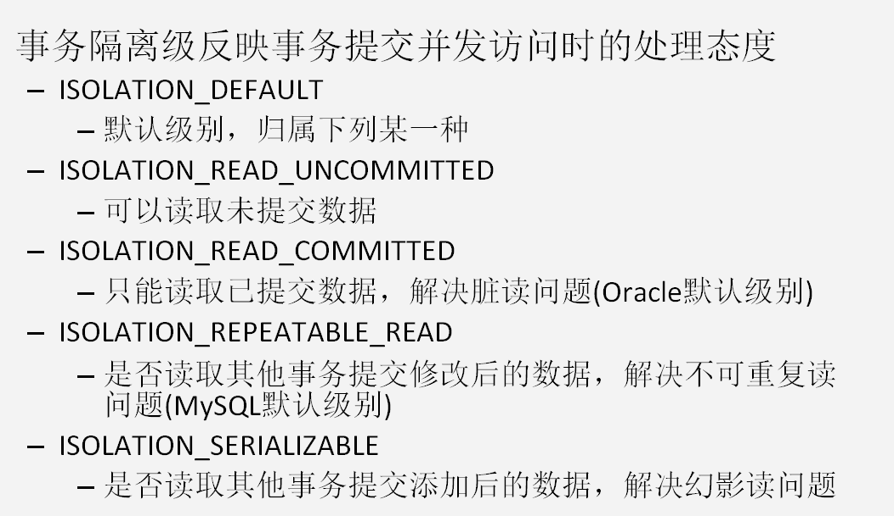

## 第1章 Spring中的JdbcTemplate[会用]

### 1.1 JdbcTemplate概述 

​		它是spring框架中提供的一个对象，是对原始Jdbc API对象的简单封装。spring框架为我们提供了很多的操作模板类。 

​		操作关系型数据的： 

​				JdbcTemplate 

​				HibernateTemplate 

​		操作nosql数据库的： 

​				RedisTemplate 

​		操作消息队列的： 

​				JmsTemplate 

​		我们今天的主角在spring-jdbc-5.1.9.RELEASE.jar中，我们在导包的时候，除了要导入这个jar包外，还需要导入一个spring-tx-XXXX.jar（它是和事务相关的）。

### 1.2 JdbcTemplate对象的创建 

我们可以参考它的源码，来一探究竟： 

```java
	public JdbcTemplate() {
    }

    public JdbcTemplate(DataSource dataSource) {
        this.setDataSource(dataSource);
        this.afterPropertiesSet();
    }

    public JdbcTemplate(DataSource dataSource, boolean lazyInit) {
        this.setDataSource(dataSource);
        this.setLazyInit(lazyInit);
        this.afterPropertiesSet();
    }
```

除了默认构造函数之外，都需要提供一个数据源。既然有set方法，依据我们之前学过的依赖注入，我们可以在配置文件中配置这些对象。

### 1.3 spring中配置数据源

#### 1.3.1 环境搭建

```xml
	<dependencies>
        <dependency>
            <groupId>org.springframework</groupId>
            <artifactId>spring-context</artifactId>
            <version>5.1.9.RELEASE</version>
        </dependency>
        <dependency>
            <groupId>org.springframework</groupId>
            <artifactId>spring-jdbc</artifactId>
            <version>5.1.9.RELEASE</version>
        </dependency>

        <dependency>
            <groupId>mysql</groupId>
            <artifactId>mysql-connector-java</artifactId>
            <version>5.1.44</version>
        </dependency>

        <dependency>
            <groupId>org.springframework</groupId>
            <artifactId>spring-test</artifactId>
            <version>5.1.9.RELEASE</version>
        </dependency>
        <dependency>
            <groupId>junit</groupId>
            <artifactId>junit</artifactId>
            <version>4.12</version>
        </dependency>
    </dependencies>
```

#### 1.3.2 编写spring的配置文件 

```xml
<?xml version="1.0" encoding="UTF-8"?>
<beans xmlns="http://www.springframework.org/schema/beans"
       xmlns:xsi="http://www.w3.org/2001/XMLSchema-instance"
       xmlns:context="http://www.springframework.org/schema/context"
       xsi:schemaLocation="http://www.springframework.org/schema/beans
        http://www.springframework.org/schema/beans/spring-beans.xsd
        http://www.springframework.org/schema/context
        http://www.springframework.org/schema/context/spring-context.xsd"> 
</beans>
```

#### 1.3.3 配置数据源 

​	要想使用数据源都需要导入对应的jar包。

##### 1.3.3.1 配置C3P0数据源 

在pom.xml添加依赖：

```xml
		<dependency>
            <groupId>com.mchange</groupId>
            <artifactId>c3p0</artifactId>
            <version>0.9.5.2</version>
        </dependency>
```

在spring的配置文件中配置： 

```xml
	<!-- 配置数据源 -->
    <bean id="dataSource" class="com.mchange.v2.c3p0.ComboPooledDataSource">
        <!--连接数据库的必备信息-->
        <property name="driverClass" value="com.mysql.jdbc.Driver"></property>
        <property name="jdbcUrl" value="jdbc:mysql://localhost:3306/mydb"></property>
        <property name="user" value="root"></property>
        <property name="password" value="mysqlpass"></property>
    </bean>
```

##### 1.3.3.2 配置spring内置数据源 

spring框架也提供了一个内置数据源，我们也可以使用spring的内置数据源，它就在spring-jdbc-5.1.9.REEASE.jar包中： 

```xml
<bean id="dataSource" class="org.springframework.jdbc.datasource.DriverManagerDataSource"> 
        <property name="driverClassName" value="com.mysql.jdbc.Driver"></property> 
        <property name="url" value="jdbc:mysql://localhost:3306/mydb"></property> 
        <property name="username" value="root"></property> 
        <property name="password" value="mysqlpass"></property> 
    </bean>
```

#### 1.3.4 将数据库连接的信息配置到属性文件中: （掌握）

【定义属性文件】 

```properties
jdbc.driverClass=com.mysql.jdbc.Driver
jdbc.url=jdbc:mysql://localhost:3306/mydb
jdbc.username=root
jdbc.password=mysqlpass
```

【引入外部的属性文件】 

一种方式: 

```xml
	<!-- 引入外部属性文件： -->
    <bean class="org.springframework.beans.factory.config.PropertyPlaceholderConfigurer">
        <property name="location" value="classpath:properties/jdbc.properties"/>
    </bean>
```

另一种方式: 

```xml
<context:property-placeholder location="classpath:properties/jdbc.properties"/>
```

也可以在配置类上使用：

```java
@PropertySource("classpath:properties/jdbc.properties") 
```

### 1.4 JdbcTemplate的增删改查操作

#### 1.4.1 前期准备 

​	创建数据库：

​		继续沿用前面课程使用的account数据库

#### 1.4.2 在spring配置文件中配置JdbcTemplate 

```xml
	<!-- 配置一个数据库的操作模板：JdbcTemplate --> 
    <bean id="jdbcTemplate" class="org.springframework.jdbc.core.JdbcTemplate"> 
        <property name="dataSource" ref="dataSource"/> 
    </bean>
```

#### 1.4.3 最基本使用 

```java
@RunWith(SpringJUnit4ClassRunner.class)
@ContextConfiguration(locations = "classpath:bean.xml")
public class JdbcTemplateTest {
    @Resource(name = "jdbcTemplate")
    private JdbcTemplate jdbcTemplate;
    
    @Test
    public void execute(){
        jdbcTemplate.execute("insert into account(name,money)values('eee',500)");
    }
}
```

#### 1.4.4 保存操作 

```java
	@Test
    public void insert(){
        jdbcTemplate.update("insert into account(name,money)values(?,?)","fff",5000);
    }
```

#### 1.4.5 更新操作

```java
	@Test
    public void update(){
        jdbcTemplate.update("update account set money = money-? where id = ?",300,2);
    }
```

#### 1.4.6 删除操作 

```java
	@Test
    public void delete(){
        jdbcTemplate.update("delete from account where id = ?",1);
    }
```

#### 1.4.7 查询所有操作 

定义一个实现RowMapper接口的类来实现对结果集的映射：

```java
public class AccountRowMapper implements RowMapper<Account> {
    @Override
    public Account mapRow(ResultSet rs, int rowNum) throws SQLException {
        Account account = new Account(); 
        account.setId(rs.getInt("id")); 
        account.setName(rs.getString("name")); 
        account.setMoney(rs.getFloat("money")); 
        return account;
    }
}
```

编写查询代码：

```java
	@Test
    public void getAll(){
        List<Account> accounts = jdbcTemplate.query("select * from account where money > ? ", new AccountRowMapper(), 500);
        System.out.println(accounts);
    }
```

#### 1.4.8 查询一个操作 

使用RowMapper的方式：常用的方式 

```java
	@Test
    public void getOne(){
        List<Account> accounts = jdbcTemplate.query("select * from account where id = ? ", new AccountRowMapper(), 55);
        System.out.println(accounts.isEmpty()?"没有结果":accounts.get(0));
    }
```

 使用ResultSetExtractor的方式:不常用的方式 

```java
	@Test
    public void getOne(){
        Account account = jdbcTemplate.query("select * from account where id = ? ", new ResultSetExtractor<Account>(){

            @Override
            public Account extractData(ResultSet rs) throws SQLException, DataAccessException {
                Account account = new Account();
                if (rs.next()) {
                    account.setId(rs.getInt("id"));
                    account.setName(rs.getString("name"));
                    account.setMoney(rs.getFloat("money"));
                }
                return account;
            }
        }, 3);
        System.out.println(account);
    }
```

#### 1.4.9 查询返回一行一列操作 

​		使用聚合函数，在不使用group by字句时，都是返回一行一列。最常用的就是分页中获取总记录条数

```java
	@Test
    public void getRows(){
        Integer rows = jdbcTemplate.queryForObject("select count(*) from account where money > ? ",Integer.class,500); 
        System.out.println(rows);
    }
```

### 1.5 在dao中使用JdbcTemplate

#### 1.5.1 准备实体类 

```java
/**
 * 账户的实体类
 */
public class Account implements Serializable {
    private Integer id;
    private String name;
    private Float money;

    public Integer getId() {
        return id;
    }

    public void setId(Integer id) {
        this.id = id;
    }

    public String getName() {
        return name;
    }

    public void setName(String name) {
        this.name = name;
    }

    public Float getMoney() {
        return money;
    }

    public void setMoney(Float money) {
        this.money = money;
    }

    @Override
    public String toString() {
        return "Account{" +
                "id=" + id +
                ", name='" + name + '\'' +
                ", money=" + money +
                '}';
    }
}
```

#### 1.5.2 在dao中定义JdbcTemplate 

持久层接口：

```java
/**
 * 账户的持久层接口
 */
public interface AccountDao {

    /**
     * 查询所有
     * @return
     */
    List<Account> findAllAccount();

    /**
     * 查询一个
     * @return
     */
    Account findAccountById(Integer accountId);

    /**
     * 更新
     * @param account
     */
    void updateAccount(Account account);
}
```

持久层实现类 ：

​	此版本的dao，需要给dao注入JdbcTemplate

```java
/**
 * 账户的持久层实现类
 */
@Repository("accountDao")
public class AccountDaoImpl implements AccountDao {
    @Resource(name = "jdbcTemplate")
    private JdbcTemplate jdbcTemplate;

    @Override
    public List<Account> findAllAccount() {
        return jdbcTemplate.query("select * from account",new AccountRowMapper());
    }

    @Override
    public Account findAccountById(Integer accountId) {
        List<Account> accounts = jdbcTemplate.query("select * from account where id = ? ", new AccountRowMapper(), accountId);
        return accounts.isEmpty()?null:accounts.get(0);
    }

    @Override
    public void updateAccount(Account account) {
        jdbcTemplate.update("update account set name=?,money=? where id=?",account.getName(),account.getMoney(),account.getId());
    }
}
```

配置文件：

```xml
<?xml version="1.0" encoding="UTF-8"?>
<beans xmlns="http://www.springframework.org/schema/beans"
       xmlns:xsi="http://www.w3.org/2001/XMLSchema-instance"
       xmlns:context="http://www.springframework.org/schema/context"
       xsi:schemaLocation="http://www.springframework.org/schema/beans
        http://www.springframework.org/schema/beans/spring-beans.xsd
        http://www.springframework.org/schema/context
        http://www.springframework.org/schema/context/spring-context.xsd">
    <!-- 告知spring在创建容器时要扫描的包 -->
    <context:component-scan base-package="com.yaorange"/>
    <!-- 配置一个数据库的操作模板：JdbcTemplate -->
    <bean id="jdbcTemplate" class="org.springframework.jdbc.core.JdbcTemplate">
        <property name="dataSource" ref="dataSource"/>
    </bean>
    <!-- 配置数据源 -->
    <bean id="dataSource" class="org.springframework.jdbc.datasource.DriverManagerDataSource">
        <property name="driverClassName" value="${jdbc.driverClass}"></property>
        <property name="url" value="${jdbc.url}"></property>
        <property name="username" value="${jdbc.username}"></property>
        <property name="password" value="${jdbc.password}"></property>
    </bean>
    <!--加载属性文件-->
    <context:property-placeholder location="classpath:properties/jdbc.properties"/>
</beans>
```

## 第2章 Spring中的事务控制(掌握)

事务：就是一组sql操作，这个操作中包含每个sql语句操作要求一起成功，要么都失败

### 2.1 Spring事务控制我们要明确的 

​	第一：JavaEE体系进行分层开发，事务处理位于业务层，Spring提供了分层设计**业务层**的事务处理解决方案。 

​	第二：spring框架为我们提供了一组事务控制的接口，开发中只需要进行配置。具体在后面的第二小节介绍。这组接口是在spring-tx-5.1.9.RELEASE.jar中。 

​	第三：spring的事务控制都是基于AOP的，它既可以使用编程的方式实现，也可以使用配置的方式实现。**我们学习的重点是使用配置的方式实现**。

### 2.2 Spring中事务控制的API介绍

#### 2.2.1 PlatformTransactionManager 

​	此接口是spring的事务管理器，它里面提供了我们常用的操作事务的方法，如下图：


我们在开发中都是使用它的实现类来真正管理事务的对象 （类似于原生开发的）：

使用Spring JDBC或iBatis 进行持久化数据时使用 ：

**org.springframework.jdbc.datasource.DataSourceTransactionManager** 

使用Hibernate版本进行持久化数据时使用：	**org.springframework.orm.hibernate5.HibernateTransactionManager** 

#### 2.2.2 TransactionDefinition 

基于Spring事务管理时需要在配置中说明以下信息内容

​	它是事务的定义**信息对象**，里面有如下方法：


##### 2.2.2.1 事务的隔离级别



###### 注：除第一个外，后面四个都是spring通过java代码模拟出来的

##### 2.2.2.2 Spring事务的传播行为 （理解）

**REQUIRED:**如果当前没有事务，就新建一个事务，如果已经存在一个事务中，加入到这个事务中。（默认值，一般更新操作选择该行为） 

**SUPPORTS:**支持当前事务，如果当前没有事务，就以非事务方式执行（没有事务，一般查询操作选择该行为） 

MANDATORY：使用当前的事务，如果当前没有事务，就抛出异常 

REQUERS_NEW:新建事务，如果当前在事务中，把当前事务挂起。 

NOT_SUPPORTED:以非事务方式执行操作，如果当前存在事务，就把当前事务挂起 

NEVER:以非事务方式运行，如果当前存在事务，抛出异常 

NESTED:如果当前存在事务，则在嵌套事务内执行。如果当前没有事务，则执行REQUIRED类似的操作。

##### 2.2.2.3 超时时间 

​	默认值是-1，没有超时限制。如果有，以秒为单位进行设置。

##### 2.2.2.4 是否是只读事务 

​	**建议查询时设置为只读**。只读表示锁表

### 2.3 基于XML的声明式事务控制（配置方式）重点

#### 2.3.1 环境搭建

##### 2.3.1.1 第一步：添加项目依赖

```xml
		<dependency>
            <groupId>org.springframework</groupId>
            <artifactId>spring-tx</artifactId>
            <version>${spring-version}</version>
        </dependency>
```

##### 2.3.1.2 第二步：创建spring的配置文件并导入约束 

​	此处需要导入aop和tx两个名称空间 

```xml
<?xml version="1.0" encoding="UTF-8"?>
<beans xmlns="http://www.springframework.org/schema/beans"
       xmlns:xsi="http://www.w3.org/2001/XMLSchema-instance"
       xmlns:context="http://www.springframework.org/schema/context"
       xmlns:aop="http://www.springframework.org/schema/aop"
       xmlns:tx="http://www.springframework.org/schema/tx"
       xsi:schemaLocation="http://www.springframework.org/schema/beans
        http://www.springframework.org/schema/beans/spring-beans.xsd
        http://www.springframework.org/schema/context
        http://www.springframework.org/schema/context/spring-context.xsd
        http://www.springframework.org/schema/aop
        http://www.springframework.org/schema/aop/spring-aop.xsd 
        http://www.springframework.org/schema/tx 
        http://www.springframework.org/schema/tx/spring-tx.xsd">
</beans>
```

##### 2.3.1.3 第三步：准备数据库表和实体类

​	省略

##### 2.3.1.4 第四步：编写业务层接口和实现类 

```java
/**
 * 账户的业务层接口
 */
public interface AccountService {

    /**
     * 更加id查询用户
     * @return
     */
    Account findAccountById(Integer accountId);

    /**
     * 转账
     * @param sourceId        转出账户
     * @param targetId        转入账户
     * @param money             转账金额
     */
    void transfer(Integer sourceId, Integer targetId, Float money);
}
```

```java
/**
 * 账户的业务层实现类
 */
@Service("accountService")
public class AccountServiceImpl implements AccountService {
    @Resource(name = "accountDao")
    private AccountDao accountDao;

    @Override
    public Account findAccountById(Integer accountId) {
        return accountDao.findAccountById(accountId);

    }

    @Override
    public void transfer(Integer sourceId, Integer targetId, Float money) {
        //1.根据名称查询转出账户
        Account source = accountDao.findAccountById(sourceId);
        //2.根据名称查询转入账户
        Account target = accountDao.findAccountById(targetId);
        //3.转出账户减钱
        source.setMoney(source.getMoney() - money);
        //4.转入账户加钱
        target.setMoney(target.getMoney() + money);
        //5.更新转出账户
        accountDao.updateAccount(source);
//            int i=1/0;
        //6.更新转入账户
        accountDao.updateAccount(target);
    }
}
```

##### 2.3.1.5 第五步：编写Dao接口和实现类 

```java
/**
 * 持久层接口
 */
public interface AccountDao {
    /**
     * 查询一个
     * @return
     */
    Account findAccountById(Integer accountId);

    /**
     * 更新
     * @param account
     */
    void updateAccount(Account account);
}
```

```java
/** 
 * 账户的持久层实现类 
 * 此版本dao，只需要给它的父类注入一个数据源 
 */
public class AccountDaoImpl1 extends JdbcDaoSupport implements AccountDao {
    
    @Override
    public Account findAccountById(Integer accountId) {
        List<Account> accounts = getJdbcTemplate().query("select * from account where id = ? ", new AccountRowMapper(), accountId);
        return accounts.isEmpty()?null:accounts.get(0);
    }

    @Override
    public void updateAccount(Account account) {
        getJdbcTemplate().update("update account set name=?,money=? where id=?",account.getName(),account.getMoney(),account.getId());
    }
}
```

#####  2.3.1.6 第六步：账户的封装类RowMapper的实现类

```java
public class AccountRowMapper implements RowMapper<Account> {
    @Override
    public Account mapRow(ResultSet rs, int rowNum) throws SQLException {
        Account account = new Account();
        account.setId(rs.getInt("id"));
        account.setName(rs.getString("name"));
        account.setMoney(rs.getFloat("money"));
        return account;
    }
}
```

##### 2.3.1.7 第六步：在配置文件中配置持久层对 

```xml
<?xml version="1.0" encoding="UTF-8"?>
<beans xmlns="http://www.springframework.org/schema/beans"
       xmlns:xsi="http://www.w3.org/2001/XMLSchema-instance"
       xmlns:context="http://www.springframework.org/schema/context"
       xmlns:aop="http://www.springframework.org/schema/aop"
       xmlns:tx="http://www.springframework.org/schema/tx"
       xsi:schemaLocation="http://www.springframework.org/schema/beans
        http://www.springframework.org/schema/beans/spring-beans.xsd
        http://www.springframework.org/schema/context
        http://www.springframework.org/schema/context/spring-context.xsd
        http://www.springframework.org/schema/aop
        http://www.springframework.org/schema/aop/spring-aop.xsd
        http://www.springframework.org/schema/tx
        http://www.springframework.org/schema/tx/spring-tx.xsd">
    <!-- 告知spring在创建容器时要扫描的包 -->
    <context:component-scan base-package="com.yaorange"/>
    <!-- 配置dao -->
    <bean id="accountDao" class="com.yaorange.dao.impl.AccountDaoImpl">
        <property name="dataSource" ref="dataSource"/>
    </bean>
    <!-- 配置数据源 -->
    <bean id="dataSource" class="org.springframework.jdbc.datasource.DriverManagerDataSource">
        <property name="driverClassName" value="${jdbc.driverClass}"></property>
        <property name="url" value="${jdbc.url}"></property>
        <property name="username" value="${jdbc.username}"></property>
        <property name="password" value="${jdbc.password}"></property>
    </bean>
    <!--加载属性文件-->
    <context:property-placeholder location="classpath:properties/jdbc.properties"/>
</beans>
```

#### 2.3.2 配置步骤

##### 2.3.2.1 第一步：配置事务管理器 

```xml
	<!-- 配置一个事务管理器 -->
    <bean id="transactionManager" class="org.springframework.jdbc.datasource.DataSourceTransactionManager">
        <!-- 注入DataSource -->
        <property name="dataSource" ref="dataSource"></property>
    </bean>
```

##### 2.3.2.2 第二步：配置事务的通知引用事务管理器 

```xml
	<!-- 事务的配置 --> 
    <tx:advice id="txAdvice" transaction-manager="transactionManager"> 
        <!--在tx:advice标签内部 配置事务的属性 -->
	</tx:advice>
```

##### 2.3.2.3 第三步：配置事务的属性 

```
 <tx:attributes> 
```

​	name：指定方法名称，是业务核心方法 

​	read-only：是否是只读事务。默认false，不只读。 

​	isolation：指定事务的隔离级别。默认值是使用数据库的默认隔离级别。 

​	propagation：指定事务的传播行为。 

​	timeout：指定超时时间。默认值为：-1。永不超时。 

​	rollback-for：用于指定一个异常，当执行产生该异常时，事务回滚。产生其他异常，事务不回滚。没有默认值，任何异常都回滚。 

​	no-rollback-for：用于指定一个异常，当产生该异常时，事务不回滚，产生其他异常时，事务回滚。没有默认值，任何异常都回滚。


```xml
		<tx:attributes>
            <tx:method name="*" read-only="false" propagation="REQUIRED"/>
            <tx:method name="find*" read-only="true" propagation="SUPPORTS"/>
        </tx:attributes>
```

#####  2.3.2.4 第四步：配置AOP切入点表达式 

```xml
	<!-- 配置aop -->
    <aop:config>
        <!-- 配置切入点表达式 -->
        <aop:pointcut expression="execution(* com.yaorange.service.impl.*.*(..))" id="pt"/>
    </aop:config>
```

##### 2.3.2.5 第五步：配置切入点表达式和事务通知的对应关系 

```xml
		<!-- 在aop:config标签内部：建立事务的通知和切入点表达式的关系 --> 
        <aop:advisor advice-ref="txAdvice" pointcut-ref="pt"/>
```

### 2.4 基于注解的配置方式

#### 2.4.1 环境搭建

##### 2.4.1.1 第一步：添加依赖

​	和基于xml的配置相同。略

##### 2.4.1.2第二步：准备数据库表和实体类

​	和基于xml的配置相同。略

##### 2.4.1.3 第三步：创建业务层接口和实现类

​	和基于xml的配置相同。略

##### 2.4.1.4 第四步：创建持久层接口和实现类

```java
@Repository("accountDao")
public class AccountDaoImpl implements AccountDao {
    @Resource(name = "jdbcTemplate")
    private JdbcTemplate jdbcTemplate;

    @Override
    public Account findAccountById(Integer accountId) {
        List<Account> accounts = jdbcTemplate.query("select * from account where id = ? ", new AccountRowMapper(), accountId);
        return accounts.isEmpty()?null:accounts.get(0);
    }

    @Override
    public void updateAccount(Account account) {
        jdbcTemplate.update("update account set name=?,money=? where id=?",account.getName(),account.getMoney(),account.getId());
    }
}
```

##### 2.4.1.3 第五步：创建spring的配置文件导入约束并配置扫描的包

```xml
<?xml version="1.0" encoding="UTF-8"?>
<beans xmlns="http://www.springframework.org/schema/beans"
       xmlns:xsi="http://www.w3.org/2001/XMLSchema-instance"
       xmlns:context="http://www.springframework.org/schema/context"
       xmlns:aop="http://www.springframework.org/schema/aop"
       xmlns:tx="http://www.springframework.org/schema/tx"
       xsi:schemaLocation="http://www.springframework.org/schema/beans
        http://www.springframework.org/schema/beans/spring-beans.xsd
        http://www.springframework.org/schema/context
        http://www.springframework.org/schema/context/spring-context.xsd
        http://www.springframework.org/schema/aop
        http://www.springframework.org/schema/aop/spring-aop.xsd
        http://www.springframework.org/schema/tx
        http://www.springframework.org/schema/tx/spring-tx.xsd">
    <!-- 告知spring在创建容器时要扫描的包 -->
    <context:component-scan base-package="com.yaorange"/>

    <!--配置JdbcTemplate-->
    <bean id="jdbcTemplate" class="org.springframework.jdbc.core.JdbcTemplate">
        <!-- 注入DataSource -->
        <property name="dataSource" ref="dataSource"/>
    </bean>
    
    <!-- 配置数据源 -->
    <bean id="dataSource" class="org.springframework.jdbc.datasource.DriverManagerDataSource">
        <property name="driverClassName" value="${jdbc.driverClass}"></property>
        <property name="url" value="${jdbc.url}"></property>
        <property name="username" value="${jdbc.username}"></property>
        <property name="password" value="${jdbc.password}"></property>
    </bean>
    
    <!--加载属性文件-->
    <context:property-placeholder location="classpath:properties/jdbc.properties"/>
</beans>
```

#### 2.4.2 配置步骤

##### 2.4.2.1 第一步：配置事务管理器并注入数据源 

```xml
	<!-- 配置一个事务管理器 -->
    <bean id="transactionManager" class="org.springframework.jdbc.datasource.DataSourceTransactionManager">
        <!-- 注入DataSource -->
        <property name="dataSource" ref="dataSource"/>
    </bean>
```

##### 2.4.2.2 第二步：在业务层使用@Transactional注解 

```java
@Service("accountService")
@Transactional(readOnly=true,propagation= Propagation.SUPPORTS)
public class AccountServiceImpl implements AccountService {
    @Resource(name = "accountDao")
    private AccountDao accountDao;

    @Override
    public Account findAccountById(Integer accountId) {
        return accountDao.findAccountById(accountId);

    }

    @Override
    @Transactional(readOnly=false,propagation=Propagation.REQUIRED)
    public void transfer(Integer sourceId, Integer targetId, Float money) {
        //1.根据名称查询转出账户
        Account source = accountDao.findAccountById(sourceId);
        //2.根据名称查询转入账户
        Account target = accountDao.findAccountById(targetId);
        //3.转出账户减钱
        source.setMoney(source.getMoney() - money);
        //4.转入账户加钱
        target.setMoney(target.getMoney() + money);
        //5.更新转出账户
        accountDao.updateAccount(source);
            int i=1/0;
        //6.更新转入账户
        accountDao.updateAccount(target);
    }
}
```

该注解的属性和xml中的属性含义一致。该注解可以出现在接口上，类上和方法上。 

- 出现接口上，表示该接口的所有实现类都有事务支持。 
- 出现在类上，表示类中所有方法有事务支持 
- 出现在方法上，表示方法有事务支持。 

以上三个位置的优先级：**方法>类>接口**

##### 2.4.2.3 第三步：在配置文件中开启spring对注解事务的支持 

```xml
	<!-- 开启spring对注解事务的支持 --> 
    <tx:annotation-driven transaction-manager="transactionManager"/>
```

完整的配置文件：

```xml
<?xml version="1.0" encoding="UTF-8"?>
<beans xmlns="http://www.springframework.org/schema/beans"
       xmlns:xsi="http://www.w3.org/2001/XMLSchema-instance"
       xmlns:context="http://www.springframework.org/schema/context"
       xmlns:aop="http://www.springframework.org/schema/aop"
       xmlns:tx="http://www.springframework.org/schema/tx"
       xsi:schemaLocation="http://www.springframework.org/schema/beans
        http://www.springframework.org/schema/beans/spring-beans.xsd
        http://www.springframework.org/schema/context
        http://www.springframework.org/schema/context/spring-context.xsd
        http://www.springframework.org/schema/aop
        http://www.springframework.org/schema/aop/spring-aop.xsd
        http://www.springframework.org/schema/tx
        http://www.springframework.org/schema/tx/spring-tx.xsd">
    <!-- 告知spring在创建容器时要扫描的包 -->
    <context:component-scan base-package="com.yaorange"/>

    <!--配置JdbcTemplate-->
    <bean id="jdbcTemplate" class="org.springframework.jdbc.core.JdbcTemplate">
        <!-- 注入DataSource -->
        <property name="dataSource" ref="dataSource"/>
    </bean>

    <!-- 配置数据源 -->
    <bean id="dataSource" class="org.springframework.jdbc.datasource.DriverManagerDataSource">
        <property name="driverClassName" value="${jdbc.driverClass}"></property>
        <property name="url" value="${jdbc.url}"></property>
        <property name="username" value="${jdbc.username}"></property>
        <property name="password" value="${jdbc.password}"></property>
    </bean>

    <!--加载属性文件-->
    <context:property-placeholder location="classpath:properties/jdbc.properties"/>

    <!-- 配置一个事务管理器 -->
    <bean id="transactionManager" class="org.springframework.jdbc.datasource.DataSourceTransactionManager">
        <!-- 注入DataSource -->
        <property name="dataSource" ref="dataSource"/>
    </bean>

    <!-- 开启spring对注解事务的支持 -->
    <tx:annotation-driven transaction-manager="transactionManager"/>
</beans>
```

#### 2.4.3 不使用xml的配置方式 

```java
@Configuration 
@EnableTransactionManagement 
public class SpringTxConfiguration { 
	//配置数据源，配置JdbcTemplate,配置事务管理器。 
}
```

## 第3章 Spring5的新特性[了解]

### 3.1 常规升级

Spring Framework 5.0遵守JDK 8和Java EE 7规范。 基本上，这意味着以前的JDK和Java EE版本不再受支持了。

Spring Framework 5.0的一些重要基于Java EE 7规范如下所示：

- Servlet 3.1
- JMS 2.0
- JPA 2.1
- JAX-RS 2.0
- Bean Validation 1.1

对于几个Java框架的最低支持版本有很多变化。下面的列表包含了一些重要框架的最低支持版本：

- Hibernate 5
- Jackson 2.6
- EhCache 2.10
- JUnit 5（目前5.2以前的版本还是可以使用junit4）
- Tiles 3

下面列表显示了受支持的服务器对应的版本：

- Tomcat 8.5+
- Jetty 9.4+
- WildFly 10+
- Netty 4.1+ (for web reactive programming with Spring Web Flux)
- Undertow 1.4+ (for web reactive programming with Spring Web Flux)

使用早期版本的任何前述规范/框架的应用程序需要在使用Spring Framework 5.0之前至少升级到上边列出的版本。

------

### 3.2 对JDK 9运行时兼容性

JDK 9预计将于2017年年中发布。Spring Framework 5.0期望与JDK 9运行时保持兼容性。

> Tips
> 关于Java 9的发布时间，定在9月末，关于更多关于Java 9 的知识，可以访问：[Java 9揭秘](https://www.jianshu.com/p/f8d6841c3912)

------

### 3.3 在Spring Framework代码中使用JDK 8特性

Spring Framework 4.x的基准版本是Java SE 6。这意味着它支持Java 6，7和8。必须支持Java SE 6和7对Spring Framework代码的约束。 框架代码不能使用Java 8中的任何新功能。所以，当世界其他地方升级到Java 8时，Spring Framework中的代码（至少主要部分）仅限于使用早期版本的Java。

使用Spring Framework 5.0，基准版本是Java 8。Spring Framework代码现在已升级为使用Java 8中的新特性。会改进更可读和更有效的框架代码。 使用的一些Java 8特性如下：

- 核心Spring接口中的Java 8 static 方法
- 基于Java 8反射增强的内部代码改进
- 在框架代码中使用函数式编程——lambdas表达式和stream流
- 用@Nullable和@NotNull注解来显示表明可为空的参数和以及返回值。这样就够在编译的时候处理空值而不是在运行时抛出NullPointerExceptions。

------

### 3.4 响应式编程支持

响应式编程是Spring Framework 5.0最重要的功能之一。

微服务通常基于事件通信的架构构建。 应用程序被设计为对事件（或消息）做出反应。

响应式编程提供了一种可选的编程风格，专注于构建应对事件的应用程序。

虽然Java 8没有内置的响应式性编程支持，但是有一些框架提供了对响应式编程的支持：

Reactive Streams：尝试定义与语言无关的响应性API。
Reactor：Spring Pivotal团队提供的响应式编程的Java实现。
Spring WebFlux：启用基于响应式编程的Web应用程序的开发。 提供类似于Spring MVC的编程模型。

### 3.5 测试方面的提升

SpringFramework5.0完全支持JUnit5Jupiter，所以可以使用JUnit5来编写测试以及扩展。此外还提供了一个编程以及扩展模型，Jupiter子项目提供了一个测试引擎来在Spring上运行基于Jupiter的测试。

另外，SpringFramework5还提供了在SpringTestContextFramework中进行并行测试的扩展。

针对响应式编程模型，spring-test现在还引入了支持SpringWebFlux的WebTestClient集成测试的支持，类似于MockMvc，并不需要一个运行着的服务端。使用一个模拟的请求或者响应，WebTestClient就可以直接绑定到WebFlux服务端设施。

你可以在这里找到这个激动人心的TestContext框架所带来的增强功能的完整列表。

当然，SpringFramework5.0仍然支持我们的老朋友JUnit!在我写这篇文章的时候，JUnit5还只是发展到了GA版本。对于JUnit4，SpringFramework在未来还是要支持一段时间的。

### 3.6 日志记录

在日志记录方面，SpringFramework5.0带来了CommonsLogging桥接模块的封装,它被叫做spring-jcl而不是标准的CommonsLogging。当然，无需任何额外的桥接，新版本也会对Log4j2.x,SLF4J,JUL(java.util.logging)进行自动检测。
